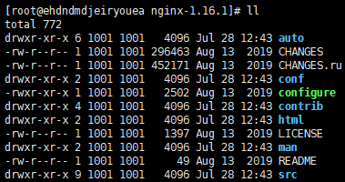
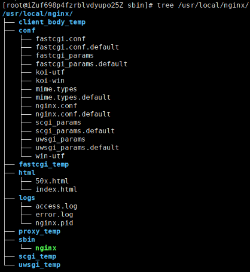
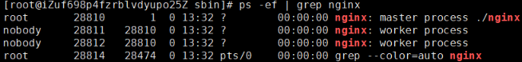
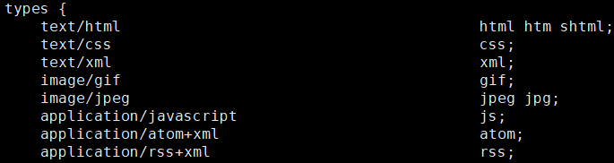
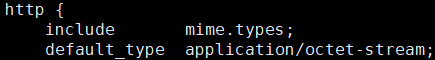

# [Nginx](https://nginx.org/)


nginx ("*engine x*") is an HTTP web server, reverse proxy, content cache, load balancer, TCP/UDP proxy server, and mail proxy server. 

## [Installing&Uninstall nginx](https://nginx.org/en/docs/install.html)

### 源码编译

1. [进入官网查找需要下载版本的链接地址](https://nginx.org/en/download.html)，然后使用wget命令进行下载；

   ```shell
   wget http://nginx.org/download/nginx-1.16.1.tar.gz
   ```

2. 建议大家将下载的资源进行包管理；

   ```shell
   mkdir -p /beanmeat/nginx
   mv nginx-1.16.1.tar.gz /beanmeat/nginx
   ```

3. 解压缩；

   ```shell
   tar -xzf nginx-1.16.1.tar.gz
   ```

   执行`tar -zxvf nginx-1.16.1.tar.gz`对下载的资源进行解压缩，进入压缩后的目录，可以看到如下结构

   

   1. auto：存放的是编译相关的脚本；

   2. CHANGES：版本变更记录；

   3. CHANGES.ru：俄罗斯文的版本变更记录；

   4. conf：nginx默认的配置文件

   5. configure：nginx软件的自动脚本程序,是一个比较重要的文件，作用如下：

      检测环境及根据环境检测结果生成C代码；

      生成编译代码需要的Makefile文件；

   6. contrib：存放的是几个特殊的脚本文件，其中README中对脚本有着详细的说明；

   7. html：存放的是Nginx自带的两个html页面，访问Nginx的首页和错误页面；

   8. LICENSE：许可证的相关描述文件；

   9. man：nginx的man手册；

   10. README：Nginx的阅读指南；

   11. src：Nginx的源代码；

4. 进入资源文件中，找到configure；

   ```shello
   ./configure
   ```

   通过`./configure`来对编译参数进行设置，需要我们手动来指定一些参数；

   - --prefix=PATH：指向Nginx的安装目录，默认值为/usr/local/nginx   
   - --sbin-path=PATH：指向(执行)程序文件(nginx)的路径,默认值为${prefix}/sbin/nginx
   - --modules-path=PATH：指向Nginx动态模块安装目录，默认值为${prefix}/modules
   - --conf-path=PATH：指向配置文件(nginx.conf)的路径,默认值为${prefix}/conf/nginx.conf
   - --error-log-path=PATH ：指向错误日志文件的路径,默认值为${prefix}/logs/error.log
   - --http-log-path=PATH：指向访问日志文件的路径,默认值为${prefix}/logs/access.log
   - --pid-path=PATH：指向Nginx启动后进行ID的文件路径，默认值为${prefix}/logs/nginx.pid
   - --lock-path=PATH：指向Nginx锁文件的存放路径,默认值为${prefix}/logs/nginx.lock

   ```shell
   ./configure --prefix=/usr/local/nginx \
   --sbin-path=/usr/local/nginx/sbin/nginx \
   --modules-path=/usr/local/nginx/modules \
   --conf-path=/usr/local/nginx/conf/nginx.conf \
   --error-log-path=/usr/local/nginx/logs/error.log \
   --http-log-path=/usr/local/nginx/logs/access.log \
   --pid-path=/usr/local/nginx/logs/nginx.pid \
   --lock-path=/usr/local/nginx/logs/nginx.lock
   ```

5. 编译&安装

   ```shell
   make & make install
   ```

### [yum安装](https://nginx.org/en/linux_packages.html#RHEL)

1. 安装必备组件

   ```shell
   sudo yum install yum-utils
   ```

2. 要设置yum存储库，请创建名为/etc/yum.repos.d/nginx.repo的文件，其中包含以下内容：

   ```shell
   [nginx-stable]
   name=nginx stable repo
   baseurl=http://nginx.org/packages/centos/$releasever/$basearch/
   gpgcheck=1
   enabled=1
   gpgkey=https://nginx.org/keys/nginx_signing.key
   module_hotfixes=true
   
   [nginx-mainline]
   name=nginx mainline repo
   baseurl=http://nginx.org/packages/mainline/centos/$releasever/$basearch/
   gpgcheck=1
   enabled=0
   gpgkey=https://nginx.org/keys/nginx_signing.key
   module_hotfixes=true
   ```

3. 查看是否安装成功；

   ```shell
   yum list | grep nginx
   ```

4. 使用yum进行安装；

   ```shell
   yun install -y nginx
   ```

5. 查看nginx的安装位置

   ```shell
   whereis nginx
   ```

### Uninstall nginx

1. 将nginx的进程关闭

   ```shell
   ./nginx -s stop
   ```

2. 将安装的nginx进行删除

   ```shell
   rm -rf /usr/local/nginx
   ```

3. 将安装包之前编译的环境清除掉

   ```shell
   make clean
   ```

## 环境配置

### Nginx配置成系统服务

如果想要启动、关闭或重新加载nginx配置文件，都需要先进入到nginx的安装目录的sbin目录，然后使用nginx的二级制可执行文件来操作，相对来说操作比较繁琐；所以把Nginx应用服务设置成为系统服务，方便对Nginx服务的启动和停止等相关操作，具体实现步骤：

1. 在`/usr/lib/systemd/system`目录下添加nginx.service

   ```shell
   vim /usr/lib/systemd/system/nginx.service
   ```

   ```shell
   [Unit]
   Description=nginx web service
   Documentation=http://nginx.org/en/docs/
   After=network.target
   
   [Service]
   Type=forking
   PIDFile=/usr/local/nginx/logs/nginx.pid
   ExecStartPre=/usr/local/nginx/sbin/nginx -t -c /usr/local/nginx/conf/nginx.conf
   ExecStart=/usr/local/nginx/sbin/nginx
   ExecReload=/usr/local/nginx/sbin/nginx -s reload
   ExecStop=/usr/local/nginx/sbin/nginx -s stop
   PrivateTmp=true
   
   [Install]
   WantedBy=default.target
   ```

2. 添加完成后如果权限有问题需要进行权限设置

   ```shell
   chmod 777 /usr/lib/systemd/system/nginx.service
   ```

3. 使用系统命令来操作Nginx服务

   - 启动： `systemctl start nginx`
   - 停止：`systemctl stop nginx`
   - 重启：`systemctl restart nginx`
   - 重新加载配置文件：`systemctl reload nginx`
   - 查看nginx状态：`systemctl status nginx`
   - 开机启动：`systemctl enable nginx`

### Nginx配置环境变量

Nginx安装目录下的二进制可执行文件`nginx`的很多命令，要想使用这些命令前提是需要进入sbin目录下才能使用，很不方便，我们可以将该二进制可执行文件加入到系统的环境变量，这样的话在任何目录都可以使用nginx对应的相关命令；

1. 创建并编辑`/etc/profile.d/nginx.sh`文件

   ```shell
   vim /etc/profile.d/nginx.sh
   ```

2. 写入以下内容，确保`nginx_home`变量的值是你的Nginx安装路径

   ```shell
   nginx_home=/usr/local/nginx
   PATH=$nginx_home/sbin:$PATH
   export PATH
   ```

3. 使环境变量生效

   ```shell
   source /etc/profile.d/nginx.sh
   ```

4. 验证

   ```shell
   nginx -v
   ```

## Nginx配置

### Nginx目录结构

> yum install -y tree	方便查看linux系统上的目录结构；



1. conf：nginx所有配置文件目录；
   - CGI(Common Gateway Interface)通用网关【接口】，主要解决的问题是从客户端发送一个请求和数据，服务端获取到请求和数据后可以调用调用CGI【程序】处理及相应结果给客户端的一种标准规范；
   - `fastcgi.conf`：fastcgi相关配置文件；
   - `fastcgi.conf.default`：fastcgi.conf的备份文件；
   - `fastcgi_params`：fastcgi的参数文件；
   - `fastcgi_params.default`：fastcgi的参数备份文件；
   - `scgi_params`：scgi的参数文件；
   - `scgi_params.default`：scgi的参数备份文件；
   - `uwsgi_params`：uwsgi的参数文件；
   - `uwsgi_params.default`：uwsgi的参数备份文件；
   - **`mime.types`：记录的是HTTP协议中的Content-Type的值和文件后缀名的对应关系；**
   - **`mime.types.default`：mime.types的备份文件；**
   - **`nginx.conf`：这个是Nginx的核心配置文件；**
   - **`nginx.conf.default`：nginx.conf的备份文件；**
   - `koi-utf、koi-win、win-utf`这三个文件都是与编码转换映射相关的配置文件，用来将一种编码转换成另一种编码；
2. **html：存放nginx自带的两个静态的html页面；**
   - **50x.html：访问失败后的失败页面；**
   - **index.html：成功访问的默认首页；**
3. **logs：记录入门的文件，当nginx服务器启动后，这里面会有 access.log，error.log ，nginx.pid三个文件出现；**
4. **sbin：是存放执行程序文件nginx；**
   - **nginx：用来控制Nginx的启动和停止等相关的命令；**

### Nginx核心配置文件

Nginx的核心配置文件默认是放在`/usr/local/nginx/conf/nginx.conf`

```shell
worker_processes  1;

events {
    worker_connections  1024;
}

http {
    include       mime.types;
    default_type  application/octet-stream;
    sendfile        on;
    keepalive_timeout  65;
    server {
        listen       80;
        server_name  localhost;
        location / {
            root   html;
            index  index.html index.htm;
        }
        error_page   500 502 503 504  /50x.html;
        location = /50x.html {
            root   html;
        }
    }
}
```

`Nginx.conf`配置文件中默认有三大块：全局块、events块、http块；http块中可以配置多个server块，每个server块又可以配置多个location块；

### global

#### user

user：用于配置运行Nginx服务器的worker进程的用户和用户组；

| 语法   | user user [group] |
| ------ | ----------------- |
| 默认值 | nobody            |
| 位置   | 全局块            |

该属性也可以在编译的时候指定，语法如下`./configure --user=user --group=group`,如果两个地方都进行了设置，最终生效的是配置文件中的配置。

1. 设置一个用户信息：beanmeat

   ```shell
   user beanmeat;
   ```

2. 修改`nginx.conf`文件

   ```shell
   user beanmeat
   
   location / {
       root   /root/html;
       index  index.html index.htm;
   }
   ```

3. 重启nginx服务器

   ```shell
   ./nginx -s stop
   ./nginx
   ```

4. 因为当前用户是beanmeat，没有root用户的访问权限，自然无法访问/root下的数据

   

5. 将文件创建到`/home/beanmeat/html/index.html`，并修改配置

   ```shell
   location / {
   	root   /home/beanmeat/html;
   	index  index.html index.htm;
   }
   ```

6. 再次访问nginx，成功访问！

   

>使用user指令可以指定启动运行工作进程的用户及用户组，这样对于系统的权限访问控制的更加精细，也更加安全；

#### work process

master_process：用来指定是否开启工作进程；

| 语法   | master_process on\|off; |
| ------ | ----------------------- |
| 默认值 | master_process on;      |
| 位置   | 全局块                  |

worker_processes：用于配置Nginx生成工作进程的数量，这个是Nginx服务器实现并发处理服务的关键所在；理论上来说workder process的值越大，可以支持的并发处理量也越多，但事实上这个值的设定是需要受到来自服务器自身的限制，建议将该值和服务器CPU的内核数保存一致；

| 语法   | worker_processes     num/auto; |
| ------ | ------------------------------ |
| 默认值 | 1                              |
| 位置   | 全局块                         |

如果将worker_processes设置成2，就会看到两个worker进程：



#### daemon

daemon：设定Nginx是否以守护进程的方式启动；

守护式进程是linux后台执行的一种服务进程，特点是独立于控制终端，不会随着终端关闭而停止；

| 语法   | daemon on\|off; |
| ------ | --------------- |
| 默认值 | daemon on;      |
| 位置   | 全局块          |

#### pid

pid：用来配置Nginx当前master进程的进程号ID存储的文件路径；

| 语法   | pid file;                              |
| ------ | -------------------------------------- |
| 默认值 | 默认为:/usr/local/nginx/logs/nginx.pid |
| 位置   | 全局块                                 |

初始化配置注释的是 logs/nginx.pid，即当前nginx下的相对路径；也可以通过`./configure --pid-path=PATH`来指定

#### error_log

error_log：用来配置Nginx的错误日志存放路径

| 语法   | error_log  file [日志级别];     |
| ------ | ------------------------------- |
| 默认值 | error_log logs/error.log error; |
| 位置   | 全局块、http、server、location  |

也可以通过`./configure --error-log-path=PATH`来指定

> 其中日志级别的值有：debug|info|notice|warn|error|crit|alert|emerg，|信息|通知|警告|错误|临界|警报|紧急，这块建议大家设置的时候不要设置成info以下的等级，因为会带来大量的磁盘I/O消耗，影响Nginx的性能。

#### include

include：用来引入其他配置文件，使Nginx的配置更加灵活

| 语法   | include file; |
| ------ | ------------- |
| 默认值 | 无            |
| 位置   | any           |

### events

#### accept_mutex

`accept_mutex`：用来设置Nginx网络连接序列化

| 语法   | accept_mutex on\|off; |
| ------ | --------------------- |
| 默认值 | accept_mutex on;      |
| 位置   | events                |

这个配置主要可以用来解决常说的"惊群"问题。大致意思是在某一个时刻，客户端发来一个请求连接，Nginx后台是以多进程的工作模式，也就是说有多个worker进程会被同时唤醒，但是最终只会有一个进程可以获取到连接，如果每次唤醒的进程数目太多，就会影响Nginx的整体性能；如果将上述值设置为on(开启状态)，将会对多个Nginx进程接收连接进行序列号，一个个来唤醒接收，就防止了多个进程对连接的争抢；

#### multi_accept

multi_accept：用来设置是否允许同时接收多个网络连接；

| 语法   | multi_accept on\|off; |
| ------ | --------------------- |
| 默认值 | multi_accept off;     |
| 位置   | events                |

如果multi_accept被禁止了，nginx一个工作进程只能同时接受一个新的连接；否则，一个工作进程可以同时接受所有的新连接

#### worker_connections

worker_connections：用来配置单个worker进程最大的连接数；

| 语法   | worker_connections number; |
| ------ | -------------------------- |
| 默认值 | worker_commections 512;    |
| 位置   | events                     |

这里的连接数不仅仅包括和前端用户建立的连接数，而是包括所有可能的连接数；另外，number值不能大于操作系统支持打开的最大文件句柄数量；

#### use

use：用来设置Nginx服务器选择哪种事件驱动来处理网络消息；

| 语法   | use  method;   |
| ------ | -------------- |
| 默认值 | 根据操作系统定 |
| 位置   | events         |

注意：此处所选择事件处理模型是Nginx优化部分的一个重要内容，method的可选值有select/poll/epoll/kqueue等，之前在准备centos环境的时候，我们强调过要使用linux内核在2.6以上，就是为了能使用epoll函数来优化Nginx；

另外这些值的选择，我们也可以在编译的时候使用

`--with-select_module`、`--without-select_module`、

` --with-poll_module`、` --without-poll_module`来设置是否需要将对应的事件驱动模块编译到Nginx的内核；

### http

#### type

Nginx通过`include mime.types;`指令引入`mime.types`文件，该文件包含了各种文件扩展名对应的MIME类型；当请求的文件具有明确的扩展名时，Nginx会根据`mime.types`文件中的映射来确定响应的`Content-Type`头。



在Nginx的配置文件中，默认有两行配置



`include mime.types`，相当于把mime.types文件中MIMT类型与相关类型文件的文件后缀名的对应关系加入到当前的配置文件中；

#### default_type

default_type：当Nginx无法根据文件扩展名确定内容类型时，会使用`default_type`指定的MIME类型来作为响应的`Content-Type`头。这确保了即使请求的文件没有扩展名或扩展名未在`mime.types`文件中定义，Nginx也能返回一个合适的MIME类型

| 语法   | default_type mime-type;   |
| ------ | ------------------------- |
| 默认值 | default_type text/plain； |
| 位置   | http、server、location    |

#### access_log

access_log：它决定了访问日志记录到哪里以及使用哪种格式

| 语法   | access_log path[format[buffer=size]] |
| ------ | ------------------------------------ |
| 默认值 | access_log logs/access.log combined; |
| 位置   | `http`, `server`, `location`         |

#### log_format

log_format：用来指定日志的输出格式。

| 语法   | log_format name [escape=default\|json\|none] string....; |
| ------ | -------------------------------------------------------- |
| 默认值 | log_format combined "...";                               |
| 位置   | http                                                     |

#### sendfile

sendfile：用于控制是否启用零拷贝机制。当启用时，Nginx会直接将文件从磁盘传输到网络，而不需要先将文件内容加载到内存中；这可以显著提高文件传输的性能，尤其是在处理大文件时；

| 语法   | sendfile on\|off；     |
| ------ | ---------------------- |
| 默认值 | sendfile off;          |
| 位置   | http、server、location |

#### keepalive_timeout

keepalive_timeout：用来设置长连接的超时时间；如果客户端在指定的时间内没有发送新的请求，连接将被关闭；

| 语法   | keepalive_timeout time; |
| ------ | ----------------------- |
| 默认值 | keepalive_timeout 75s;  |
| 位置   | http、server、location  |

#### keepalive_requests

keepalive_requests：用于控制一个长连接（keep-alive）上可以处理的最大请求数量，当达到这个限制时，连接会被自动关闭；

| 语法   | keepalive_requests number; |
| ------ | -------------------------- |
| 默认值 | keepalive_requests 100;    |
| 位置   | http、server、location     |

#### [server](#Nginx静态资源部署) 

## Nginx静态资源部署

通过浏览器发送一个HTTP请求实现从客户端发送请求到服务器端获取所需要内容后并把内容回显展示在页面的一个过程。这个时候，我们所请 求的内容就分为两种类型，一类是静态资源、一类是动态资源；

静态资源即指在服务器端真实存在并且能直接拿来展示的一些文件，比如常见的html页面、css文件、js文件、图 片、视频等资源；
动态资源即指在服务器端真实存在但是要想获取需要经过一定的业务逻辑处理，根据不同的条件展示在页面不同这 一部分内容，比如说报表数据展示、根据当前登录用户展示相关具体数据等资源；

### Nginx静态资源配置指令

#### [listen](https://nginx.org/en/docs/http/ngx_http_core_module.html#listen)

listen：用来配置监听端口；

| 语法   | listen address[:port] [default_server]...;<br/>listen port [default_server]...; |
| ------ | ------------------------------------------------------------ |
| 默认值 | listen *:80 \| *:8000                                        |
| 位置   | server                                                       |

```shell
listen 127.0.0.1:8000;
listen 127.0.0.1;
listen 8000;
listen *:8000;
listen localhost:8000;
```

default_server属性是标识符，用来将此虚拟主机设置成默认主机。所谓的默认主机指的是如果没有匹配到对应的address:port，则会默认执行的；如果不指定默认使用的是第一个server

#### [server_name](https://nginx.org/en/docs/http/ngx_http_core_module.html#server_name)

补充：hosts是一个没有扩展名的系统文件，可以用记事本等工具打开，其作用就是将一些常用的网址域名与其对应的IP地址建立一个关联“数据库”，当用户在浏览器中输入一个需要登录的网址时，系统会首先自动从hosts文件中寻找对应的IP地址，一旦找到，系统会立即打开对应网页，如果没有找到，则系统会再将网址提交DNS域名解析服务器进行IP地址的解析。

windows：`C:\Windows\System32\drivers\etc`

centos：`/etc/hosts`

##### 精确匹配

```shell
server {
	listen 80;
	server_name www.beanmeat.cn www.beanmeat.cn;
	...
}
```

##### 通配符匹配

server_name中支持通配符 * ，但需要注意的是通配符**不能出现在域名的中间，只能出现在首段或尾段**，如：

```shell
server {
	listen 80;
	server_name  *.beanmeat.cn	www.beanmeat.*;
	...
}
```

##### 正则表达式匹配

server_name中可以使用正则表达式，并且使用 **`~`** 作为正则表达式字符串的开始标记；

```shell
server{
        listen 80;
        server_name ~^www\.(\w+)\.com$;
        default_type text/plain;
        return 200 $1  $2 ..;
}
注意 ~后面不能加空格，括号可以取值
```

##### 匹配顺序

由于server_name指令支持通配符和正则表达式，因此在包含多个虚拟主机的配置文件中，可能会出现一个名称被多个虚拟主机的server_name匹配成功，当遇到这种情况；**范围越小越优先生效**；

#### [location](https://nginx.org/en/docs/http/ngx_http_core_module.html#location)

location：用来设置请求的URI；

| 语法   | location [  =  \|   ~  \|  ~*   \|   ^~   \|@ ] uri{...} |
| ------ | -------------------------------------------------------- |
| 默认值 | —                                                        |
| 位置   | server,location                                          |

uri变量是待匹配的请求字符串，可以不包含正则表达式，也可以包含正则表达式，那么nginx服务器在搜索匹配location的时候，是先使用不包含正则表达式进行匹配，找到一个匹配度最高的一个，然后在通过包含正则表达式的进行匹配，如果能匹配到直接访问，匹配不到，就使用刚才匹配度最高的那个location来处理请求。

##### /

要求必须以指定模式开始

```shell
server {
	listen 80;
	server_name 127.0.0.1;
	location /abc{
		default_type text/plain;
		return 200 "access success";
	}
}
以下访问都是正确的
http://192.168.200.133/abc
http://192.168.200.133/abc?p1=TOM
http://192.168.200.133/abc/
http://192.168.200.133/abcdef
```

##### =

精确匹配

```shell
server {
	listen 80;
	server_name 127.0.0.1;
	location =/abc{
		default_type text/plain;
		return 200 "access success";
	}
}
可以匹配到
http://192.168.200.133/abc
http://192.168.200.133/abc?p1=TOM
匹配不到
http://192.168.200.133/abc/
http://192.168.200.133/abcdef
```

##### ~

用于表示当前uri中包含了正则表达式，并且区分大小写

##### ~*

用于表示当前uri中包含了正则表达式，并且不区分大小写

##### ^~

用于不包含正则表达式的uri前，功能和不加符号的一致，唯一不同的是，如果模式匹配，那么就停止搜索其他模式了；

```shell
server {
	listen 80;
	server_name 127.0.0.1;
	location ^~/abc{
		default_type text/plain;
		return 200 "access success";
	}
}
```

#### root