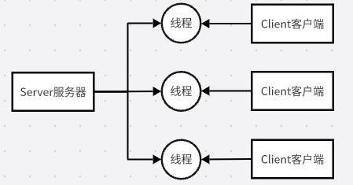
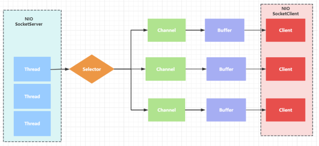

## 网络编程IO模型介绍

**Blocking IO**

Blocking IO也称BIO，即同步阻塞IO。Java的io包基于流模型实现，提供`File`、`FileInputStream`、`FileOutputStream`等输入输出流的功能。Java的io包下提供的流操作，交互方式是同步且阻塞的方式，在输入输出流的操作进行读写完成之前，线程会一直阻塞。因此io包中流的操作容易造成性能的瓶颈。

同样的，在java.net包下提供了部分网路API，如`Socket`、`ServerSocket`、`HttpURLConnection`等，进行网络通信时，也用到了java.io包下的流操作，因此也属于同步且阻塞的IO行为。

**Non Blocking IO**

Non Blocking IO也称NIO，即同步非阻塞IO。Java1.4中引入NIO框架，在java.nio包中提供了`Channel`、`Selector`、`Buffer`等抽象类，可以快速构建多路复用的IO程序，用于提供更接近操作系统底层的高新能数据操作方式。

**Asynchronous IO**

Asynchronous IO也称AIO，即异步非阻塞IO。Java7提供了改进版的NIO，进入异步非阻塞IO，有操作系统完成后回调通知服务端程序启动线程去处理。

### Blocking IO

在BIO同步阻塞逻辑模型下，一个服务器可以开启多个处理线程来处理客户端的连接，但是一个处理线程只能对应一个客户端的连接。



SocketServerSingleThread Code：

```java
/**
 * 单线程服务器
 */
public class SocketServerSingleThread {
    public static void main(String[] args) throws IOException {
        ServerSocket serverSocket = new ServerSocket(9090);
        while (true) {
            System.out.println("wait for client connection...");
            // 阻塞等待客户端的连接
            Socket socket = serverSocket.accept();
            System.out.println("connection a client...");

            InputStream inputStream = socket.getInputStream();
            byte[] bytes = new byte[1024];

            // 阻塞的等待客户端向io流通道中写数据
            int len = inputStream.read(bytes);
            System.out.println("receive client data: " + new String(bytes, 0, len));

            // 服务端返回信息给客户端
            OutputStream outputStream = socket.getOutputStream();
            outputStream.write("success".getBytes());
            outputStream.flush();
        }
    }
}

```


SocketClient Code:

```java
/**
 * 客户端
 */
public class SocketClient {
    public static void main(String[] args) throws IOException {
        // 连接服务器
        Socket socket = new Socket("localhost", 9090);

        // 发送数据
        OutputStream outputStream = socket.getOutputStream();
        outputStream.write("hello bio form client 1".getBytes());
        outputStream.flush();
        // 接受返回数据
        InputStream inputStream = socket.getInputStream();
        byte[] bytes = new byte[1024];
        int len = inputStream.read(bytes);
        System.out.println("receive server data:" + new String(bytes, 0, len));
        socket.close();
    }
}
```

单线程实现会导致如果有多个客户端连接服务器时候，如果client1先建立连接在写数据的时候，server就会在`inputStream.read(bytes)`阻塞等待client1写数据，此时client2连接之后也会在`inputStream.read(bytes)`阻塞等待server返回数据。


SocketServerMultipleThread Code：

```java
/**
 * 多线程服务器
 */
public class SocketServerMultipleThread {
    public static void main(String[] args) throws IOException {
        ServerSocket serverSocket = new ServerSocket(9090);
        while (true) {
            System.out.println("wait for client connection...");
            // 阻塞等待客户端的连接
            Socket socket = serverSocket.accept();
            System.out.println("connection a client...");
            new Thread(() -> {
                try {
                    handle(socket);
                } catch (IOException e) {
                    throw new RuntimeException(e);
                }
            }).start();
        }
    }

    public static void handle(Socket socket) throws IOException {

        InputStream inputStream = socket.getInputStream();
        byte[] bytes = new byte[1024];

        // 阻塞的等待客户端向io流通道中写数据
        int len = inputStream.read(bytes);
        System.out.println("receive client data: " + new String(bytes, 0, len));

        // 服务端返回信息给客户端
        OutputStream outputStream = socket.getOutputStream();
        outputStream.write("success".getBytes());
        outputStream.flush();
    }
}

```

>IO代码里Read操作是阻塞操作，如果连接不做数据读写操作，会导致线程阻塞，浪费线程资源。初次之外，如果客户端请求过多，将会导致服务器不断创建新的线程，对服务器造成过大压力。

BIO方式的使用和维护相对比较简单，适用于较小且固定的应用架构。

### Non Blocking IO

NIO（Non Blocking IO）是同步非阻塞的IO，服务器可以**使用一个线程来处理多个客户端请求**，客户端发送的请求会注册到多路复用器Selector上，由多路复用器Selector轮询各客户端的请求并进行处理。

#### NIO线程模型

NIO包含三大组件：

- Channel通道：每个通道对应一个buffer缓冲区。
- Buffer缓冲区：buffer底层是数组，类似于蓄水池，channel就是水管。
- Selector选择器：selector对应一个或多个线程。channel会注册到selector上，由selector根据channel读写事件的发生交给某个空闲线程来处理。
- Buffer和Channel都是可读可写的。

