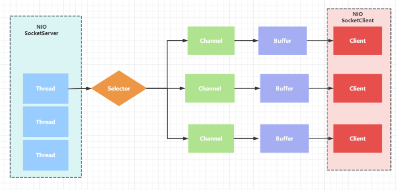

BIO

`BIO`（block I/O）：**同步阻塞**，服务器实现模式为一个连接一个线程，即客户端有连接请求时服务器就需要启动一个线程进行处理，如果这个连接不做任何事情会造成不必要的吸纳成开销，可以通过`线程池机制`改善（实现多个客户端连接）

`BIO`方式适用于连接数目比较小且固定的架构，这种方式对服务器资源要求比较高，开发局限于应用中，`JDK1.4`以前的唯一选择。

server code：

```java
public class BIOServer {
    public static void main(String[] args) throws Exception {
        ExecutorService newCachedThreadPool = Executors.newCachedThreadPool();

        // ServerSocket
        ServerSocket serverSocket = new ServerSocket(6666);

        System.out.println("server init..");

        while (true) {
            Socket accept = serverSocket.accept();  // blocking
            System.out.println("connection a client");

            // 创建线程与之通信
            newCachedThreadPool.execute(() -> {
                handler(accept);
            });
        }
    }

    // 与客户端通信
    public static void handler(Socket socket) {
        try {
            System.out.println("Thread info: " + Thread.currentThread().getId() + "\t" + Thread.currentThread().getName());
            byte[] bytes = new byte[1024];
            InputStream inputStream = socket.getInputStream();

            // 循环读取客户端发送的数据
            while(true) {
                System.out.println("Thread info: " + Thread.currentThread().getId() + "\t" + Thread.currentThread().getName());
                int read = inputStream.read(bytes); // blocking
                if(read != -1) {
                    System.out.println(new String(bytes, 0, read));
                } else {
                    break;
                }
            }
        } catch (Exception e) {
            e.printStackTrace();
        } finally {
            System.out.println("close socket...");
            try {
                socket.close();
            } catch (IOException e) {
                e.printStackTrace();
            }
        }

    }
}
```

client code：

连接服务器

```shell
telnet 127.0.0.1 6666
```

发送信息

```shell
# CTRL + ] 发送数据
send hello
```

每个请求都需要创建独立的线程，与对应的客户端进行数据处理。

并发量大的时候，需要创建大量线程来处理，系统资源占用较大。

连接建立后，如果当前线程暂时没有数据可读，则线程就阻塞在Read操作上，造成线程资源浪费。


NIO

`NIO`（non-blocking IO ）：**同步非阻塞**，从 JDK1.4 开始， Java 提供 了一 系列改进的输入 / 输出的新特性，NIO 相关类都被放在 java.nio 包及子包下。

NIO 有三大核心部分： **Channel（通道），Buffer（缓冲区） , Selector（选择器）**


