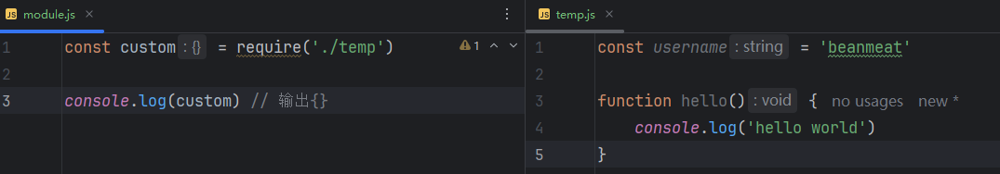
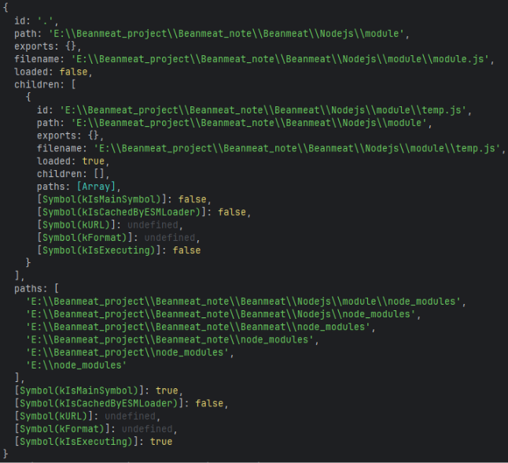
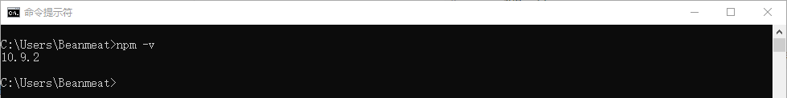
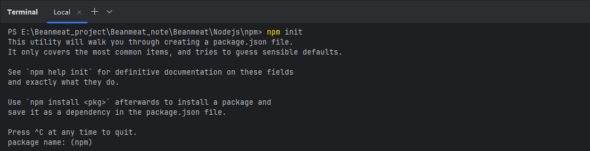
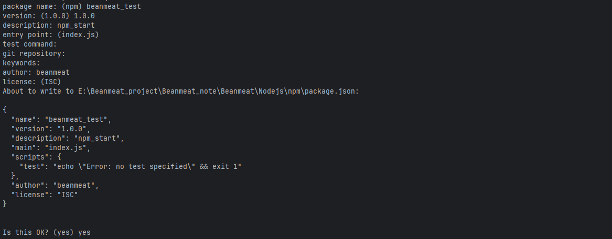
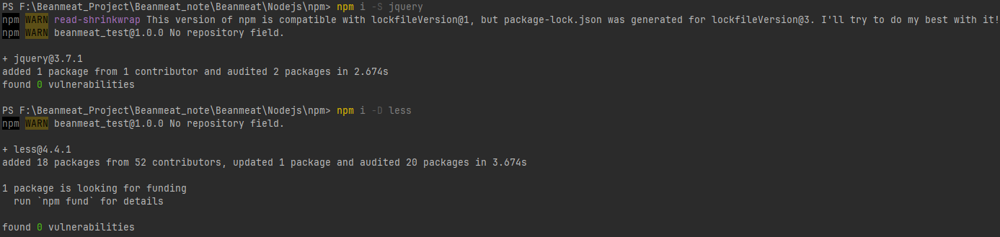
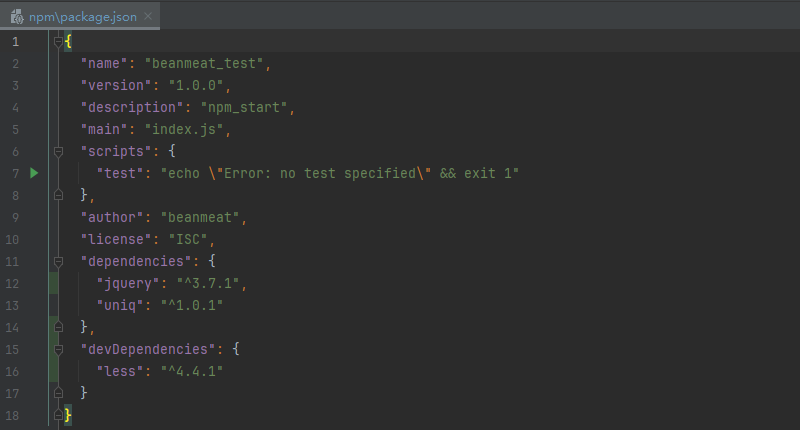

# [Nodejs](https://nodejs.org/en)

相关网址：

https://nodejs.cn/

https://nodejs.org/zh-cn

## [fs文件系统](https://nodejs.cn/api/v20/fs.html)

fs模块是官方提供的、用来操作文件的模块，提供了一系列的方法和属性。


### [fs.readFile(path[, options], callback)](https://nodejs.org/docs/latest-v23.x/api/fs.html#fspromisesreadfilepath-options)

- `path`:  filename or `FileHandle`
- `options`:  Object | string
  - `encoding`
  - `flag`
  - `signal`
- `callback`: Function
  - `err`
  - `data`

```js
// 导入fs模块中的readFile
const { readFile } = require('fs')

readFile('./temp.txt', (err, data) => {
    if (err) throw err;
    console.log(data);
})
```

回调传入了两个参数 `(err, data)`，其中 `data` 是文件的内容。如果未指定编码，则返回原始缓冲区。如果 `options` 是字符串，则它指定编码：

```js
import { readFile } from 'node:fs';

readFile('/etc/passwd', 'utf8', callback); 
```

### fs.writeFile(file, data[, options], callback)

- `file`: 文件名或文件描述符
- `data`
- `option`: Object | string
  - `encoding`
  - `mode`
  - `flag`
  - `flush`: 如果所有数据都成功写入文件，并且 `flush` 是 `true`，则使用 `fs.fsync()` 来刷新数据。默认值：`false`。
  - `signal`
- `callback`
  - `err`

当 `file` 是文件名时，将数据异步地写入文件，如果文件已存在则替换该文件。`data` 可以是字符串或缓冲区。

```js
import { writeFile } from 'fs';
import { Buffer } from 'buffer';

const data = new Uint8Array(Buffer.from('Hello Node.js'));
writeFile('message.txt', data, (err) => {
    if (err) throw err;
    console.log('The file has been saved!');
});
```

如果 `options` 是字符串，则它指定编码：

```js
import { writeFile } from 'node:fs';

writeFile('message.txt', 'Hello Node.js', 'utf8', callback); 
```

在同一个文件上多次使用 `fs.writeFile()` 而不等待回调是不安全的。对于这种情况，建议使用 [`fs.createWriteStream()`](https://nodejs.cn/api/fs.html#fscreatewritestreampath-options)。

与 `fs.readFile` 类似 - `fs.writeFile` 是一种便捷方法，它在内部执行多个 `write` 调用以写入传递给它的缓冲区。对于性能敏感的代码，则考虑使用 [`fs.createWriteStream()`](https://nodejs.cn/api/fs.html#fscreatewritestreampath-options)。

在同一个文件上多次使用 `fs.writeFile()` 而不等待回调是不安全的。对于这种情况，建议使用 [`fs.createWriteStream()`](https://nodejs.cn/api/fs.html#fscreatewritestreampath-options)。

与 `fs.readFile` 类似 - `fs.writeFile` 是一种便捷方法，它在内部执行多个 `write` 调用以写入传递给它的缓冲区。对于性能敏感的代码，则考虑使用 [`fs.createWriteStream()`](https://nodejs.cn/api/fs.html#fscreatewritestreampath-options)。


## [Path](https://nodejs.cn/api/path.html)

在使用`fs`模块操作文件的时候，如果提供的操作路径是以 ./ 或者 ../ 开头的相对路径时，很容易出现路径动态拼接错误的问题，代码在运行的时候，**会执行node命令时所处的目录**，动态拼接出被操作文件的完整路径。

解决方案：

- 使用绝对路径（移植性非常差，不利于维护）
- 使用 `__dirname`，表示当前文件所处的目录

```js
// 导入fs模块中的readFile
const { readFile } = require('fs')

readFile(__dirname + '/../temp.txt', (err, data) => {
    if (err) throw err;
    console.log(data);
})
```


`node:path` 模块提供了用于处理文件和目录的路径的实用工具。可以使用以下方式访问它：

```js
const path = require('node:path');
```

### [path.join([...paths])](https://nodejs.cn/api/path.html#pathjoinpaths)

用来将多个路径片段拼接成一个完整的字符串

- `...paths`: 路径片段的序列
- 返回：String

`path.join()` 方法使用特定于平台的分隔符作为定界符将所有给定的 `path` 片段连接在一起，然后规范化生成的路径。零长度的 `path` 片段被忽略。如果连接的路径字符串是零长度字符串，则将返回 `'.'`，表示当前工作目录。

```js
const path = require('node:path');

path.join('/foo', 'bar', 'baz/asdf', 'quux', '..');
// Returns: '/foo/bar/baz/asdf'

path.join('foo', {}, 'bar');
// Throws 'TypeError: Path must be a string. Received {}'
```


>凡是涉及到路径拼接的操作，都要使用path.join()方法进行处理。不要直接使用 + 进行字符串的拼接。

```js
const { readFile } = require('fs')
const path = require('node:path');

readFile(path.join(__dirname + '/../temp.txt'), (err, data) => {
    if (err) throw err;
    console.log(data);
})
```


### [path.basename(path[, suffix])](https://nodejs.cn/api/path.html#pathbasenamepath-suffix)

用来从路径字符串中，将文件名解析出来

- `path`
- `suffix`: 要删除的可选后缀

`path.basename()` 方法返回 `path` 的最后一部分，类似于 Unix `basename` 命令。

```js
const path = require('node:path');

path.basename('/foo/bar/baz/asdf/quux.html');
// Returns: 'quux.html'

path.basename('/foo/bar/baz/asdf/quux.html', '.html');
// Returns: 'quux' 
```


### [path.extname(path)](https://nodejs.cn/api/path.html#pathextnamepath)

`path.extname()` 方法返回 `path` 的扩展名，即 `path` 的最后一部分中从最后一次出现的 `.`（句点）字符到字符串的结尾。如果 `path` 的最后一部分中没有 `.`，或者除了 `path` 的基本名称（参见 `path.basename()`）的第一个字符之外没有 `.` 个字符，则返回空字符串。

```js
const path = require('node:path');

path.extname('index.html');
// Returns: '.html'

path.extname('index.coffee.md');
// Returns: '.md'

path.extname('index.');
// Returns: '.'

path.extname('index');
// Returns: ''

path.extname('.index');
// Returns: ''

path.extname('.index.md');
// Returns: '.md' 
```

## [http](https://nodejs.cn/api/http.html)

`http模块`是 Node.js 官方提供的，用来创建web服务器的模块。通过`http模块`提供的`http.createServer()`方法，就能方便的把一台不同的电脑，变成一台Web服务器，从而对外服务Web资源服务。

服务器和普通电脑的区别在于，服务器上安装了web服务器软件，例如：IIS、Apache等。通过安装这些服务器软件，就能把普通的电脑变成一台web服务器。在Nodejs中，我们不需要使用 IIS、Apache等这些第三方web服务器软件，使用Node.js提供的http模块来对外提供web服务。

### http.createServer()

```js
// 导入http模块
const http = require('http');

// 创建web服务器
const server = http.createServer();

// 为服务器绑定request时间，监听客户端端口
server.on('request', (request, response) => {
    console.log('Hello World!');
})

// 启动服务器
server.listen(80, function () {
    console.log('server running at http://127.0.0.1');
})
```

### request

```js
const http = require('http')

const server = http.createServer();

server.on('request', (request, response) => {
    const url = request.url;
    const method = request.method;
    const str = `Your request url is ${url}, and request method is ${method}`;
    console.log(str);
})

server.listen(80, () => {
    console.log('server running at http://127.0.0.1');
})
```

### response

```js
const http = require('http');

const server = http.createServer();

server.on('request', (request, response) => {
    const url = request.url;
    const method = request.method;
    const str = `Your request url is ${url}, and request method is ${method}`;
    console.log(str);

    // 调用response.end()方法，向客户端响应一些内容
    response.end(str)
})

server.listen(80, () => {
    console.log('server running at http://127.0.0.1');
})
```

### setHeader

```js
const http = require('http')

const server = http.createServer();

server.on('request', (request, response) => {
    const str = `请求的URL地址是 ${request.url}，请求的类型是 ${request.url}`;
    // 为了防止中文显示乱码问题，需要设置响应头 Content-Type 的值是 text/html; charset=utf-8
    response.setHeader('Content-Type', 'text/html; charset=utf-8');
    response.end(str);
})

server.listen(80,() => {
    console.log('server running at http://127.0.0.1');
})
```

## module模块化

### 基本概念

遵守固定的规则，把一个大文件拆分成独立并相互依赖的多个小模块。

例如：

- 使用什么样的语法格式来**引用模块**
- 在模块中使用什么样的语法格式去**向外暴露成员**


1. 提高代码复用性
2. 提到代码可维护性
3. 可以实现按需加载

### 模块作用域

和函数作用域一样，在自定义模块中定义的变量、方法等成员，只能在当前模块内被访问，这种模块级别的访问限制，叫做模块作用域。防止全局变量污染问题。



那如果需要向外共享模块作用域中的成员，可以使用`module`对象，在每个`.js`自定义模块中都有一个`module`对象，它里面存储了和当前模块有关的信息，打印如下：



### module.exports

在自定义模块中，可以使用module.export对象，将模块内的成员共享出去，供外界使用。外界用`require()`方法导入自定义模块时，得到的就是`module.exports`所指向的对象。

```js
// temp.js
// 向module.exports对象上挂在username和sayHello方法
module.exports.username = 'beanmeat';
module.exports.sayHello = function hello() {
    console.log('hello world')
}

```

```js
// module.js
const custom = require('./temp')

// 每个自定义模块中都有一个module对象
console.log(custom) //{ username: 'beanmeat', sayHello: [Function: hello] }
```

### exports

Node提供了`exports`对象来简化向外共享成员的代码，默认情况下，`exports`和`module.exports`指向同一个对象。最终共享的结果，还是以`module.exports`为准。

```js
console.log(exports == module.exports) // true
```

>require()模块的时候，得到的永远都是`module.exports`指向的对象。
>
>不要在同一个模块中同时使用`exports`和`module.exports`

```js
exports.username = 'beanmeat';
module.exports = {
    gender: '男',
    age: '20',
}
console.log(module.exports) // { gender: '男', age: '20' }
```

```js
exports.username = 'beanmeat';
module.exports.gender = 'man';
console.log(module.exports) // { username: 'beanmeat', gender: 'man' }
```

```js
module.exports.username = 'beanmeat';
exports = {
    gender: '男',
    age: 22
}

console.log(module.exports) // {'username': 'beanmeat'}
```

### CommonJS规范

`module.exports`、`exports`以及`require`这些都是`CommonJS`模块化规范的内容。而Node.js是实现了CommonJS模块化规范，二者的关系有点像JavaScript与ECMAScript。

## Package包管理工具

【包】`package`，代表了一组特定功能的源码集合

包管理工具是管理【包】的应用软件，可以对包进行下载安装、更新、删除、上传等操作。借助包管理工具，可以快速开发项目，提升开发效率。

包管理工具是一个通用的概念，很多编程语言都有包管理工具。下面是前端常用的包管理工具：

- `npm`
- yarn
- cnpm

### npm

npm全程`Node Package Manager`，Node的包管理工具，是node.js官方内置的包管理工具。

node.js在安装时会`自动安装 npm`，所以如果安装了node.js，可以直接使用npm，可以通过`npm -v`查看版本号测试，如果显示版本号则说明安装成，反之安装失败。



#### init

创建一个空目录，然后以此目录为工作目录`启动命令行`工具，执行`npm init`



`npm init`命令的作用是将文件夹初始化为一个包，`交互式创建 package.json文件`



`package.json`是包的配置文件，每个包必须要有`package.json`

`package.json`内容示例：

```json
{
  "name": "beanmeat_test",
  "version": "1.0.0",
  "description": "npm_start",
  "main": "index.js",
  "scripts": {
    "test": "echo \"Error: no test specified\" && exit 1"
  },
  "author": "beanmeat",
  "license": "ISC"
}

```

>初始化的过程中注意事项：
>
>1. package name（包名）不能使用中文、大写、默认值是`文件夹名称`，所以文件名称也不能使用中文和大写。
>2. version（`版本号`）要求`x.x.x`的形式定义，`x`必须是数字，默认是`1.0.0`
>3. ISC证书与MIT证书功能上一个相同的，关于开源证书扩展阅读http://www.ruanyifeng.com/blog/2011/05/how_to_choose_free_software_licenses.html
>4. `package.json`可以手动创建与修改
>5. 使用`npm init -y` 或者 `npm init --yes`极速创建`package.json`

#### 搜索包

搜索包的方式有两中国

1. 命令行 `npm s/search 关键字`
2. 网站搜索，https://www.npmjs.com

#### 下载依赖

可以通过`npm install` 和 `npm i` 命令安装包

```shell
# 格式
npm install <包名>
npm i <包名>

# 示例
npm install uniq
npm i uniq
```

运行之后文件夹会增加两个资源

- `node_modules`存放下载的包
- `package-lock.json`用来锁定包的版本，确保这次安装和将来安装所安装的版本是一致的

##### 全局安装

可以执行安装选项`-g`进行全局安装

```shell
npm i -g nodemon
```

全局安装完成之后就可以在命令行的任何位置运行`nodemon`命令，该命令的作用是`自动重启 node 应用程序`，当你代码更改的时候，会自动重新编译。

>说明：
>
>1. 全局安装的命令不受工作目录位置的影响
>2. 可以通过`npm root -g`可以查看全局安装包的位置
>3. `不是所有的包都适合全局安装`，只有全局类的工具才适合，可以`查看包的官方文档来确定安装方式`。

##### 安装所有依赖

在项目写作中有一个常用的命令就是`npm i`，通过该命令可以依据`package.json`和`package-lock.json`的依赖生命安装项目依赖。

```shell
npm i
npm install
```

>node_modules文件夹大多数情况都不会存入版本库

##### 安装指定版本的包

项目中可能会遇到版本不匹配的情况，有时就需要安装指定版本的包，可以使用下面的命令的。

```shell
## 格式
npm i <包名@版本号>

## 示例
npm i jquery@1.11.2
```

#### 删除依赖

项目中可能需要删除某些不需要的包，可以使用下面的命令

```shell
## 局部删除
npm remove uuiq
npm r uniq

## 全局删除
npm remove -g nodemon
```

#### require导入npm包基本流程

1. 在当前文件夹下`node_modules`中寻找同名的文件夹，直至找到磁盘根目录
2. 在上级目录中下的`node_modules`中寻找同名的文件夹，直至找到磁盘跟目录

```js
const uniq = require('uniq')
```

```js
const uniq = require('./node_modules/uniq')
// 读取目录相当于读取这个目录下的package.json中的main里面的文件，即uniq.js
```


```js
const uniq = require('./node_modules/uniq/uniq.js')
```

#### dev/prod

测试环境是程序员`专门用来写代码`的环境，一般指程序员的电脑，开发环境的项目一般`只能是开发自己访问`

生产环境是项目`代码正式运行`的环境，一般指正式的服务器电脑，生产环境的项目一般每个客户都可以访问。

#### devDependencies/dependencies

我们可以在安装时设置选项来区分是开发依赖，还是生产依赖，目前分为两类：

| 类型     | 命令                                     | 补充                                                         |
| -------- | ---------------------------------------- | ------------------------------------------------------------ |
| 生产依赖 | npm i -S uniq<br />npm i --save uniq     | -S等效于--save，`-S 是默认选项`<br />包信息保存在package.json中`dependencies`属性 |
| 开发依赖 | npm i -D less<br />npm i --save-dev less | -D等效于--save-dev<br />包信息保存在package.json中`devDependencies`属性 |

```js
npm i -S jquery
npm i -D less
```



安装成功后，package.json效果如下：



#### npm配置命令别名

通过配置命令别名可以更简单的执行命令

配置`package.json`中的`scripts`属性

```json
{
 ..
 ..
  "scripts": {
    "test": "echo \"Error: no test specified\" && exit 1"
    "serve": "vue-cli-service serve"
  }
 ..
 ..
}
```

配置完成之后，可以使用别名执行命令

```shell
npm run serve
npm run start
```

不过`start`别名比较特别，使用时可以省略`run`

```shell
npm start
```

>补充说明：
>
>1. `npm start`是项目中常用的一个命令，一般用来启动项目
>2. `npm run` 是自动向上级目录查找的特性，跟`require` 函数也一样
>3. 对于陌生的项目，我们可以通过查看`scripts`属性来参考项目的一些操作
