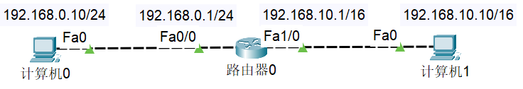
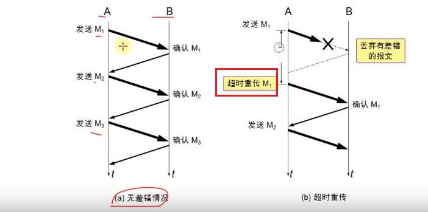
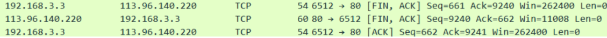

## 基本概念

### 网络互联模型

>为了更好地促进互联网的研究和发展，国际标准化组织ISO在1985年制定了网络互连模型。
>
>OSI参考模型，具有7层结构：偏理论。
>
>TCP/IP协议模型：实际应用中用的最多，偏实际。
>
>所以TCP/IP是一种网络互连模型的名称。


当然，为了方便学习，一些教材会出现5层结构。因为**数据链路层**和**物理层**很值得单独学习。


**大致的请求过程**


>应用层数据：**报文，用户数据**
>
>经过运输层包装：**段**
>
>经过网络层包装：**包**
>
>经过数据链路层包装：**帧**
>
>经过物理层包装：**比特流**


### 计算机之间的通信基础

>需要得知对方的IP地址
>
>最终是根据MAC地址（网卡地址），传送数据到网卡，被网卡接收
>
>​	数据中包括源IP地址、目标IP地址、源MAC地址、目标MAC地址
>
>​	如果网卡发现数据的目标MAC地址是自己，就会将数据传递给上一层处理
>
>​	如果网卡发现数据的目标MAC地址不是自己，就会将数据丢弃，不会传递给上一层进行处理

### 计算机之间的连接方式

#### 网线直连

需要用交叉线（不是直通线）


**直通线**：用于连接不同类型的设备，例如电脑与交换机、路由器与交换机、电脑与路由器等

**交叉线**：用于连接相同类型的设备，例如两台电脑直接相连、两台交换机相连（在不支持自动翻转功能的旧设备上）

>在早期网络设备中，发送和接收信号的引脚是固定的。当连接相同类型的设备时，需要通过交叉线来交换发送和接收引脚的信号，以确保数据能够正确传输。
>
>现代设备大多支持自动翻转功能（Auto-MDIX），可以自动识别并调整信号，因此在很多情况下，直通线和交叉线都可以通用


ARP协议的作用：已知 IP地址，通过 **广播** 获取 MAC地址。

为什么右边出现3个ARP包，实际上是 **一次完整的发送请求，接收响应的过程**。


#### 同轴电缆（Coaxial）


注意：同轴电缆只要有一个地方线断了，整个线路都瘫痪了。

#### 集线器


集线器相比同轴电缆唯一的优点就是：哪怕连着集线器的某一个设备中间线路出问题，不会影响到连着集线器的其他设备。

#### 网桥


所谓隔绝冲突域是通过：**记录设备的MAC地址在左还是在右**。

例如，6向7发数据包，
当6发出请求ARP广播时，网桥会记录6的MAC地址在左；
当7发出响应ARP广播时，网桥会记录7的MAC地址在左。


#### 交换机（Switch）


>若全球所有设备都用交换机连接：
>1、他们必然处于同一网段，因此 IP地址可能会不够用
>2、即使使用交换机，第一次发送数据包仍然需要ARP广播，耗费大量时间。
>3、形成广播风暴，只要有一个设备发送ARP广播，全球设备都能收到

#### 路由器（Router）

主机在发数据之前，首先会判断目标主机的IP地址跟它是否在同一个网段：

1. **在同一个网段**：ARP广播、通过 **交换机/集线器** 传递数据
2. **不在同一个网段**：通过**路由器**转发数据

网线直连、同轴电缆、集线器、网桥、交换机

- 连接的设备必须在**同一网段**
- 连接的设备处在**同一广播域**

路由器

- 可以在不同网段之间转发数据
- 隔绝广播域


### MAC地址（40-55-82-0A-8C-6D）

每个网卡都有一个 6字节(48bit) 的 MAC地址 (Media Access Control Address)

MAC地址全球唯一，固化在网卡的ROM中，由 IEEE802 标准规定

> 前3字节：OUI (Organizationally Unique Identifier)，组织唯一标识符，由 IEEE 的注册管理机构分配给厂商
> 后3字节：网络接口标识符，由厂商自行分配


OUI 查询：可以根据OUI查询出对应的厂商

- http://standards-oui.ieee.org/oui.txt
- https://mac.bmcx.com/

#### MAC地址的表示格式（Windows、Linux）

- Windows

  40-55-82-0A-8C-6D

- Linux、Android、Mac、iOS（类Unix操作系统）

  40:55:82:0A:8C:6D

- Packet Tracer

  4055.820A.8C6D

> 注：当48位全为1时，代表广播地址：FF-FF-FF-FF-FF-FF

#### MAC地址操作（`ipconfig /all`）

查看MAC地址：`ipconfig /all`

修改MAC地址：更改适配器选项-属性-配置-高级-网络地址（填写的时候需要把 减号`-` 去掉）


> 注： 有时可以通过修改 MAC地址蹭网...

#### MAC地址的获取（`arp -a`）

不知道对方主机的MAC地址时，可以通过发送ARP广播获取对方的MAC地址

- 获取成功后，会缓存IP地址、MAC地址的映射信息，俗称：**ARP缓存**
- 通过ARP广播获取的MAC地址，属于 **动态（dynamic）缓存**，存储时间比较短（默认是2分钟），过期就自动删除

`arp -a [主机地址]`：查看ARP缓存
`arp -d [主机地址]`：删除ARP缓存
`arp -s 主机地址 MAC地址`：增加一条缓存信息（这是**静态缓存**，存储时间较久，不同系统的存储时间不同）

#### ARP（Address Resolution Protocol）

**ARP (Address Resolution Protocol)，地址解析协议**

> 通过 IP地址 获取 MAC地址

**RARP (Reverse Address Resolution Protocol)，逆地址解析协议**

>使用与ARP相同的报头结构
>
>作用与ARP相反，用于**将MAC地址转换为IP地址**
>
>后来被 BOOTP、**DHCP** 所取代

#### ICMP（Internet Control Message Protocol）

**ICMP (Internet Control Message Protocol)，互联网控制消息协议**

>IPv4中的ICMP被称作 **ICMPv4**，IPv6中的ICMP则被称作 **ICMPv6**
>
>通常用于返回错误信息，比如 TTL值过期、目的不可达
>
>ICMP的错误消息总是包括了源数据并返回给发送者

## IP

IP地址 (Internet Protocol Address)：互联网上的每一个主机都有一个IP地址

>最初是 **IPv4** 版本，32bit（4字节），2019年11月25日，全球的IP地址已经用完
>
>后面推出了 **IPv6** 版本，128bit（16字节）
>
>我们在学习中讨论的都是 **IPV4**


### IP地址的组成

IP地址 由2部分组成：**网络标识（网络ID）、主机标识（主机ID）**

- 通过子网掩码（subnet mask）可以得知 网络ID 、主机ID

主机所在的网段 = 子网掩码 & IP地址

```text
IP地址：192.168.1.10
子网掩码：255.255.255.0

	1100 0000 . 1010 1000 . 0000 0001 . 0000 1010
&	1111 1111 . 1111 1111 . 1111 1111 . 0000 0000
----------------------------------------------------
	1100 0000 . 1010 1000 . 0000 0001 . 0000 0000

网段：192.168.1.0  
```

**网段是由子网掩码计算得出**，只有IP地址无法得知网段。

```text
IP地址：130.168.1.10
子网掩码：255.255.0.0
网段：130.168.0.0

该网段最多有 256*256-2 个IP地址
-2是因为: 全0代表网段,全1代表广播
网段和广播无法分配IP地址.
```

计算机和其他计算机通信前，会先判断目标主机和自己是否在同一网段：

- 同一网段：不需要由路由器进行转发
- **不同网段**：交由**路由器**进行转发

### IP地址的分类

注：判断IP地址的类别只要看第一部分即可。

只有 A\B\C 类地址才能分配给主机

- 主机ID为 **全0**，表示主机所在的**网段**，如 `192.168.1.0`
- 主机ID为 **全1**，表示主机所在**网段的全部主机（广播）**，如 `192.168.1.255`
  可以尝试用`ping`给某个网段的全部主机发数据


>网络ID
>
>- 0 不能用，127 作为保留网段。
>- 其中 127.0.0.1 是 **本地环回地址（Loopback）**，代表本机地址
>- 可以分配给主机的第1部分的取值范围是：1~126
>
>主机ID
>
>- 第2、3、4部分的取值范围是：0~255
>- **每个A类网络能容纳的最大主机数是：256\*256\*256–2 = 2^24–2 = 16777214**


>网络ID
>
>- 第1部分的取值范围是：128~191
>- 第2部分的取值范围是：0~255
>
>主机ID
>
>- 第3、4部分的取值范围是：0~255
>- **每个B类网络能容纳的最大主机数是：256\*256-2 = 2^16-2 = 65534**


>网络ID
>
>- 第1部分的取值范围是：192~223
>- 第2、3部分的取值范围是：0~255
>
>主机ID
>
>- 第4部分的取值范围是：0~255
>- **每个C类网络能容纳的最大主机数是：256-2 = 254**


### 子网掩码的CIDR表示方法

**CIDR (Classless Inter-Domain Routing)，无类别域间路由**

子网掩码的CIDR表示方法

- 192.168.1.100/24，代表子网掩码有24个1，也就是 255.255.255.0
- 123.210.100.200/16，代表子网掩码有16个1，也就是 255.255.0.0

计算工具：https://www.sojson.com/convert/subnetmask.html

### 子网划分

#### 为什么要进行子网划分？

如果需要让 **200** 台主机在同一个网段内，可以分配一个 **C类网段**，比如`192.168.1.0/24`

- 共 254 个可用IP地址：`192.168.1.1` ~ `192.168.1.254`
- 多出 54 个空闲的IP地址，这种情况并不算浪费资源

如果需要让 **500** 台主机在同一个网段内，那就分配一个 **B类网段**，比如`191.100.0.0/16`

- 共 65534 个可用IP地址：`191.100.0.1` ~ `191.100.255.254`
- 多出 65034 个空闲的IP地址，这种情况属于极大的浪费资源

如何尽量避免浪费IP地址资源？

- 合理进行 **子网划分**

> 子网划分：借用主机位作子网位，划分出多个子网
>
> - **等长子网划分**：将一个网段等分成多个子网，**每个子网的可用IP地址数量一样**
> - **变长子网划分**：**每个子网的可用IP地址数量可以是不一样的**

子网划分器：http://www.ab126.com/web/3552.html


**子网划分的步骤**

1. 确定子网的子网掩码长度
2. 确定子网中第1个、最后1个主机可用的IP地址

#### 等长子网划分

##### C类子网划分

```text
本来有一个C类网段: 192.168.0.0/24

划分成两个子网后:

A子网: 192.168.0.0/25 子网掩码: 255.255.255.128
可用IP地址: 192.168.0.1 ~ 192.168.0.126 共 126 个

B子网: 192.168.0.128/25 子网掩码: 255.255.255.128
可用IP地址: 192.168.0.129 ~ 192.168.0.254 共 126 个
```

等分成 2 个子网：


等分成 4 个子网：


等分成 4 个子网的**广播地址**：


等分成 8 个子网：


#####  A、B类子网划分

B类子网划分：


A类子网划分 ：


#### 子网划分实践

如此划分，他们还是属于同一个网段，可以直接 ping 通。


下面这样划分就不是一个网段了，它们分别属于 `192.168.0.0` 和 `192.168.0.128` 网段，需要用路由器并设置网关才可以 ping 通。

注：下图 `192.168.0.129/25` 和 `192.168.0.1/25` 写反了。


#### 思考题：双方子网掩码不同，计算对方所处网段

问：下列两台计算机可以正常通信吗？


答：不可以。计算机0 想要发送数据包，先判断计算机1是否和自己处于同一个网段，计算网段的方法是：IP地址 & 子网掩码，计算机0判断计算机1的网段为 192.168.10.10 & 255.255.255.0 = 192.168.10.0，而计算机0判断自身所处网段为 192.168.0.10 & 255.255.255.0 = 192.168.0.0，双方不处于同一网段，所以计算机0无法将数据包发给计算机1（不同网段的数据通信需要路由器）


解决方案：利用路由器。



### 超网合并

超网：跟子网反过来，它是将多个**连续的网段**合并成一个更大的网段

需求：原本有200台计算机使用 192.168.0.0/24 网段，现在希望增加200台设备到同一个网段

- 200台在 192.168.0.0/24 网段，200台在 192.168.1.0/24 网段
- 合并 192.168.0.0/24、192.168.1.0/24 为一个网段：192.168.0.0/23
  （子网掩码往左移动1位）


>问：192.168.0.255/23 这个IP地址，可以分配给计算机使用么？
>
>192.168.0.255/24 是广播，不能分配给计算机。
>
>192.168.0.255/23 如下：
>
>

主机部分并不全为1，所以是可以分配给计算机使用的。

#### 合并4个网段

子网掩码向左移动 2 位，可以合并 4 个网段


将 192.168.0.0/24、192.168.1.0/24、192.168.2.0/24、192.168.3.0/24 合并为**192.168.0.0/22** 网段

#### 子网合并的规律

假设 n 是 2 的 k 次幂（k≥1），子网掩码左移 k 位能够将能够合并 n 个网段


假设 n 是 2 的 k 次幂（k≥1），如果第一个网段的网络号能被 n 整除，那么由它开始连续的 n 个网段，能通过左移 k 位子网掩码进行合并。

- 第一个网段的网络号以二进制 0 结尾，那么由它开始连续的 2 个网段，能通过左移1位子网掩码进行合并

- 第一个网段的网络号以二进制 00 结尾，那么由它开始连续的 4 个网段，能通过左移2位子网掩码进行合并
- 第一个网段的网络号以二进制 000 结尾，那么由它开始连续的 8 个网段，能通过左移3位子网掩码进行合并


#### 判断一个网段是子网还是超网

首先看该网段的类型，是A类网络、B类网络、C类网络？

- A类子网掩码的位数是8（255.0.0.0）
- B类子网掩码的位数是16（255.255.0.0）
- C类子网掩码的位数是24（255.255.255.0）

如果该网段的子网掩码位数比默认子网掩码**多**，就是**子网**
如果该网段的子网掩码位数比默认子网掩码**少**，则是**超网**

>例如：判断 25.100.0.0/16 是子网还是超网？
>
>- 根据 25 判断出这是个 A 类网络，默认子网掩码 8 位
>- 由于该网段子网掩码 16 位，比默认**多**，所以是**子网**
>
>判断 200.100.0.0/16 是子网还是超网？
>
>- 根据 200 判断出这是个 C 类网络，默认子网掩码 24 位
>- 由于该网段子网掩码 16 位，比默认**少**，所以是**超网**

## 物理层（Physical）

>物理层定义了接口标准，线缆标准，传输标准，传输方式等。


### 相关概念

#### 模拟信号/数字信号

>模拟信号
>
>连续的信号，适合长距离传输
>
>抗干扰能力差，收到干扰时表型变形很难纠正。
>
>
>
>数字信号
>
>离散的信号，不适合长距离传输
>
>抗干扰能力强，受到干扰时波形失真可以修复。
>
>

#### 数据通信模型

>局域网通信模型


>广域网通信模型


❗ 电话线不能传输数字信号，所以要用猫[^cat]将数字信号转成模拟信号。

#### 信道

> 信息传输的通道，一条传输介质上（比如网线）上可以有多条信道
>

> 单工通信：有A，B两端进行通讯。信号只能往一个方向传输，任何时候都不能改变信号的传输方向。比如无线电广播，有限电视广播。
>
> 半双工通信：信号可以双向传输，但是A，B两端必须交替进行，同一时间只能往一个方向传输。比如对讲机。
>
> 全双工通信：信号可以同时双向传输。比如手机（打电话，听说同时进行）

## 数据链路层（Data Link）

>不同类型的数据链路，在数据链路层所用的通信协议可能是不同的。
>
>广播信道：CSMA/CD协议。
>
>点对点信道：PPP协议。
>
>数据链路层的数据：**帧**。

**链路：**从一个节点到相邻节点的一段物理线路（有线或无线），中间没有其他交换节点。(注意：集线器是没有智商的，完全可以把它当成一根网线)


**数据链路：**在一条链路上传输数据时，需要有对应的通信协议来控制数据的传输。

>不同类型的数据链路，在**数据链路层**所用的通信协议可能是不同的：
>
>广播信道：CSMA/CD协议（广播信道：比如同轴电缆，集线器组成的网络）
>
>点对点信道：PPP协议（比如两个路由器之间的信道）

### 数据链路层的3个特性

#### 封装成帧

>把来自网络层的数据包封装成数据帧。
>
>帧的数据部分就是网络层传递下来的数据包（IP数据包，Package）

>最大传输单元MTU（Maximum Transfer Unit）：每一种数据链路层协议都规定了能够传送的帧的数据长度上线，以太网的MTU位1500个字节


#### 透明传输

>帧在传输介质上传输的时候，是一连串的多个帧进行传输的。那么怎么区分那一部分是一个完整的帧呢？
>
>数据链路层在包装来自网络层的数据包时，会在帧两头加上帧首部（SOH）和帧尾部（EOT）。但是这又会出现新的问题，如果帧的数据部分出现了SOH/EOT，这就产生冲突，导致得到一段残缺的帧。


数据部分一旦出现了SOH，EOT，就需要进行**转义**。


#### 差错检验

>考虑到帧在链路上传输时可能会发生差错，那么就有一个差错检验机制。
>
>根据帧数据部分和数据链路层首部，计算出一个值叫做FCS放到帧尾部部分。传到目标端后，对方也会计算出FCS和帧尾部的FCS比较来判断是否出错。如果出错就会丢掉该数据。


### CSMA/CD协议

>CSMA/CD（Carrier Sense Multiple Access with Collision Detection）载波侦听多路访问/冲突检测


>载波侦听：某一端会监听线路上是否有信号在传输，有的话就不发数据；没有的话，才会发数据。
>
>多路访问：各个端都可以发送信号。
>
>冲突检测：如果两个端（计算机）同时检测线路上没有信号在传输，那么就会都发信号。但是此时由于是半双工通信，就会发生冲突。信号发生冲突，就会往回弹。所以计算机要能判断出收到的信号是来自其他端直接发送的还是因为冲突弹回来的。
>
>例如 集线器组成的网络，是半双工通信的，同一时间只能往一个方向传输。

>使用了CSMA/CD协议的网络可以称为是以太网，他传输的是以太网帧。比如集线器，交换机组成的网络。（局域网）
>
>以太网帧的格式有：Ethernet V2标准， IEEE的802.3标准。
>
>使用最多的是：Ethernet V2标准。

>为了能够检测正在发送的帧是否产生了冲突，以太网帧至少64个字节。
>
>以太帧一般是传输信道的2倍，这样发生冲突时，信号会回弹。弹回到发出点时，会发现该信号还在发送（因为是信道的2倍）。那么就可以认定该信号发生了冲突。

>用交换机组建的网络，已经支持全双工通信。不需要再使用CSMA/CD协议，但它传输的帧依然是以太网帧。
>
>所以用交换机组建的网络仍然可以叫做以太网。


### Ethernet V2帧的格式


>Ethernet V2帧的格式：不需要帧开始符和帧结束符。
>
>那么接收帧时，怎么判断帧结束怎么判断帧开始呢？
>
>以太网使用曼切斯特编码。接收端接收帧过程只要发现没有信号跳变，就认为帧结束。

>帧在传到物理层时，会在帧起始位置加上前同步码和帧开始定界符，一共8字节。

>首部：目标MAC+源MAC+网络类型（IPV4/IPV6）
>
>以太网帧：首部 + 数据（网络层传过来的IP数据包）+FCS
>
>数据部分的长度至少是：64-6-6-2-4=46字节，最多是1500字节
>
>当数据部分的长度小于46个字节时，数据链路层会在数据的后面加入一些字节填充，当接收端接收时又会将填充的部分去掉。


总结：以太网帧的数据长度：46~1500字节，以太网帧的长度：64~1518字节

### PPP协议


>Address字段：图中的值是0xFF，形同虚设，点到点信道不需要源MAC和目标MAC地址。
>
>Control字段：图中的值是0x03，目前没有什么作用
>
>Protocol字段：内部用到的协议类型
>
>帧开始符、帧结束符：0x7E

>PPP协议特点
>
>因为是点对点通信，所以两端是确定的，顺着链路方向只能到达确定的一端。所以不需要源MAC地址和目标MAC地址。
>
>PPP帧和以太网帧是不一样的，但数据部分都是相同的，都是从IP层传下来的。
>
>如果俩个路由器之间有一个交换机，那么路由器和交换机传输的就是以太网帧，有源目的MAC的。


### 网卡

>网卡工作在物理层和数据链路层。


>网卡接收到一个帧，首先会进行差错检验，如果校验通过则接收，否则丢弃
>
>Wireshark抓到的帧没有FCS，因为它抓到的是差错校验通过的帧（帧尾的FCS会被硬件去掉）
>
>Wireshark抓不到差错校验失败的帧

## 网络层

> 概念
>
> 1.网络数据包（IP数据包，Packet[^Package]）由首部，数据两部分组成。
>
> 2.数据部分：很多时候是由传输层传递下来的数据段（Segment[^Segment]）


### 网络层首部

>由两部分组成：① 固定部分20个字节 ②可变部分

#### 固定部分

##### 版本（Version）

> 作用：用来判断是IPV4还是IPV6，占4位
>
> 0100：IPV4
>
> 0110：IPV6

##### 首部长度（Header Length）

> 作用：占4位，二进制乘以4才是最终长度
>
> 最小值：0b0101，对应的十进制值是5，所以最终首部长度最小是5*4=20字节
>
> 最大值：0b1111，对应的十进制值是15，所以最终首部长度最大时15*4=60字节。
>
> 所以根据最小值最大值可以得出：由于首部固定长度是20字节，所以可变长度是0~40字节。


##### 总长度（Total Length）

> 作用：整个数据包的长度
>
> 首部 + 数据部分的长度之和，占16位 ，即整个数据包的长度，最大值是65535[^网络层总长度]字节。
>
> 整个数据包是要传给数据链路层作为帧的数据部分的，但是帧的数据部分不能超过1500字节，所以过大的IP数据包，会被分成片（fragments）传输给数据链路层。
>
> 而且每一片fragments都有自己的网络层首部（IP首部）。


##### 区分服务（Differentiated Services Field）

> 作用：可以用来提高网络的服务质量（了解）
>
> 占8位，可以用来提高网络的服务质量，Quality of Service。
>
> 没有值时：0x00；如果值是0x40，可能路由器就会优先传输这个给IP包，即提高网络服务质量。

##### 标识（Identification）

>作用：专门管理数据包的ID
>
>占16位，数据链路层时，发现数据包过大，数据包就会进行分片。每一片fragments都有自己的IP首部，而且这些片的IP首部的标识部分都一样。这样就能区分哪些片是一个IP包拆分的。
>
>数据包的ID：代表是哪个IP包。而且有一个计数器专门管理数据包的ID，每发出一个数据包，ID就加1。

这个时候虽然能确定下来片fragments属于哪个数据包，但是怎么确定哪个片属于数据包的哪个部分呢？就引出了下一个点：**片偏移**

##### 片偏移（Fragment Offset）

>作用：用来确定当同一个包数据过多是，拆分成多个fragments时候，他们之间的先后顺序
>
>占13位，片偏移乘以8：字节偏移，每一片的长度一定是8的整数倍。
>
>
>
>字节偏移：
>
>第一片：从IP数据包首部后的第0字节处开始算，共1400字节
>
>​			第二片：从IP数据包首部后的第1400字节处开始算，共1400字节。
>
>​			第三片：从IP数据包首部后的第2800字节处开始算，共1000字节。
>
>​			所以第一片的字节偏移是0，其IP首部中片偏移就是0/8=0
>
>​			第二片的字节偏移是1400，其IP首部中片偏移就是1400/8=175
>
>​			第三片的字节偏移是2800，其IP首部中片偏移就是2800/8=350
>
>
>
>❓为什么不直接用字节偏移呢，而是要再除以8，用片偏移呢？
>
>因为存放偏移量的这部分一共才13位，最大值是8192-1=8191。而整个IP数据包的最大长度是65535字节。所以如果用字节偏移量的话，很可能13位不够表示。

​		

##### 标志（Flags）

>作用：占3位，每一位都有着不同的含义
>
>第一位（Reserved Bit）：保留位（没什么用）
>
>第二位（**Don't Fragment**）：1代表不允许分片，0代表允许分片
>
>第三位（**More Fragments**）：1代表不是最后一片，0代表最后一片。

❗	**一旦发现第三位是0，说明这个网络层的数据包已经组装好了。**


##### 协议和首部检验和（header CheckSum）

>作用：用于检查首部是否正确

##### 协议（Protocol）

>作用：表明所封装的数据是使用了什么协议
>
>8位，网络层的数据是从运输层传下来的，那么`运输层用的什么协议`会被记录下来，放在网络层首部的协议位置处。
>
>另外，ICMP也有协议字段，但是这些协议是被划分到网络层的。
>
>传输层的TCP协议的数据，或者UDP协议的数据，都会传输给网络层，被打包成IP协议的数据。


##### 生存时间：Time To Live, TTL

>作用：防止路由环路，经过路由器的次数
>
>每个路由器在转发之前都会将TTL减1，一旦发现TTL减为0，路由器会返回错误报告。
>
>各个操作系统的发送数据的默认TTL。

​		 


最后回来时的TTL即百度服务器相应的数据，进过多层路由器后，最后TTL减成了48，所以百度服务器应该是部署在linux服务器上，所以中间经历了64 - 52 = **12**个路由器。

> ping baidu.com -i 1
>
> 设置ping的数据的TTL是1，那么经过第一个路由器时就会减成0，就不会往下再发送包，而是返回报错信息。
>
> 我的IP：192.168.3.32，所以我的第一个网关地址就是192.168.3.1：


### 工作在网络层的协议

ARP[^ARP]，IP[^IP]，ICMP[^ICMP]。

传输层的TCP协议的数据，或者UDP协议的数据，都会传输给网络层，被打包成IP（IPV4、IPV6）协议的数据。

网络数据包的数据部分很多时候就是由传输层传递下来的数据段。但是这个不是绝对的，因为有时候的传输过程没有用到应用层，传输层等。

比如发送一个ICMP包，ICMP协议是专门工作在网络层的协议。直接在网络层组织一个ICMP包，发送给接收端，此时网络数据包的数据部分就不是来自传输层了。

ARP虽然更贴近数据链路层，ICMP协议在网络层上，但都划到了网络层。

### ping的几个用法

> ping发的是ICMP协议数据
>
> 
>
> ping /?：查看ping的用法。
>
> ping ip地址 -l 数据包大小：发送指定大小的数据包。
>
> ping ip地址 -f：不允许网络分层。
>
> ping ip地址 -i TTL：设置TTL的值


> 通过tracert，pathping命令，可以跟踪数据包经过了哪些路由器。


### Demo

ping 4000个字节的包给B站，看一下包分。


​	1.发了4次包，每次4000字节。

​	2.因为IP包是要传给数据链路层的，而数据链路层的数据部分不能超过1500字节。所以这个4000字节的IP包要分片。

​	3.那么就是这个包要分三片，发现这3片的IP网络层首部的表示部分Identification都是12025，所以这三篇属于同一个包。

​	4.这里的Fragment Offset部分是乘以8之后的结果。


## 传输层

>传输层的TCP协议的数据，或者UDP协议的数据，都会传输给网络层，被打包成IP（IPV4、IPV6）协议的数据。
>
>传输层有两个协议：
>
>TCP（Transmission Control Protocol），传输控制协议
>
>​	如果之前的数据没有发送成功，还会再发送一次，那么就打乱了实时性（现在接收的信息，突然插入一个之前的信息）。
>
>UDP（User Datagram protocol），用户数据报协议
>
>​	如果之前的数据没有成功发过来，那我也不要了，我只关注当前的信息：音视频通话。


我们一般发送一个请求，是先在应用层用一个协议封装一个数据，然后在发给下一层，即**传输层**。

TCP协议一般封装的是，来自应用层的HTTP/HTTPS等协议封装的数据

UDP协议一般封装的是，来自应用层的DNS协议封装的数据。

### UDP

>UDP是无连接的，减少了建立和释放连接的开销。
>
>UDP尽最大可能交付传输的数据，但是不保证数据的完整性，即不保证可靠交付。
>
>因此不需要维护一些复杂的参数，首部只有8个字节。（TCP首部至少20个字节）


#### 长度（Length）

>16位，2字节：表示首部的长度 + 数据的长度

#### 校验和（ Checksum）

>检验和的计算部分：伪首部+首部+数据
>
>伪首部：仅在计算检验和时起作用，并不会传递给网络层。


#### 端口（Port）

>服务器可以在一个端口上开启一个服务器软件，这个服务器软件来监听发送到这个端口的数据。之后服务器软件再从8080端口将数据返回给客户端。
>
>UDP首部中每个端口部分占用2字节，可以推测出端口号的取值范围0~65535。
>
>
>
>客户端的源端口是应用软件发送请求时的端口，而且是临时开启的随机端口，不固定。
>
>临时开一个端口发数据，所以同一个应用软件前后两次发数据时，源端口很可能是不一样的。
>
>服务响应请求，返回数据时。此时UDP数据包首部中的目的端口部分，就是客户端发送这个数据的源端口。


防火墙可以设置开启/关闭一些端口	来提高安全性。

>#### 注意服务器默认是用80端口监听http请求的
>
>Tomcat服务器软件默认配置的监听的端口是8080，所以我们访问部署在Tomcat服务器上的应用时，一般要加上:8080来访问。
>
>我们访问百度时：www.baidu.com 我们输入了域名，域名在解析成ip地址时，自动找到了百度服务器。但是我们没有指明端口呀，因为监听http请求的默认端口是80，即80可以不加。
>
>如果我们想要直接访问部署在tomcat下的项目,不加8080端口，通过直接访问网址不加8080端口。可以通过niginx监听http请求，监听80端口，然后转发给8080端口。

### 常用命令行

>netstat -an：查看被占用的端口
>
>netstat -anb：查看被占用的端口、占用端口的应用程序
>
>telnet：控制面板 - 程序 - 启用或关闭Windows功能 - 勾选 “Telnet Client” - 确定

√ 安装telnet：控制面板 - 程序 - 启用或关闭Windows功能 - 勾选 “Telnet Client” - 确定

### TCP


#### TCP首部

##### 数据偏移

>占4位，取值范围是0x0101~0x1111
>
>乘以4：就是TCP报文段的首部长度（Header length），最小20~最大60字节
>
>因为TCP报文段首部最小是20字节，所以数据偏移的最小值是20/4=5，0x0101
>
>这部分和网络层首部一样

🐦之所以叫数据偏移，可以理解为右部数据的偏移量

##### 保留位

>占6位，目前用不到，预防以后可能用到，现在全是0。

❗ 有些资料中，TCP首部的保留（Reserved）字段占3位，标志（Flags）字段占9位


>一个细节
>
>UDP的首部中有个16位的字段记录了整个UDP报文段的长度（首部+数据）
>
>但是TCP的首部中仅仅有个4位的字段记录了TCP报文段的首部长度，并没有字段进路TCP报文段的数据长度
>
>
>
>分析：
>
>UDP首部中占16位的长度字段是冗余的，纯粹是为了保证首部是32bit对齐
>
>TCP\UDP的数据长度，完全可以由IP数据包的首部推测出来
>
>√ 传输层的数据长度 = 网络层的总长度 - 网络层的首部长度 - 传输层的首部长度

##### 检验和

>16位，两个字节
>
>跟UDP一样，TCP检验和的计算内容：伪首部 + 首部 + 数据
>
>伪首部：占用12个字节，仅在计算检验和的时候起作用，并不会传递给网络层


##### 标志位


###### URG（Urgent）

>紧急标志位
>
>当URG = 1时，紧急指针字段才有效。表明当前报文段是有紧急数据的，应优先尽快传递。
>
>❗ TCP首部存在一个紧急指针，当URG = 1的时，紧急指针的值才有意义。如果不为1的时候，紧急指针存什么值都是瞎放的。
>
>
>
>紧急指针存的是长度，表明数据部分的开头多少数据是需要优先传递的。

###### ACK（Acknowledgment）

>当ACK = 1时，确认号字段才有效。如果ACK = 0时，确认号里面是什么值都没有意义。

###### PSH（PUSH）

> 交互式网络，网上巴拉巴拉资料就行，一般不关注这东西

###### RST（Reset）

>重置
>
>当RST = 1时，表明连接中出现严重差错，必须释放连接，然后再重新建立连接

###### SYN（Synchronization）

>同步
>
>当SYN = 1、ACK = 0时，表明这个一个建立连接的请求。
>
>若对方同意建立连接，则回复SYN = 1、ACK = 1

###### FIN（Finish）

>当FIN = 1时，表明数据已经发送完毕，要求释放连接

##### 序号（Sequence Number）

>占4个字节
>
>首先在传输过程的每一个字节都会有一个编号
>
>在建立连接后，序号代表：**这一次传给对方的TCP数据部分的第一个字节的编号**

##### 确认号（Acknowledgment Number）

>占4个字节
>
>在建立连接之后，确认号代表：期望下一次传递过来的TCP数据部分的第一个字节的编号

##### 窗口（Window）

>占2个字节
>
>这个字段有流量控制的功能，用于告诉对方下一次允许发送数据的大小（字节为单位）

#### 可靠传输

##### 停止等待ARQ协议

>ARQ（Automatic Repeat-reQuest），自动重传请求

假设A要发送给B发送3个包，如果发送第一个包M1时，B没有接收到，那么B就不会给A发送消息，直到B确认收到M1包这个消息。然后A端等待接收ACK消息，直到超时，如果超时的话，就会重新发送M1包，逻辑同上。


**停止等待ARQ协议**实现TCP可靠传输的两种情况：

>确认（信息）丢失：
>
>B收到A发送的M1包，然后返回一个确认信息。但是这个M1确认信息在传输时丢失了。那么A在等待超时后会在次发送一个M1包，此时B端接收后，就会收到两个M1包，B端会丢掉一个M1包，再返回确认收到M1包的消息给A端。
>
>
>
>确认（信息）迟到：
>
>B收到A发送的M1包，然后返回一个确认消息。但是这个确认消息可能因为线路或者网络问题传输的很慢，可能造成A端等待超时，再次发送M1包。B端接收到这第二个M1包后发现已经收到过了，就会丢掉一个M1包，再次发送确认M1消息。
>
>对于A端来说，收到B端发送的确认M1消息后，就会接着发送M2信息。之后可能还会再次收到确认M1信息。A端收到这个迟到的确认信息，发现之前收到过了，那么A端就会不响应这个信息。

❗ **停止等待ARQ协议能够保证TCP的可靠传输，但是因为必须等上一个数据传输结束，下一个信息才能传输，所以效率很低。**


##### 连续ARQ协议 + 滑动窗口

>连续ARQ：发送窗口中有4个分组，会一口气发送完然后再等待确认信息。而且确认信息，也只会发送确认收到最后一个分组的确认信息。等价于确认收到所有分组信息。
>
>滑动窗口：B这边有一个缓存窗口，用来暂时存放每次从A发送来的数据。这个窗口的大小会告诉A。窗口的大小，代表每次最多能能接收多少分组。发送方的窗口大小，一般是由接收方决定的。


**图示一个传输过程：注意序号Seq和确认号ack**


##### SACK（Selective Acknowledgment）选择性确认

>在TCP通信过程中，如果发送序列中间某个数据包丢失（比如1、2、**3**、4、5中的3丢失了）
>
>TCP会通过重传最后确认的分组后续的分组（最后确认的是2，会重传**3**、4、5）
>
>这样原先已经正确传输的分组也可能重复发送（比如4、5），降低了TCP性能

为改善上述情况，发展出SACK（Selective Acknowledgment，选择性确认）技术。告诉发送方哪些数据丢失，哪些数据已经提前收到使TCP只重新发送丢失的包（比如**3**），不用发送后续所有的分组（比如4、5）


>SACK信息会放在TCP首部的**选项部分**：此时TCP首部的选项部分就是SACK选项。
>
>Kind：占1个字节，值为5代表这是SACK选项
>
>Length：占1个字节，表明SACK选项一共占用多少字节
>
>Left Edge：占4个字节，左边界
>
>Right Edge：占4个字节，右边界

##### Q&A

**Q：**如果一个包重传了N次还是失败，会一直持续重传到成功为止吗？

这个取决于操作系统的设置，比如有些操作系统，重传5次还未成功就会发送reset报文（RST）断开TCP。即发送端超出一定的重传次数或等待时间，还没有收到来自接收端的确认报文，于是发送reset报文。当RST=1时，表明连接出现严重错误，必须释放连接，然后再重新建立连接。

**Q：**如果接收窗口最多能接收4个包，但是发送方只发送了2个包，接收方如何确定后面还有没有第3个包呢？

等待一定时间后还是没有第3个包发过来，接收端就认为只传过来了2个包（无论是传输过程中丢包还是只有2个包）。接收端就会返回确认信息：确认收到2个包。

**Q：**为什么选择在传输层就将数据"大卸八块"分成多个段，而不是等到网络层再分片传递给数据链路层？

因为可以提高重传的性能：需要明确的是，可靠传输是在传输层进行控制的，即没有收到确认信息后，发送端会重新发送这个报文段。所以如果在传输层不分段，一旦出现数据丢失，整个传输层的数据都得重传。如果在传输层分了段，一旦出现数据丢失，只需要重传丢失的那些段即可。

#### 流量控制

>让发送方的发送速率不要太快，让接收方来得及接收处理
>
>如果接收方的缓存区满了，发送方还是疯狂的发送数据，接收方只能把收到的数据包丢掉，大量的丢包会极大着浪费网络资源。所以要进行流量控制。
>
>缓存区和窗口是不同的概念：缓存区要比窗口大很多，每次收到一窗口大小的数据，会先放到缓存区中。


##### 原理

>通过确认报文中窗口字段来控制发送方的发送速率。**发送方的发送窗口大小不能超过接收方给出的窗口大小**。当发送方收到接收窗口的大小为0时，发送方就会停止发送数据。
>


##### Q&A

**Q：**一开始接收方给发送方发送了报文段中的窗口字段值为0。后面接收方又有了一些存储空间，会给发送方发送一个非0窗口的报文但是这个报文丢了。结果就是：发送方一直认为接收方的窗口为0，不发送报文；接收方一直等不到数据，一直等待；双方陷入僵局？

A：发送方主动询问窗口大小。当发送方收到窗口为0的报文时，发送方会停止发送报文，但是同时会开启一个定时器，隔一段时间就发个测试报文去询问接收方最新的窗口大小。如果接收方的窗口大小还是0，则发送方会再次刷新启动这个定时器。

#### 拥塞控制


##### 什么是拥塞

>如果一个路由器R3允许通过的最大带宽是1000M，此时R3路由器左侧又连接这个两个路由器R1和R2，R1的最大带宽是700M，R2的最大带宽是600M。那么此时就极有可能发生拥塞现象。
>
>在理想情况下，R3能同时允许1000M的数据通过，但是R1和R2最多能通过1300M。此时就可能发生R3路由器来不及处理这么多数据，或者无法一次性通过这么多数据，就会造成拥塞现象。R3就会丢弃掉过载的数据包。
>
>拥塞是指到达通信子网中某一部分的分组数量过多，使得该部分网络来不及处理，一致引起这个部分乃至整个网络性能下降的现象，严重时甚至会导致网络通信业务陷入停顿，即出现死锁现象。


>**理想情况和实际情况是不同的**
>
>
>
>如果某个链路的理想情况下的吞吐量是1000M，但是实际情况由于数据可能在传输过程中可能会互相干扰。往往实际负载在不到1000M时，该链路的吞吐量就达到最大了，之后再加大负载就会造成拥塞。

##### 拥塞控制

>防止过多的数据注入到网络中，避免网络中的路由器或链路过载。
>
>拥塞控制是一个全局性的过程（流量控制，是两端，点对点的控制过程）。要整个链路来协同控制，涉及到所有的主机，路由器，以及与降低网络传输性能有关的所有因素，是大家共同努力的结果。

##### 相关标志

###### MSS（Maxium Segment Size）

>每个段的数据部分的最大长度
>
>两端建立连接时，会商定一个合适的MSS值，即MSS在建立连接时确定。
>
>每个段数据部分最大值的理论值：1460字节

**抓包观察这个字段**

首先这个MSS段的数据部分的最大长度是在建立连接时确定的，那肯定是在三次握手时确定的：

当SYN=1，ACK=0时，表明这是一个建立连接的请求。


查看这个TCP报文的首部：发现TCP首部长度是32字节，所以有12字节在选项Options部分中。

在Options部分中发现了MSS字段且是1460（注意这个值不是固定的，两端发送的的TCP报文中这个值可能是不一样的）。


> 这个选项部分Options就是存放两端确定的一些东西：
>
> 比如MSS段的数据部分的最大长度，是否允许SACK选择性确认（SACK permitted）
>
> 注意这个值不是固定的，两端发送的的TCP报文中这个值可能是不一样的。
>
> 比如A发给B的报文中MSS是1460，B发给A的报文中MSS是1412，那么此时MSS在两者中取最小值。为了兼顾两者，这样传输数据两者都能接收。MSS在建立连接时确定（协商的）。

###### cwnd（congestion window）：拥塞窗口

>进行拥塞控制，会动态的变化。

###### rwnd（receive window）：接收窗口

>接收方告诉发送方，你最多一次能发送多少的TCP报文段。

###### swnd（send window）：发送窗口

>swnd = min(cwnd, rwnd)
>
>实际发送方的发送窗口，取拥塞窗口和接收窗口的最小值。

##### 拥塞控制解决方案

###### 慢开始（slow start，慢启动）

>一开始接收方告诉发送方的接收窗口rwnd=3000比较大，且MSS=100比较小。所以理论上发送方可以一口气发送30个报文段给接收方。但是考虑到拥塞控制的话，拥塞窗口cwnd=100一开始会设置的比较小。那么发送窗口swnd会取拥塞窗口cwnd和接收窗口rwnd两者的最小值100，所以第一次会只发送1个报文段。
>
>发送一个报文段后，发现网络状况良好。那么拥塞窗口会 * 2，cwnd=200。发送窗口取两者最小值为swnd=200，所以这次发送2个报文段。发现网络状况依然良好，拥塞窗口继续 * 2，cwnd=400。下一次发送4个报文段，如果网络状况依然良好的话，拥塞窗口cwnd * 2。
>
>发送窗口缓慢增长，试探增长，慢慢开始。试探接收方的接收程度。
>
>cwnd的初始值比较小，然后随着TCP报文段被接收方确认（收到一个ACK）而成倍增长（指数级）。


###### 拥塞避免（congestion avoidacne）

>在慢开始的基础上，为拥塞窗口cwnd加上一个慢开始阈值slow start threshold，cwnd在到达阈值之前只要网络良好没有出现拥塞等状况，就会成指数增长（乘以2）；如果达到阈值而且网络状况依然良好，拥塞窗口cwnd会呈乘法级增长（每次加固定值）。
>
>当出现拥塞时（发现开始丢包/报文段），就会把慢开始阈值slow start threshold减半，同时从头开始执行慢开始算法（cwnd从初始值开始）。
>
>ssthresh(slow start threshold)：慢开始阈值，cwnd达到阈值后，以线性方式增长。
>
>拥塞避免（加法增大）：拥塞窗口缓慢增大，以防止网络过早出现拥塞。
>
>乘法减小：只要网络出现拥塞（发现开始丢包了），把ssthresh减半，与此同时，开始重新执行慢开始算法。
>
>当网络出现频繁拥塞的话，ssthresh这个值会下降的很快。


###### 快速重传（fast restransmit）

之前的实现TCP可靠传输时，有一个重传机制是“超时重传”。在ARQ自动重传请求机制中，如果A等待接受B的确认消息，如果等待超时的话，就会重新发送上一个报文段。



> 快重传机制：在接收方和发送方都进行了限制
>
> 接收方：
>
> 之前的做法：A发送5个段给B时，B只有等A的5个都发送完时或最后一个段超时时，才给A发确认信息：我收到了哪些段。
>
> 
>
> 
>
> 快重传做法：当接收方收到第二个分组后，返回一个确认收到分组2。但是没有收到第三个分组，直接收到了分组4，即收到了一个失序的分组。那么在收到分组4后，会立即发出重复的确认（上一个确认信息）：确认收到了分组2。然后继续收到分组5，再次发送确认收到了分组2；然后继续收到分组6，再次发送确认收到了分组2。
>
> 
>
> 发送方：
>
> 如果连续收到3个重复的确认（总共4个相同的确认），就会立即重传尚未收到的报文段。而不必继续等待重传计时器到期后再重传。
>

###### 快速恢复（fast recovery）


**拥塞控制是上述4个方法综合来治理的**

>**大致过程**
>
>慢开始算法开始增大拥塞窗口，当拥塞窗口以指数增长，直到达到慢开始阈值后，执行拥塞避免算法即拥塞窗口以线性增长。当收到3个重复的确认后，意识到此时开始掉包，产生拥塞了---->慢开始阈值乘法减半，变成以前的一半。之后又重新开始“慢开始算法”，拥塞窗口重初始值开始呈指数增长（这是旧版本的做法，已经弃置不用）。但是这样效率较低，拥塞窗口应该在一个合适的初始值开始增大。拥塞窗口直接以新的慢开始阈值作为初始值，开始以线性增长。当发送方连续收到3个重复确认后，就意识到此时发生了丢包的现象，可能出现了拥塞。就执行“乘法减小”，把慢开始阈值减半。之后不会执行慢开始算法，而是将拥塞窗口的值直接设置为慢开始阈值减半后的新阈值，并且呈线性增长。
>
>发送窗口的限制条件
>
>发送窗口的最大值：swnd = min(cwnd, rwnd)
>
>当rwnd < cwnd时，是接收方的接收能力限制发送窗口的最大值。
>
>cwnd < rwnd时，则是网络的拥塞限制发送窗口的最大值。
>
>**拥塞控制可以理解为是在可靠传输，流量控制的基础上，进一步来控制网络的状态，协调网络的情况。尽量避免网络拥塞，出现状况。**

#### 连接管理

##### 序号，确认号相关过程

>先回顾一下
>
>序号Seq：我当前发送的包的数据部分的第一个字节的编号（在分段之前的整个数据包的编号）。可以理解为我当前这个包的数据从哪个字节发。
>
>确认号Ack：在建立连接后，确认号代表：期望对方下一次穿过来的TCP数据部分的第一个字节的编号。也可以理解，我确认收到了这个编号前面字节的数据。确认号Ack只有在标志位ACK为1时明才有效。
>
>**序号，确认号：相对**


存放在TCP首部的序号和确认号其实都是**原始值**

在建立连接时，客户端会告诉服务器一个序号初始值；服务器也会告诉客户端一个序号初始值；这两个初始值可以不同，而且分别在客户端和服务器中起作用。

> 比如：服务器给客户端发送数据时，序号字段的值就是在序号初始值上在加上发送的数据部分的首字节编号。客户端给服务器发送数据时，序号字段的值就是在序号初始值上在加上发送的数据部分的首字节编号。双方都是在建立连接的时候确定好，以后各自的序号从哪里开始。

##### 分析一下Seq和Ack的变化过程

客户端给服务器发起建立连接的请求：

​				标志位**SYN=1**，确认客户端序号初始值seq = 123456

服务器响应客户端建立连接的请求：

​				标志位**SYN=1，ACK=1**,确认服务器序号初始值seq=234567

客户端响应客户端：我知道你同意建立连接了

​				标志位**SYN=0， ACK=1**：连接建立好了，下面可以发送HTTP请求了

客户端给服务器发送第一个报文段：

​				**序号seq = 123456 + 1，len = 100**

服务器收到这个报文段响应：下一个包希望从这个位置开始接收，前面的都接收到了

​				**确认号ack = 123456 + 1 + 100**

服务器也会给客户端发送第一个数据：

​				**序号seq = 234567 + 1，len = 100**

客户端接收到这个数据后，给服务器一个响应：

​				**确认号ack = 234567 + 1 + 100**


##### 序号、确认号变化过程


①②③是建立连接

④客户端发送HTTP请求给服务器

⑤⑥⑦⑧服务器连发4个数据给客户端

⑨客户端响应服务端


###### ① 客户端向服务器发起建立连接的请求

客户端序号的初始值是**seq=s1，确认号ack=0**，因为没有收到数据


###### ② 服务器响应客户端发起的建立请求

服务器序号**初始值seq=s2，确认号ack=s1+1**。虽然客户端发给服务器的请求`没有数据部分，只有TCP首部。`但是服务器端仍然收到客户端发给服务器的数据，所以要有响应给客户端一个确认号，数据部分收到了0个字节，此时的ack=s1+0+1。意味着，我期待你下次发给我的数据部分从第一个字节开始。


###### ③ 客户端响应服务器的响应

按理说这次也是没有数据部分的，但是为了响应上一次服务器的响应TCP报文的**确认号ack=s1+1**，所以这次TCP报文的**序号是seq=s1+1**。同时客户端发现这次我收到的服务器响应的TCP报文的数据部分是0个字节，所以下次希望从1字节收。响应服务器期待下次发给我的数据部分从第一个字节开始ack=s2+0+1。


###### ④ 真正发送一个HTTP请求

此时的TCP肯定是有数据的，因为发送了HTTP请求，TCP会封装这个HTTP请求到自己的数据部分。


客户端给服务器发送一个HTTP请求，上一次客户端接收到服务器的TCP报文是在第2步。客户端当时接收到的报文中数据部分是len=0。所以在第4步，客户端继续发请求给服务器时的**确认号ack=s2+0+1**。且上一次服务器响应的ack=s1+1，所以这次的序号seq=s1+1，且长度len=k。所以第4步和第3步的seq和ack都是一样的，因为都是对第2步的回应。只是第四步有真正的数据部分。

###### ⑤⑥⑦⑧ 服务器给客户端发送数据


服务器要响应给客户端的数据分4次发送。这4次发送的TCP报文段中的确认号ack都是s1+k+1。因为ack表示响应接收到上一次对方发给自己的数据长度，并且期望下一次从哪个字节开始接收。序号分别是s2+1，s2+b1+1，s2+b1+b2+1，s2+b1+b2+b3+1。

###### ⑨ 客户端连续收到了服务器发送的4个TCP数据段


客户端响应给服务器一个TCP报文段：seq=s1+k+1，就是上一次就收到服务器发送的报文的ack。	ack=s2+b1+b2+b3+b4+1，但是此时只是个确认TCP，所以数据部分len=0。

###### 完整图示


##### TCP建立连接

为了建立稳定的TCP连接，通信双方必须从对方了解如下信息：

>对方报文发送的开始序号Seq。
>
>对方发送数据的缓冲区大小。
>
>能被接收的报文段的数据部分的最大长度MSS。
>
>被支持的TCP选项：MSS，是否支持SACK，窗口缩放系数Window scale来确认对方能接受的窗口大小。

在TCP协议中，通信双方将通过三次TCP报文实现对以上信息的了解，并在此基础上建立一个TCP链接。而通信双方的三次TCP报文段的交换过程，也就是通常所说的TCP实现建立连接的三次握手过程。一般是客户端主动发起建立连接的请求。


- 首先客户端处于关闭状态CLOSED，服务器是开启的处于监听状态LISTEN，比如监听某一端口。
- 客户端想和服务器建立连接：客户端回结束CLOSED状态，并发送一个建立连接的请求。发送的TCP报文中没有数据部分，且标志位SYN=1，ACK=0；还要告诉了服务器我的初始序号seq=x。之后客户端进入SYN-SENT同步已发送状态，表示客户端已发送SYN报文，等待服务器的第2次握手。-----第一次握手
- 服务器监听到客户端发送的这个建立连接的请求，如果没有问题的话，服务器就会给客户端一个响应，发送一个TCP报文段给客户端，报文的标志位SYN=1，ACK=1；并且返回给客户端一个初始化序号Seq=y和确认号ack=x+1来作为对收到的报文中的seq=x的回应。同时结束LISTEN状态，进入同步已接收SYN-RCVD状态，表示服务器接收到了SYN报文，服务器同意建立连接，并且我也想建立连接。-----第二次握手
- 客户端收到了服务器发过来的确认信息，如果没有问题的话，客户端会给服务器一个响应。发送一个TCP报文给服务器，报文的标志位ACK=1，注意此时的SYN=0标志位没有值；并且由于上一个报文中的ack=x+1，seq=y，所以响应的序号seq=x+1，确认号ack=y+1。同时结束同步已发送SYN-SENT状态，进入ESTABLiSHED连接已建立状态。----第三次握手
- 服务器接收到第三次握手后，会结束同步已接收SYN-RCVD状态，进入ESTABLiSHED连接已建立状态。连接就正式建立了。

##### TCP释放连接

由于TCP连接是全双工的，因此每个方向都必须单独进行关闭。这个原则是当一方完成它的数据发送任务后就会发送FIN标志位，表明我的数据已经发完了，我要终止终止这个方法向的连接。但是也仅仅表示这个方向上没有数据流动了，另一端仍能发送数据。首先进行关闭的一方将执行主动关闭，而另一方执行被动关闭。

全双工：意味着客户端可以给服务器发东西，服务器也可以给客户端发东西，并且可以同时进行。我发东西给你的同时，你也可以同时发数据给我。


1. 首先客户端，服务器都处于ESTABLISHED，链接已建立状态
2. 客户端先发起一个释放连接的请求，客户端会结束ESTABLLISHED连接已建立状态，进入FIN-WAIT-1终止等待1状态。并且发送一个TCP报文，其中标志位是FIN=1，ACK=1。表明客户端的数据已经发完，要断开连接了。**ACK标记为1，说明ack确认号是有用的。**
3. 服务器端会收到一个FIN=1的TCP报文，即客户端发送的连接释放的请求。然后会先回应一个ACK=1的报文给对方，并且结束ESTABLISHED状态，进入CLOSE-WAIT关闭等待状态。客户端不会回应这个相应，但是会结束IN-WAIT-1终止等待1状态，进入FIN-WAIT-2等待2状态。
4. 处于CLOSE-WAIT关闭等待状态的服务器，还要考虑自己是否还有数据要发送对方，如果没有，那么也向对方发送一个释放连接的请求报文FIN=1，并且结束CLOSE-WAIT关闭等待状态，进入LAST-ACK最后确认状态。
5. 客户端收到FIN=1的报文后，就知道服务器也没有东西要发了，服务器也要开始断开连接了。就会在响应一下这个请求，发送一个TCP报文给服务器ACK=1，并且结束FIN-WAIT-2终止等待2状态，进入TIME-WAIT时间等待状态。
6. 服务器收到最后这个请求，就会结束LAST-ACK最后确认状态，进入CLOSED关闭状态。

###### 为什么要进行4次挥手

1. 因为TCP是全双工通信，所以两头，两个传输方向要分别都关闭。

2. 第一次挥手：客户端发送FIN报文段时

   表示客户端告诉服务端，客户端已经没有数据要发送了，但客户端还是可以接收服务端的数据。

3. 第二次挥手：当服务端返回ACK报文段时

   表示服务端已经知道客户端没有数据发送了，但是服务端还是可以发送数数据到客户端。

4. 第三次挥手：当服务端也发送FIN报文段时

   表示服务端告诉客户端，服务端已经没有数据要发送了。

5. 第四次挥手：当客户端返回ACK报文段时

   表示客户端已经知道服务器没有数据要发送了，随后正式断开整个TCP连接。

###### 释放连接时的各个状态

1. FIN-WAIT-1：表示想要主动关闭连接

   向对方发送了FIN报文，此时进入FIN-WAIT-1状态。

2. CLOSE-WAIT：表示正在等待关闭。（在这个阶段，考虑自己需不需要关闭连接）

   当对方发送FIN给自己，自己会回应一个ACK报文给对方，此时则进入CLOSE-WAIT状态。

   在此状态下，需要考虑自己是否还有数据要发给对方，如果没有，发送FIN报文给对方，表明自己也要断开连接了。

3. FIN-WAIT-2：只要对方发送ACK确认后，主动方就会处于FIN-WAIT-2状态，等待看看对方是不是也要发送FIN报文，对方是不是也要结束连接结束

4. CLOSING：一种比较罕见的例外状态

   表示你发送FIN报文后，并没有收到对方的ACK报文，反而却也收到了对方的FIN报文。

   如果双方几乎在同时准备关闭连接的话，那么就会出现双方同时发送FIN报文的情况，也即会出现CLOSING状态，表示双方都正在关闭连接。

5. LAST-ACK：被动关闭一方在发送FIN报文后，最后等待对方的ACK报文

   当收到ACK报文后，即可进入CLOSED关闭连接状态了。

6. TIME-WAIT：表示主动方也收到了对方的FIN报文，并发送出了ACK报文，就等2MSL后即可进入COLSED状态了。

###### TCP释放细节

1. TCP/IP协议栈在设计上，允许任何一方先发起断开请求。这里演示的是Client主动断开请求。

2. Client发送ACK后，需要有个TIME-WAIT阶段，等待一段时候后，再真正关闭连接。

   一般是等待2倍的MSL（Maximum Segment Lifetime，最大分段生存期），即4分钟。

   MSL是TCP报文在Internet上的最大生存时间。

   每个具体的TCP实现（操作系统实现TCP）都必须选择一个确定的MSL值，RFC 1122建议是2分钟。

3. 为什么要有TIME-WAIT这个阶段?

   主要是预防这种情况：如果没有TIME-WAIT阶段，Client发送ACK=1报文后立马断开连接。但是因为网络原因，服务器端没有收到客户端的ACK报文。服务器端就会重发FIN=1报文。但是此时客户端已经关闭了。此时可能出现的情况：

   - Client没有任何反应，服务器那边会干等，甚至多次重发FIN，浪费资源
   - Client启动了一个新的应用程序，并且刚好分配了同一个端口号，新的应用程序就会收到服务器端重发的FIN=1报文。那么客户端就会马上开始执行断开连接的操作，但是客户端本来想和服务器建立连接的。

   换句话说：有了TIME-WAIT阶段可以防止本次连接中产生的数据包误传入下一次连接中（因为本次连接中的数据包包括服务器端重发的FIN=1报文，都会在2MSL时间内消失：所以2MSL时间后没有收到再FIN=1报文，就可以确认服务器端接收到了客户端的ACK报文）。所以TIME-WAIT主要是预防对方端没有收到上一次发送的ACK=1报文，看看能不能收到对方端重发的FIN=1报文。如果在TIME-WAIT阶段又收到FIN=1报文，说明上一次发的ACK=1报文对方没有收到，那么就会再次发送一个ACK=1报文，帮助对方顺利关闭。

##### 保活，心跳包

日常开发中可能出现这种情况，服务器为了节约资源，可能会实现如果在1min中内，没有收到客户端发送的数据，那么就会主动发起一个4次挥手断开连接。之后客户端再想发送数据给客户端时，就要发起一个3次握手建立连接。这样可能导致频繁的建立连接过程。那么为了避免这个情况，客户端就要定期向服务器发送一个心跳包，保证连接存活。

传输层TCP有一个`keep-alive`机制（和应用层HTTP的keep-alive不同），可以设置这个保活时间和心跳包。但是一般不用，开发中我们可以自己设置，相对灵活。

##### Q&A

**为什么建立连接的时候，要进行3次握手，2次不行吗？**

>主要原因：防止服务器端一直等待，浪费资源。如果建立连接的时候，只进行了2次握手，可能会出现一种服务器端一直等待的情况：
>
>客户端发送的第一个连接请求，因为网络延迟等原因，迟迟没有到达服务器端。所以客户端迟迟没有收到服务器端的响应，就会再次发送一个连接请求。并且忘掉上一次的连接请求。这次的连接请求很顺畅，两端成功建立了连接。并且数据传输完成后，连接又释放了。此时，第一个发送的连接请求姗姗来迟。注意！！！这个连接请求，客户端已经忘记了，或者说已经认为它失效了。但是服务器端确认为它是一个新的连接请求，那么服务器端会同意，并返回一个同意连接的响应。客户端收到这个响应有些不明所以，它会认为我没有给你发连接请求呀，所以会不管这个响应。结果就是客户端认为没有建立连接，但是服务器端认为已经建立连接了，所有服务器端会一直等待客户端发送数据过来，直到超时。
>
>采用3次握手既可以避免上述现象：如果是三次握手，在上述情况下：客户端没有向【服务器端的响应】发出确认，服务器端由于收不到确认，就知道客户端并没有建立连接。

**如果第三次握手失败了，会怎么处理？**

>此时服务器端的状态为SYN-RCVD同步已接收状态，如若等不到客户端的ACK=1的TCP报文，客户端会重新发送SYN=1，ACK=1的TCP报文。
>
>如果服务器端多次重发SYN=1，ACK=1的TCP报文还是等不到客户端的ACK=1的TCP报文，服务器端就会发送RET=1的TCP报文，强制关闭连接。


**实际上抓包只看到了3次挥手？**

有时候在使用抓包工具的时候，有可能只会看到3次挥手，其实是将第2，3次挥手合并。因为当服务器接收到客户端的FIN时，发现自己也没有数据要发送给客户端了，这时服务器就会给客户端回应的ACK=1报文段和自己断开连接请求FIN=1的报文段合并成一个同时发送给客户端。




本来两件事是分开的，发现两次报文段，但是发现自己也没有数据要发送给客户端了，就会只发一个报文段，同时告诉客户端两件事：
① 已经知道客户端没有数据要发，知道客户端要断开连接了，响应客户端发送的FIN=1断开连接请求
② 服务器也已经没有数据要发了，服务器也要断开连接。主动发送FIN=1断开连接请求。

按照上面的逻辑，如果两次请求合并成了一个请求，那么此时FIN-WAIT-2状态还有吗？
因为FIN-WAIT-2状态时等待，看看服务器是不是也要断开连接，等待服务器发送的FIN=1报文。但是FIN-WAIT-1就收到了一个报文且标志位ACK=1，FIN=1。那么就会直接进入TIME-WAIT状态，没有FIN-WAIT-2状态。如果在FIN-WAIT-1状态下，收到了服务段同时带有FIN=1，ACK=1标志的报文时，可以直接进入TIME-WAIT状态，无需经过FIN-WAIT-2状态。

**长连接/短连接**

如果建立连接后，进行一轮交互后就不需要在进行交互数据了，会立马关闭，这就是短连接，偶尔交互。
如果建立连接后可以一致进行数据交互，知道超过某一等待时间后还没数据，才会断开，这就是长连接，交互很频繁。

**Socket对象**

客户端和服务器建立连接后，在软件层面的体现就是**各自的内存中都有一个Socket对象，这两个对象建立了连接**。而网卡只是收发数据，没有连接建立的概念，所以如果建立连接后，一致不断开，只会影响到内存，不会影响到网卡硬件。连接只是一种就绪状态，双方准备号随时进行数据交互。**每个连接都会有一对Socket对象，各个连接之间互不干扰。**


>网卡的作用：
>① 对接收到的额数据包进行检验，看一下MAC地址是不是给我的，不是我的就会丢掉。
>② 网卡有贷款的概念：传输速度，如果传过来的速度超过了网卡能接收的速度，数据就可能会会被丢掉。

## 应用层（Application)

> 开发一般都是面向应用层的

### 应用层常见协议

1. 超文本传输协议：HTTP、HTTPS
2. 文件传输：FTP
3. 电子邮件：SMTP、POP3、IMAP
4. 动态主机配置：DHCP
5. 域名系统：DNS

### DNS协议

#### 域名：Domain Name

由于IP地址不方便记忆，并且不能表达组织的名称和性质，从而设计了域名（比如：baidu.com），但实际上，为了能够访问到具体的主机，最终还是得知道目标的IP地址。域名申请注册：https://wanwang.aliyun.com/

**为什么不干脆全程直接用域名，不用IP地址呢？**

>首先域名本身就比IP地址占用的数据量大，每个字母一个字节，一个域名可能就十几个字节，而在网络层IP协议包中的IP地址仅占4个字节。IP地址固定4个字节，域名随随便便都至少十几个字节，这无疑会增加路由器的负担，浪费流量。

#### 域名分类

##### 根域名

>最右边的点 '.' ，但一般省略；
>www.baidu.com.


##### 顶级域名（Top-level Domain，简称TLD）

>通用顶级域名（General Top-level Domain，简称gTLD）
>.com（公司）	.net（网络机构）	.org（组织机构）	.edu（教育）	.gov（政府部门）	.int（国际组织）等
>
>国家及地区顶级域名（Country Code Top-level Domain，简称ccTLD）
>.cn（中国）	.jp（日本）	.uk（英国）
>
>新通用顶级域名（New Generic Top-level Domain，简称：New gTLD）
>.vip	.xyz	.top	.club	.shop等；

##### 二级域名

二级域名是指顶级域名之下的域名，在通用顶级域名下，它一般指域名注册人的名称，例如google，baidu，microsoft等。在国家及地区顶级域名下，它一般指注册类别的，例如com，edu，gov，net等。


#### DNS概述

DNS的全称是：Domain Name System，译为：域名系统，**利用DNS协议，可以将域名解析成对应的IP地址**。

>在浏览器敲下www.baidu.com，想要访问百度服务器时，会先找DNS服务器；
>
>如果是第一次访问百度服务器，而且电脑中没有缓存百度的DNS信息时（DNS服务器也会缓存的），此时就会发送一个DNS协议包给DNS服务器。DNS服务器就会经过一些列过程告诉你百度服务器的IP地址；
>
>DNS服务器上存储有域名和IP地址的信息；
>
>DNS是应用层的协议，所以底层也是走的传输层。DNS可以基于UDP协议，也可以基于TCP协议，服务器占用53端口；
>
>DNS常用命令
>
>- ipconfig/displaydns：查看DNS缓存记录
>- ipconfig/flushdns：清空DNS缓存记录
>- ping 域名
>- nslookup域名

#### 找到example.microsoft.com的ip地址


1. 客户端浏览器想要访问`example.microsoft.com`这个网站，假设是第一次访问，没有DNS服务相关的缓存；

2. 那么客户端想要访问这个example.microsoft.com地址，就得先知道对应的IP地址，那么客户端会先发送一个请求，即DNS协议包给本地DNS服务器。本地DNS服务器收到DNS协议包后就会检查自己有没有这个域名对应的IP地址；


3. 因为是第一次访问这个域名，那么本地DNS服务区和客户端本身都没有相关的缓存信息。由于所有的DNS服务器都记录了DNS根域名服务器的IP地址（每个DNS服务器都记录了DNS根域名服务器的IP地址和下一级DNS服务器的地址），那么本地DNS服务器会向根DNS服务器发送请求，询问根DNS服务器是否知道example.microsoft.com这个域名对应的IP地址。
4. 显然根域名不会知道这个域名对应的IP，因为它只知道它下一级的DNS服务器的IP。但是他发现这个地址的顶级域名是com，所以会将下一级的comDNS服务器的IP地址返回给本地DNS服务器。
5. 本地DNS服务器知道了comDNS服务器的ip地址后，就会发一个请求给comDNS服务器问它是否知道example.microsoft.com这个域名对应的IP地址。显然comDNS服务器也不知道这个域名对应的IP地址，但是它知道microsoft.com这级DNS服务器的IP地址，所以会将这个IP地址返回给本地DNS服务器。
6. 本地DNS服务器继续发请求给microsoft.com这级DNS服务器，询问example.microsoft.com这个域名对应的IP地址。此时这个DNS服务器就知道他的下级example.microsoft.com这个服务器的IP地址了。并且把IP地址返回给本地DNS服务器。做好缓存后，再返回个客户端。

>所有的DNS服务器都记录了DNS根域名服务器的IP地址。
>
>上级DNS服务器记录了下一集DNS服务器的IP地址。
>
>全球一共13台IPV4的DNS根域名服务器，25台IPV6的DNS根域名服务器。

### DHCP（动态主机配置协议）

Dynamic Host Configuration Protocol

#### IP地址分类方式：静态IP地址，动态IP地址

动态IP地址是从动态主机配置协议（DHCP）服务器获得的地址。当每一次上网时，会随机分配一个IP地址，子网掩码，默认网关和DNS服务器。动态IP地址经常变化，每次设备连接到网络时，动态IP地址都会发生变化；

>动态IP地址适用场景：移动设备，无线设备
>
>静态IP地址是由网络管理员手动设置分配给设别的固定地址，使用场景：不怎末挪动的台式机（比如学校机房中的台式机），服务器等

#### 概述

DHCP协议基于UDP协议，客户端是68端口，服务器是67端口

客户端会首先发一个DHCP请求给DHCP服务器，然后DHCP服务器会从IP地址池中，挑选一个IP地址“出租”给客户端一段时间，并且时间到期后就会回收。平时家里上网的路由器就可以充当DHCP服务器。

#### DHCP分配IP地址的4个阶段

1. DISCOVER：发现服务器

   此时还没有IP地址，发广播包从附近找一个DHCP服务器。因为还没有IP地址，所以发的包的源IP是0.0.0.0，目标IP是255.255.255.255（说明谁都可以收到），目标MAC时FF:FF:FF:FF:FF:FF（说明谁都可以收到）

2. OFFER：提供租约

   当找到一个DHCP服务器时，这个DHCP服务器就会返回可以租用的IP地址，以及租用期限，子网掩码，网关，DNC等信息。

   **注意：此时可能有多个服务器提供租约。**

3. REQUEST：选择IP地址

   客户端选择一个OFFER，发送广播包进行回应。

4. ACKNOWLEDGE：确认

   被选中的服务器发送ACK数据包给客户端，到此DHCP分配IP地址已经完毕。


>DHCP服务器可以跨网段分配IP地址吗？
>
>DHCP服务器，客户端不在同一个网段时，可以借助DHCP中继代理实现跨网段分配IP地址。
>
>
>
>自动续约：客户端会在租期不足时，自动向DHCP服务器发送REQUEST信息申请续约。
>
>
>
>常用命令
>
>ipconfig /all ：可以看到DHCP相关的详细信息，比如租约过期时间，DHCP服务器地址等。
>
>ipconfig /release：释放租约（会断网）
>
>ipconfig /renew：重新申请IP地址/（没有到期的话）申请续约，延长租期。

### HTTP

#### 概述

HTTP（Hyper Test Transfer Protocol），译为**超文本传输协议**，互联网中应用最广泛的应用层协议之一。

设计HTTP最初的目的是，提供一种发布和接收HTML页面的方法（就是为了浏览网页的），由URI来标识具体的资源，后面用HTTP来传递的数据格式不仅仅是HTTP，用途非常广泛。

URL是URI的一部分，URL能全网确定一个唯一的资源，URI不能唯一确定一个唯一资源（可以局部确定唯一的资源）。


#### 版本迭代

1. 1991年，HTTP/0.9

   只支持GET请求方法获取文本数据（比如HTML文档），且不支持请求头，响应头等，无法向服务器传递太多信息。

2. 1996年，HTTP/1.0

   支持POST，HEAD等请求方式，支持请求头，响应头等，支持更多种数据类型（不再局限于文本数据）

   浏览器的每次请求都需要与服务器建立一个TCP连接，请求处理完成后立即断开TCP连接。即没法送一个HTTP请求我都要新建立一个连接，每次一个请求响应完，都要断掉这个连接，即多个请求不能共用一个TCP连接，每个都要建立单独的TCP连接。

3. 1997年，HTTP/1.1（最经典，使用最广泛的版本）

   支持PUT，DELETE等请求方法

   采用持久连接（Connection：keep-alive），长连接；多个请求可以共用一个TCP连接。

4. 2015年，HTTP/2.0

5. 2018年，HTTP/3.0（还没成熟，草稿阶段）

#### HTTP的标准

由万维网写会（W3C），互联网工程任务组（IETF）协调制定，最终发布了一系列的RFC文档。

>RFC（Request For Comments，可以译为：请求意见稿）
>
>HTTP/1.1.最早是在1997年的RFC 2068中记录的，该规范在1999年的RFC 2616中已经作废；2014年又由RFC 7230系列的RFC取代。
>
>HTTP/2标准于2015年5月以RFC 7540正式发表，取代HTTP/1.1成为HTTP的实现标准。

中国的RFC：1996年3月，清华大学提交的适应不同国家和地区中文编码的汉字统一传输标准被IETF通过为RFC 1922，称为中国大陆第一个被认可为RFC文件的提交协议。

**注意：**RFC文档仅仅是一个标准，是个规范，要有服务器去实现它，也就是说到具体的实现时，可能和标准有些差异。比如其他人要开发一个HTTP服务器（比如Tomcat服务器），那么它要遵守这个RFC规范来解析报文。但是在实现这个HTTP服务器时，可以增加一些“容错能力”。比如有多少空格，都可以正确解析出来（不认为是错误的报文）

#### 报文格式（简）

##### 浏览器Chrome解析的请求响应格式

注意：每一对key-value后还要跟一个换行符发送给服务器。冒号后跟一个空格。


##### 抓包工具HTTP报文格式


所以响应头response header和数据是一次性返回给客户端的。

##### 请求报文格式

请求行+请求头+请求体（GET请求是没有请求体的）

POST请求是将请求参数放在请求体上，所以能放很多数据。

GET请求是将请求参数拼接在请求行后面，所以放的数据有限。


##### 响应报文格式


#### 报文格式（详）

##### ABNF(Augment BNF)

是BNF（Backus-Naur Form， 译为：巴克斯-瑙尔范式）的修改，增强版。在RFC 5234中表明：ABNF用作internet中通信协议的定义语言，ABNF是最眼睛的HTTP报文格式描述形式，脱离ABNF谈论HTTP报文格式，往往都是不严谨的。

ABNF核心规则：


##### 报文格式：整体

注意：request-line（请求行） / start-line（响应行）内部包含了一个CRLF


##### 报文格式 - request-line（请求行） / start-line（响应行）


##### 报文格式-heaer-field，message-body


**注意：请求头冒号后面可以是空格也可以是tab制表符。而且可以是多个或者0个。消息体：多个字节或者0个字节。**

##### URL编码

URL中一旦出现了一些特殊字符（比如中文，空格），需要进行编码。在浏览器地址栏输入URL时，是采用UTF-8进行编码的；

>编码前：https://www.baidu.com/s?wd=百度
>
>编码后：https://www.baidu.com/s?wd=%E7%99%BE%E5%BA%A6

可通过 Java 将 “百度” 用 UTF-8 解码后转为16进制查看：

```java
import java.nio.charset.StandardCharsets;

public class Main {
    public static void main(String[] args) throws Exception {
        byte[] bytes = "百度".getBytes(StandardCharsets.UTF_8);
        for (byte b : bytes) {
            System.out.print(Integer.toHexString(b & 0xFF) + " "); //保留低8位
        }
    }
}

//结果：e7 99 be e5 ba a6 
```


##### Xshell + telnet面向报文与服务器交互

1. 安装一个Xshell（安全终端模拟软件），在Xshell中使用telnet

  - 可以直接面向HTTP报文与服务器交互
  - 可以更清晰，更直观地看到请求报文，响应报文的内容
  - 可以检验请求报文格式正确与否

2. telnet命令可以理解为与服务器`建立TCP连接`，然后我们可以`直接输入报文`来获取响应。

3. 启动一个本地服务器，键入telnet localhost 8080。

   成功建立连接，下面可以直接发送HTTP报文给服务器。

   

4. 发送一个最简单的HTTP请求报文

   ```shell
   GET /hello/ HTTP/1.1    //注意URL最后还要加一个 “/”
   
   Host: localhost:8080
   ```

回车确定：得到响应报文


#### 请求方法（9种）

RFC 7231, section 4: Request methods: 描述了8中请求方法

GET，HEAD，POST，PUT，DELETE，CONNECT，OPTIONS，TRACE

RFC 5789, section 2: Patch method: 描述了PATCH方法

1. GET：常用于读取的操作，请求参数直接拼接在URL的后面。（但是浏览器对URL是有长度限制的）

2. POST：常用于添加，修改，删除的操作，请求参数可以放到请求体中（没有大小限制），而且也可以放参数在URL上面

3. HEAD：请求得到与GET请求相同的响应（只有响应行和响应头），但没有响应体

   使用场景：在下载一个大文件前，先获取其大小（HEAD），在根据响应头中的文件大小来决定是否要下载这个资源。如果要下载的话，那么在发送一个GET请求，以此可以节约宽带资源

4. OPTIONS：用于获取目的资源所支持的通信选项，比如服务器支持的请求方法

   OPTIONS * HTTP/1.1

   通过向Tomcat发送OPTIONS请求，可以知道它支持以下请求方法

   

5. PUT：用于对已存在的资源进行整体覆盖。（不安全，一般不用）

6. PATCH：用于对资源进行部分修改（资源不存在，会创建新的资源）

7. DELETE：用于删除指定的资源。（不安全，一般不用）

8. TRACE：请求服务器回显其收到的请求信息（发给服务的内容，服务器再返回发送的内容），主要用于HTTP请求的测试或诊断。

9. CONNECT：可以开启一个客户端与所请求资源之间的双向沟通的通道，它可以用来创建隧道（tunnel）

#### 请求头字段（**Request Header Fields**）

| 头字段名          | 说明                                                         | 示例                                                         |
| ----------------- | ------------------------------------------------------------ | ------------------------------------------------------------ |
| user-agent        | 浏览器的身份标识字符串，其中还标识了当前操作系统：一些网站会根据这个标识来返回定制的页面，比如下载Windows(64)/.. | https://blog.csdn.net/QcloudCommunity/article/details/142205140Mozilla/5.0 (Windows NT 10.0; Win64; x64) AppleWebKit/537.36 (KHTML, like Gecko) Chrome/133.0.0.0 Safari/537.36 |
| Host              | 服务器的域名、端口号                                         | Host: eva2.csdn.net                                          |
| Date              | 发送该消息的日期和时间                                       | Date: Sat, 01 Mar 2025 11:07:07 GMT                          |
| Referer           | 标识浏览器所访问的前一个页面，正是前一个页面的某个链接将浏览器带到了当前这个页面。可以防盗链 | Referer: https://blog.csdn.net/QcloudCommunity/article/details/142205140 |
| Content-Type      | 请求体的类型，因为GET请求没有请求体，POST请求才有请求体      | Content-Type: multipart/form-data                            |
| Content-Length    | 请求体的长度（字节为单位），POST请求才有请求头               | Content-Length: 38                                           |
| Accept            | 能够接受的响应内容类型（Content-Types）                      | Accept: text/plain                                           |
| Accept-Charset    | 能够接受的字符集                                             | Accept-Charaset: utf-8                                       |
| Accept-Encoding   | 能够接收的编码方式列表                                       | Accept-Encoding: gzip, deflate                               |
| Accept-Language   | 能够接受的响应内容的自然语言列表                             | Accept-Language: en-US                                       |
| Range             | 仅请求某个实体的一部分。字节偏移以0开始                      | Range: bytes=500-000                                         |
| Origin            | 发起一个针对跨域资源共享的请求                               | Origin: https://www.baidu.com                                |
| **Cookie**        | 之前由服务器通过Set-Cookie发送的Cookie                       | Cookie: $Version=1; Skin=new;                                |
| Connection        | 该浏览器想要优先使用的链接类型                               | Connection: keep-alive                                       |
| **Cache-Control** | 用来指定在这次的请求/响应链中的所有缓存机制都必须遵守的指令  | Cache-Control: no-cache                                      |

- Referer请求头字段可以**防盗链**：如果服务器中的某个资源，不想让外部用户随意访问，只能来自本公司的网站连接才能访问。那么就可以用这个Referer请求头字段来判断。如果该字段的URL不是本公司的网站链接，那么就拒绝这个访问请求。

- q代表**权重**：q 值越大，表示优先级越高，如果不指定q值，默认是1.0（1.0是最大值）

  

- Range：**可以用在多线程断点下载**

  充分利用CPU的多核：开4个线程，每个线程都发一个HTTP请求，根据Range请求头字段分别下载资源的某一部分。断点：如果突然断网，客户端会记录线程1下载到哪里了，线程2下载的哪里了...；当网络恢复时，就可以从断点继续下载。

- Connection：keep-alive，如果是keep-alive，代表是一个长连接。返回响应后，不要立马关闭。

- Content-Type：通知服务器请求体的类型，GET请求没有请求请求体，POST请求有请求体。

  - application/x-www-form-urlencoded：默认的Content-Type类型，表示用&分隔请求体中的参数，用=分隔键和值，字符用URL编码方式进行编码。

    ```java
    <form action="/hello/form" method="post" enctype="application/x-www-form-urlencoded">
    </form>
    ```

    

  - multipart/form-data：

    可以在提交表单时，设置该请求头：multipart/form-data，文件上传时请求体必须使用这种的编码方式。

    ```java
    <form action="/hello/form" method="post" enctype="multipart/form-data">
    </form>
    ```

    

    ```java
    //只能取出来用&隔开的请求体中的参数，比如，application/x-www-form-urlencoded这种Content-Type编码的参数数据，或者GET请求中URL的参数。
    //multipart/form-data这种编码取不出来
    String name = req.getParameter("name");
    String age = req.getParameter("age");
    String photo = req.getParameter("photo");
    
    //结果
    null
    null
    null
    ```

#### 响应头字段（Response Header Fields）

| 头字段名                        | 说明                                                         | 示例                                                 |
| ------------------------------- | ------------------------------------------------------------ | ---------------------------------------------------- |
| Date                            | 发送消息的日期和时间                                         | Date: Wed, 05 Mar 2025 08:14:13 GMT                  |
| Last-Modified                   | 所请求的对象的最后修改日期                                   | Last-Modified：Wed, 05 Mar 2025 08:14:13 GMT         |
| Server                          | 服务器的名字                                                 | Server：Apache/2.4.1（Unix）                         |
| Expires                         | 指定一个时间，超过该时间则认为此响应已经过期                 | Expires：Thu，01 Dec 1994 16:00:00 GMT               |
| Content-Type                    | 响应体类型                                                   | Content-Type：application/json                       |
| Content-Encoding                | 内容所使用的编码类型                                         | Content-Encoding：gzip                               |
| Content-Length                  | 响应体的长度（字节为单位）                                   | Content-Length：348                                  |
| Content-Disposition             | 一个可以让客户端下载文件并建议文件名的头部                   | Content-Disposition：attachment;filename="fname.ext" |
| Accept-Ranges                   | 服务器支持哪些种类的部分内容范围                             | Accept-Ranges：bytes                                 |
| Content-Range                   | 这条部分信息是属于完整消息的拿部分                           | Content-Range：bytes 21010-47021/47022               |
| **Access-control-allow-origin** | 指定哪些网站可参与到跨来源资源共享过程中                     | Access-control-allow-origin：*                       |
| Location                        | 用来进行重定向，或者在创建了某个新资源时使用                 | Location：http://ww.w3.org                           |
| **Set-Cookie**                  | 返回一个Cookie让客户端去保存                                 | Set-Cookie：UserID=JohnDoe；Max-Age=3600；Version=1  |
| Connection                      | 针对该连接所预期的选项                                       | Connection：close                                    |
| **Cache-Control**               | 向从服务器知道客户端在内的所有缓存机制告知，他们呢是否可以缓存这个对象。单位为秒 | Cache-Control：max-age=3600                          |

- Content-Type：相当于告诉客户端，我返回给你的是一个HTML页面，且字符串使用ISO-8859-1编码的（所以客户端会用这个字符集解码：显然会乱码）

  

  相当于告诉客户端：我返回给你的是一个普通文本，那么里面的HTML语法不会被浏览器解析

  ```html
  response.setHeader("Content-Type", "text/plain; charset=ISO-8859-1");
  ```

  

- Content-Disposition：

  ```java
  @Override
   protected void doPost(HttpServletRequest request, HttpServletResponse response) throws ServletException, IOException {
       response.setContentType("text/plain; charset=UTF8");
       response.setHeader("Content-Disposition", "attachment; filename=\"mj.txt\"");
       response.getWriter().write("这是我的文件数据");
   }
  ```

  

#### 状态码（Status Code）

在RFC 2616 10.Status Code Definitions规范中定义状态码指示HTTP请求会否已成功完成

状态码可以分为5类

- 信息响应：100~199
- 成功响应：200~299
- 重定向：300~399
- 客户端错误：400~499
- 服务器错误：500~599

##### 常见状态码

1. **100 Continue**

   情景：客户端给服务器发送的HTTP请求报文中，包含URL，请求头，请求体。服务器接收到这个报文后，仅仅通过判断URL，请求头就发现这个请求不合法，拒绝。即没有判断请求体中的内容，就拒绝了这个HTTP请求，那么发送的报文中的请求体（请求体可能很大）就是多余的，效率低下的。那么客户端为了提高效率，可以先发送的请求中只有URL，请求头。服务器收到后，如果拒绝了这个请求后，那么客户端这次没有发送请求体，即提高了效率。如果服务器通过判断URL和请求头愿意接收该请求，会发现这个请求缺少一个请求体，那么就会在响应报文中添加一个状态码100 Continue，让客户端将这次请求的请求体也发过来。

   概述：在某些情况下，如果服务器在不看请求体就拒绝请求时，客户端就发送请求体是不恰当的或低效的。允许客户端发送带请求体的请求前，看看服务器是否愿意接收请求（服务器通过请求体判断）。请求的初始部分已经被服务器收到，并且没有被服务器拒绝，服务器会响应给客户端状态码100 Continue。客户端应该继续发送剩余的请求，如果请求已经完成，就忽略这个响应。

2. **200 OK：请求成功**

3. **302 Found**：请求的资源被暂时的移动到了由Location头部指定的URL上

   重定向：① 首先发送一个登陆请求/login/，携带用户名和密码：即本来是请求URL是/login/ ② 用户名和密码正确：服务器返回一个302状态码，且还有个响应头Location: /home.html/ ③ 客户端收到这个响应后，会再发送一个请求/home.html/：重定向，客户端再次发送一个请求。

   ```java
   response.sendRedirect("/hello/html/home.html");
   //等价于：
   //response.setStatus(302);
   //response.setHeader("Location", "/hello/html/home.html");
   ```

   

4. **304 Not Modified**：说明无需再次传输请求的内容，也就是说可以使用缓存的内容。

   客户端会缓存一些静态资源，比如HTML页面，服务器发现客户端这次请求的内容我上一次已经给过你了，而且这次请求的内容在我的服务器这边根本就没有动过。服务器端就会返回一个304状态码给客户端，和一些常规的响应头，不返回请求的资源了。告诉客户端这次响应的内容，我就不响应给你了，你直接从自己的缓存中拿吧。

5. **400 Bad Request**：由于语法无效，服务器无法理解该请求。

6. **401 Unauthorized**：由于缺乏目标资源要求的身份验证凭证，请求被拒绝。

7. **403 Forbidden**：服务器端有能力处理该请求，但是拒绝授权访问。

8. **405 Method Not Allowed**：当前HTTP请求的方法不合法。

9. **406 Not Acceptable**：服务器端无法提供与Accept-Charset以及Accept-Language指定的值相匹配的响应。

10. **408 Request Timeout**：服务器想要将当前连接关闭（没有在使用），一些服务器会在空闲链接上发送此信息，即便是在客户端没有发送任何请求的情况下。

11. **500 Internal Server Error**：所请求的服务器遇到以外的情况并阻止其执行请求。

12. **501 Not Implemented**：请求的方法不被服务器支持，因此无法被处理。服务器必须支持的方法，只有GET和HEAD

13. **502 Bad Gateway**：作为网关或代理角色的服务器，从上游服务器（如tomcat）中接收到的响应是无效的。

14. **503 Service Unavailable**：服务器尚未处于可以接受请求的状态，通常造成这种情况的原因是由于服务器挺急维护或者超载。

### 跨域

#### Origin和Access-Control-Allow-Origin

> Origin是请求头中的一个请求头字段：告诉服务器我是来自哪个源头（部署的服务器，主机）
>
> Access-Control-Allow-Origin是响应头中的一个响应头字段：告诉客户端这是一个允许跨域访问的请求。
>
> 两者根跨域有关，且两者是对应的。

#### 原因

在一个前后端不分离的项目中


因为前后端代码都部署在一个Tomcat服务器中，前后端代码是可以正常调用的，且没有出现跨域的问题。

但是前后端不分离会带来很多的开发问题，所以目前一般项目都是前后端分离。


此时后端代码（项目）部署在tomcat服务器上，前端代码部署在另一个服务器上


此时点击“显示用户数据”，前端代码会调用后端项目代码http://localhost:8080/cors/users，此时发送了一个异步请求，此时就会出现问题：

```java
$('#load-btn').click(() => {
    //http://localhost:8080/cors/users请求的到的response，赋值给了users
    $.getJSON('http://localhost:8080/cors/users', (users) => {
        const $table = $('table')
            for (const user of users) {
                const $tr = $('<tr>')
                    $tr.append($(`<td>${user.name}</td>`))
                    $tr.append($(`<td>${user.age}</td>`))
                    $table.append($tr)
            }
    })
})
```

通过断点调试，发现请求能进入后端代码里面。但是前端页面没有展示最后数据，且前端报错：


**这就是“跨域”的问题了**

前端代码向后端发送了一个异步请求：http://localhost:8080/cors/users；前端部署在http://localhost:63342/NetworkProject2/03_CORS_FrontEdge/index.html；前端部署在localhost:63342主机端口，发送的请求发到localhost:8080，被跨域策略（CORS policy）阻止（blocked）了。异步请求时是会受到同源策略限制，所以http://localhost:8080/cors/users这个请求和http://localhost:63342不是同源的，所以不能发AJAX请给给对方。

**怎么解决跨域呢？**

注意浏览器的报错信息中有一句：“No 'Access-Control-Allow-Origin' header is present on the requested resource.”，提示我们响应头中没有这个 `Access-Control-Allow-Origin`响应字段。那么我们在后端代码加上这个响应头：

```java
resp.setHeader("Access-Control-Allow-Origin", "http://localhost:63342");
```

**跨域资源共享**

1. 解决AJAX跨域请求的常用方法: CORS(Cross-Origin Resource sharing)，跨域资源共享

2. CORS的实现需要客户端和服务器同时支持

   客户端：所有的浏览器已经都支持了（IE至少是IE10版本）

   服务器：需要返回相应的响应头（比如Access-Control-Allow-Origin），告诉浏览器这是一个允许跨域访问的请求。

3. 其实请求是成功了，且数据也返回给浏览器了（断点调试发现进入了后端代码），但是当浏览器没有发现这个响应头时，认为服务器是不允许跨域的，所以浏览器不会把数据给回页面。

4. a标签，img标签等标签不受跨域影响。

   ```java
   <a href="http://www.baidu.com">百度</a>
   
   
   ```

5. 开发中一般是先拿到Request中的Origin请求头字段，判断这个源能不能跨域，在决定要不要设置响应头字段Access-Control-Allow-Origin

   ```java
   if(req.getHeader("Origin") == "www.xxx.com"){
       resp.setHeader("Access-Control-Allow-Origin", "http://localhost:63342");
   }
   ```

#### 同源策略

浏览器有个同源策略（Same-Origin Policy），它规定了默认情况下，AJAX请求只能发送给同源的URL

同源是指3个相同：协议（HTTP等），主机，端口。


#### 前端解决跨域的办法

怎么解决跨域：通过配置代理来解决

同源策略限制的是浏览器，但是中间代理是服务器，**服务器之间的请求响应不受同源策略限制**。

用一个中间代理服务器和客户端开在同一个端口，客户端直接给代理服务器发请求，代理服务器再转发给5000服务器。

但是由于同源策略限制的是浏览器，中间代理是服务器，服务器之间进行请求不受同源策略限制，所以5000服务器的响应不会被拦截。开在3000端口上的代理服务器能接收到5000端口服务器的响应，然后在返回给3000端口的客户端，客户端和代理服务器是同源的，这样就解决了跨域问题。同源策略限制不了代理服务器。

所以代理服务器可以顺利把5000的响应成功返回给3000客户端。

### Cookie和Session

Cookie是直接存储在浏览器本地的一小串数据。Windows中的Chrome浏览器的Cookie存放位置：C:\Users\13099\AppData\Local\Google\Chrome\User Data\Default\Cookies这个文件中，存储着JSESSIONID，是使用SQLite数据库进行存储的。

#### 服务器怎么确定用户已经登陆过了？

1. 当用户访问某个服务需要登录并且已经登陆后，那么在后续的请求中，服务器怎么知道这个用户已经登陆了呢？我们要知道HTTP请求是无状态的，每次HTTP请求都是独立的，服务器根本感知不到之前已经处理过登录的HTTP请求。

2. 当用户登录成功后，服务器在内存中存储一些信息来记录这个用户已经登录，记录什么呢？用户名和密码吗？可是用户只会在登录的时候携带用户名和密码来访问，那么服务怎么知道后续的请求还是这个已经登录过的用户发起的呢？

3. **将用户的登录信息和登录时的浏览器绑定起来**

   通过将登录状态和浏览器挂钩：服务器可以存储用户的登录信息，在浏览器访问资源时，通过判断用户是否已经登录，来决定是否允许。要知道存储的登录信息来自哪个浏览器，要确定访问请求时来自于同一个浏览器，这样才能认为用户已经登录了。

4. Session是跟浏览器建立一个会话，来区分这次请求来自哪个浏览器，所以也称会话跟踪技术。

#### 具体流程

1. Cookie是一个请求头，Set Cookie是一个响应头。

   Cookie在客户端（浏览器）存储一些数据（而且是存储到本地磁盘，硬盘），而且服务器可以以响应头的形式返回一个Cookie交给客户端去存储。

   Session：在服务器端存储一些数据（一般是存储到内存中）。

2. 当用户登陆成功后：localhost:8080/xx/login?username=xx&password=xxx

   服务器会创建一个Session来保存用户的登录信息，注意是**为了这个浏览器特意创建的Session**，且有一个SessionId，还有domain:localhost:8080/,path:/xx。说明这个Cookie是针对localhost:8080/xx这个路径的。

   设置一个响应头给浏览器：Set-Cookie: JSESSIONID=SessionId返回给浏览器。

   客户端接收到这个Set-Cookie响应头后，就知道服务器希望我将Set-Cookie：JSESSIONID=SessionId响应头存起来，存在浏览器本地Cookie:JESSIONID=SessionId；

3. 客户端下一次访问：localhost:8080/xx/content

   发现本地有个Cookie中的domain和path是对的上这个请求URL的，那么这次请求就会自动带着这个Cookie: JSESSIONID=SessionId放在请求头，一起发给服务器。

4. 服务器收到这次请求，发现HTTP报文中有个请求头Cookie: JSESSIONID=SessionId，且这个JSESSIONID在服务器内存中存在，说明这个浏览器登录成功过。因为只有登陆成功的浏览器，服务器才会为其创建一个Session存放在内存中，并且才会给客户端返回一个响应头Set-Cookie: JSESSIONID=SessionId，希望客户端将Cookie响应头存到浏览器本地。

5. 所以浏览器访问服务器一旦带着Cookie这个请求头，服务器就会判断内存中是否有Cookie请求头中的 JSESSIONID，有的话就认为这个浏览器登录过了。

6. 服务器验证浏览器登陆过之后，就会返回请求localhost:8080/xx/content的响应数据。

#### Request.getSession()

**Request.getSession()的执行流程**

1. 如果Request中没有Cookie请求头，或者Cookie中没有JSESSIONID，或者服务器中没有JSESSIONID对应的Session，那么就会创建一个新的Session对象。

2. 如果Request中有Cookie请求头且Cookie有JSESSIONID，那么就会拿到这个JSESSIONID对象的Session，返回。

3. 登录成功的话，会创建一个Session，并设置相应内容。之后服务器端返回给浏览器的响应就会自动带着Set-Cookie响应头字段，而且服务器会自动生成一个JSESSIONID。

   ```java
   if("mj".equals(username) && "mj".equals(password)) {
               //将用户信息存放到Session中：
               HttpSession session = req.getSession();
               session.setAttribute("username", username);
               session.setAttribute("password", password);
   
               resp.getWriter().write("<h1 style=\"color:blue\">登陆成功!!!</h1>");
           } else {
               resp.getWriter().write("<h1 style=\"color:red\">登陆失败!!!</h1>");
           }
   ```

  4. 服务器会默认为这个Cookie设置一个JSESSIONID和Path，且domain默认的就是当前的主机端口：localhost:8080。

     

  5. 之后客户端再次访问:localhost:8080/cs/xx时，就会带着Cookie请求头。

     

     

#### 有效期

1. 浏览器关闭后，默认情况下会删除本地的Cookie。也可以通过服务器设置浏览器本地Cookie的过期时间。

   比如一个星期，那么下次在打开浏览器时就会发现Cookie还在；

2. Session的默认有效期是30分钟；

#### 代码演示

```java
// LoginServlet
    
@Override
protected void doPost(HttpServletRequest req, HttpServletResponse resp) throws 	
    ServletException, IOException {
    
    String username = req.getParameter("username");
    String password = req.getParameter("password");
    resp.setContentType("text/html; charset=UTF-8");
    HttpSession session = req.getSession();
    if("mj".equals(username) && "mj".equals(password)) {
        //将用户信息存放到Session中：设置好Session后，服务器端返回给浏览器的数据就会自动带着Set-Cookie响应头字段
        session.setAttribute("username", username);
        session.setAttribute("password", password);

        resp.getWriter().write("<h1 style=\"color:blue\">登陆成功!!!</h1>");
    } else {
        //登录失败后：清除掉服务器端存的Session
        session.invalidate();
        resp.getWriter().write("<h1 style=\"color:red\">登陆失败!!!</h1>");
    }
}
```

```java
// UserServlet
    @Override
    protected void doPost(HttpServletRequest req, HttpServletResponse resp) throws ServletException, IOException {
        //
        /**
         * 判断是否登陆成功
         *  request.getSession()的执行流程
         *     如果request中没有Cookie请求头或者Cookie中没有JSESSIONID或者服务器中没有JSESSIONID对应的Session，那么就会创建一个新的Session对象。
         *     如果request中有Cookie请求头且Cookie有JSESSIONID，那么就会拿到这个JSESSIONID对象的Session。
         * 	   所以Session不会为空，并且都会返回一个Session。
         */
        HttpSession session = req.getSession();

        if("mj".equals(session.getAttribute("username")) && "mj".equals(session.getAttribute("password"))){
            //登陆成功
            resp.setContentType("application/json; charset=UTF-8");
            StringBuilder sb = new StringBuilder();
            sb.append("[");
            sb.append("{\"name\": \"mj0\", \"age\": 10},");
            sb.append("{\"name\": \"mj1\", \"age\": 11},");
            sb.append("{\"name\": \"mj2\", \"age\": 12},");
            sb.append("{\"name\": \"mj3\", \"age\": 13},");
            sb.append("{\"name\": \"mj4\", \"age\": 14}");
            sb.append("]");
            resp.getWriter().write(sb.toString());
        }else{
            //清除掉服务器端Session
            session.invalidate();
            //登录不成功：重定向到登录页面
            resp.sendRedirect("/cs/login.html");
        }
    }
```

登陆成功后，再次到login.html页面，且输入错误的账户密码

第一次登录成功时，服务器存储了一个JSESSIONID=666的SESSION，客户端也存着一个Cookie: JSESSIONID=666。

请求到LoginServlet后，验证用户名和密码发现不正确，服务器会清除SESSIONID=666的SESSION。注意：客户端还有这个JSESSIONID=666的Cookie。

再次请求UserServlet：请求头中有Cookie: JSESSIONID=666请求头字段。服务器要先拿Session，发现Request中的JSESSIONID=666，但是服务器自身却没有JSESSIONID=666的Session。那么服务器就会创建一个新的Session返回给req.getSession();这个新的Session没有用户信息，所以在UserServlet中，会判断没有登录成功，将请求重定向到登录页面。

#### Cookie的作用域

domain和path标识定义了Cookie的作用域，即访问哪些URL时，会携带着Cookie请求头。

**domain：标识指定了那些主机可以接受Cookie**

**path：标识指定了主机下的哪些路径可以接受Cookie。**

#### 服务器设置Cookie

Cookie通常是由Web服务器使用响应头Set-Cookie设置的

在Java中，如果设置max-age为0，则立即删除Cookie；如果设置为负数，按照默认情况处理。

#### 服务器设置Session

1. 默认情况下，当用户关闭浏览器时，Cookie中存储的JSESSIONID会被销毁。可以通过以下代码延长JSESSIONID在客户端的寿命：

   ```java
   Cookie cookie = new Cookie("JSESSIONID", req.getSession().getId());
   cookie.setMaxAge(3600);
   resp.addCookie(cookie);
   ```

2. 可以在HTTP服务器Tomcat通过web.xml配置文件中设置Session的有效期。

   

### 代理（Proxy）

#### 概述

有时候我们连接不到目标服务器（被墙），比如Google，这个时候就需要代理服务器了，这个代理服务器能连上Google。特点：本身不生产内容。处于中间位置转发上下游的请求和响应，面向下游的客户端时：它是服务器。面向上游的服务器时：它是客户端；

#### 正向代理：代理的对象是客户端


正向代理的作用：

- 绕过防火墙（突破访问限制）
- 隐藏客户端的身份（公网IP）
- Internet访问控制：通过代理服务器才能访问目标主机。
- 数据过滤：必须通过代理来访问主机，代理服务器可以做一些过滤操作。


一些免费的正向代理

>https://ip.jiangxianli.com/
>
>https://www.kuaidaili.com/free/inha/
>
>可以专门为一个浏览器设置一个代理，也可以为整个操作系统设置一个代理。

#### 反向代理：代理对象是服务器


反向代理作用:

- 隐藏服务器身份

- 安全防护

- 负载均衡

  当服务器有非常大的访问量时，我们可以做一个Web服务器集群，然后通过一个反向代理服务器做负载均衡。

  那么会有一个疑问，以前是巨大的访问量都访问一个服务器，但是现在巨大的访问量都访问代理服务器了，那么代理服务器能撑的住吗？要知道，服务器接收的到这些访问，不仅仅接收请求，还要做很多的算法，业务处理，返回响应等，所以负担很大。但是代理服务器收到这个请求，只需要根据具体的负载均衡算法，做一下转发即可，不做具体的业务处理，所以负载能力很强。

  服务器返回的响应也会经过代理服务器。

#### 代理服务器相关的头部字段


### CDN（Content Dlivery Network）内容分发网络

#### 概述

一般是处理静态资源的：利用最靠近每位用户的服务器（CND服务器），更快更可靠地将音乐，图片，视频等资源文件（一般是静态资源）传递给用户。

使用CND前后：


#### 谁来提供这些CDN服务器呢?

CND运营商在全国，乃至全球的各个大枢纽城市都建立了机房，部署了大量拥有高存储高带宽的节点（CND服务器），构建了一个跨运营商，跨地区的专用网络。内容所有者向CDN运营商支付费用，CDN将其内容交付给最终用户。

#### CND原理

使用前：


使用CDN后：

假设是第一次访问这个域名，还没有存储DNS和CDN缓存。

1. 在根据DNS服务器查询IP时，DNS服务器发现要找的是CDN资源，那么就会去找CND的DNS服务器。

2. CND的DNS服务器会根据域名，告诉客户端一个IP地址，这个IP地址是CDN 全局负载均衡系统的IP（CDN根服务器IP）。

3. CDN根服务器根据这个源IP地址能够定位到一个离这个IP最近的CDN服务器的IP地址返回给浏览器。

4. 浏览器拿到这个CDN服务器IP地址，访问这个离它最近的CDN服务器，并且缓存下来这个IP地址，下次在访问相同域名时，就会直接发请求到这个CDN服务器。

   

5. 如果这个CDN服务器没有浏览器要请求的内容（没有实时更新，缓存新的内容），那么这个CDN服务器会向更上一级的CDN服务器发请求，看看有没有想要的数据。因为更大一层的CDN服务器会服务更多的区域范围，所以缓存的内容会更多，更丰富。一级一级往上请求都没有的话，就会访问到源站，即域名对应的IP。得到数据后，更新CDN服务器的缓存。

   

## 网络安全

### 网中面临的4种安全威胁

- 截取：窃听通信内容
- 中断：中断网络通讯
- 篡改：篡改通讯内容
- 伪造：伪造通信内容


### HTTP协议的安全问题

HTTP协议默认是采取明文传输的（没有加密，数据包被拦截到就能直接看到），因此有很大的安全隐患。

常见的加密方式有：

1. 不可逆

   单向散列函数：MD5，SHA等；

2. 可逆

   对称加密：DES，3DES，AES等；

   非对称加密：RSA等；

3. 其他

   混合密码系统，数字签名，证书；

>encrypt：加密	decrype：解密	plaintext：明文	ciphertext：密文

### 背景假设

>Alice，Bob：互相通信
>
>Eve：窃听者
>
>Mallory：主动攻击者。


**加密防止被窃听**


### 单向散列函数

#### 单向散列函数：One-way hash function

1. 单向散列函数，可以根据消息内容计算出散列值

2. 散列值的长度和消息的长度无关，无论消息是1bit，10M，100G，单向散列函数都会计算出固定长度的`散列值`。

   

3. 单向散列函数的特点

  1. 根据任意长度的消息，计算出固定长度的散列值。
  2. 计算速度快，能快速计算出散列值
  3. 消息不同，散列值也不同
  4. 具备单向性：设计初的目的就是，无法根据散列值得到原数据。（现在可能被破解了）
  5. 哪怕原数据只有1bit的区别，也会产生完全不同的散列值。

   

4. 单向散列函数的其他称呼

   单向散列函数也被称为：消息摘要函数（Message digest function）、哈希函数（hash function）

   输出的散列值，也被称为：消息摘要（message digest）、指纹（fingerprint）

5. 常见的单向散列函数：

   MD4，MD5：产生128bit的散列值，MD就是Message Digest的缩写，目前已经不安全。

   SHA-1：产生160bit的散列值，目前已经不安全

   SHA-2：SHA-256，SHA-384，SHA-512，散列值长度分别是256bit，384bit，512bit

   SHA-3：全新标准

#### 单向散列函数的应用

##### 防止数据被篡改

为将要检测的数据计算出一个散列值，通过检测这个数据的散列值是否发生了改变，来判断数据是否改变。


##### 密码加密


### 对称加密和非对称加密

#### 对称加密（Symmetric Cryptography）

对称加密中，**加密用的密码和解密用的密钥是相同的**。


主要两个组成部分：加密算法和密钥

常见的对称加密算法：

1. DES（Data Encryption Standard）

   只能一次性将64bit明文加密成64bit密文的对称加密算法，密钥程度是56bit；

   规格上来说，密钥长度是64bit，但是每隔7bit会设置一个用于错误检查的bit，因此密钥长度实际上是56bit。

   由于DES每次只能加密64bit的数据，遇到比较大的数据，需要对DES加密进行迭代（反复）。

   目前已经可以在短时间内被破解，所以不建议使用。

2. TDES（Triple Data Encryption Standard）

   将DES重复3次所得到的一种加密算法，也叫做3重DES

   三重DES并不是进行三次DES加密（加密->加密->加密），而是（加密->解密->加密）的过程，这个过程中加密解密的密钥不同。

   目前还被一些银行机构使用，但是处理速度不高，安全性逐渐暴露出问题。

3. AES（Advanced Encryption Standard）

   取代DES称为新标准的一种对称加密算法，又称Rijndae加密法

   AES的密钥长度有128，192，256bit三种

   目前AES，已经逐步取代DES，3DES，成为首选的对称加密算法。

   一般来说，我们也不应该去使用任何自制的密码算法，而是应该使用AES

   它经过了全世界密码学家所进行的高品质的验证工作。

#### 非对称加密（公钥密码）

加密用的密钥和解密用的密钥是不同的。


#### 密钥配送问题

在使用对称加密时，一定会遇到**密钥配送问题**。

如果Alice将使用对称加密过的消息发送给Bod，那么两者必须协商好加密算法，并且Alice要将密钥发送给Bod。只有这样Bod才能完成解密。但是在发送密钥过程中，可能会遇到问题：可能会被Eve窃取到密钥，最后Eve也能完成解密。

**如何解决密钥配送问题？**有以下几种解决密钥配送的方法

>实现共享密钥（比如私下共享）
>
>密钥分配中心
>
>Diffie-Hellman密钥交换
>
>非对称加密

##### 非对称加密解决密钥配送问题


##### 非对称加密（Asymmetric Cryptography）

1. 在非对称加密中，密钥分为加密密钥，解密密钥2中，它们并不是同一个密钥。
2. 加密密钥：一般是公开，因此该密钥称为公钥（public key）
3. 私密密钥：由消息接收者自己保管的，不能公开，因此也称为私钥（private key）
4. 公钥和私钥是一一对应的，不能单独生成。一对公私钥是`针对一个接收端的`。
5. 由公钥加密的密文，必须使用与该公钥对应的私钥才能解密。
6. 由私钥加密的密文，必须使用与该私钥对应的公钥才能解密。

​		因为公钥是公开的，那用私钥加密的东西，都会被其他端用公钥解密。

​		有其特定用途：**数字签名**

​	7.目前使用最广泛的非对称加密算法是RSA，是三位开发者名字的首字母组成。

​	8.非对称加密的加密解密速度比对称加密要慢，但是比要安全的多。

​		怎么解决加密解密速度慢这个问题呢？

##### 混合密码系统（Hybrid Cryptosystem）

1. 对称加密的缺点

   不能很好地解决密钥配送问题（密钥会被窃听）

2. 非对称加密的缺点

   加密解密速度比较慢

3. 混合密码系统：是将对称加密和非对称加密的优势相结合的方法。

   解决了非对称加密速度慢的问题，并通过非对称加密解决了对称加密的密钥配送问题。

4. 网络上的密码通信所用的SSL/TLS都运用了混合密码系统。

5. 原理

   我们一般通信时，两端传输的数据都不会太小，那么如果都用非对称加密对这些数据加密的话，会是个非常低效的过程，那么就又混合密码系统来解决这个问题。

   思路：既然非对称加密加密解密数据很慢，那么就用对称加密加密解密数据；同时对对称加密的密钥进行非对称加密后再传给接收端（这个密钥的数据量很小：所以用非对称加密来安全加密）。

   即用对称加密来加密解密数据，非对称加密来加密解密对称加密的密钥。

   所以最终发送给接收端的是两部分：用公钥密码加密的会话密钥（对称加密的密钥）和用对称密钥加密的数据部分。

   会话密钥（session key）：为本次通信随机生成的临时密钥，作为对称加密的密钥，用于加密消息，提高速度。

   

6. 加密步骤

  1. 首先，消息发送者要拥有消息接收者的公钥
  2. 生成会话密钥，作为对称加密的密钥，加密消息
  3. 用消息接收者的公钥，加密会话密钥。
  4. 将2，3两步生成的加密结果，一并发送给消息接收者。

7. 发送出去的内容包括：

  1. 用会话密钥加密的消息（加密方法：对称加密）
  2. 用公钥加密的会话密钥（加密方法：非对称加密）

### 数字签名

#### 概述

**确定消息是发送者发的**


Alice发的内容有可能是被篡改过的，或者有人伪装成Alice发消息，或者就是Alice发的，但她可能会否认。

问题来了：Bob如何确定这段消息的真实性呢？如何识别篡改，伪装，否认呢？

解决方案：数字签名

在数字签名技术中，有2种行为，生成签名：由消息的发送者完成，通过“签名密钥”生成。验证签名：由消息的接收者完成，通过“验证密钥”验证。但是签名也可能被篡改伪造。如何能保证这个签名是消息发送者自己签的呢？用消息发送者的私钥进行签名：因为私钥只有消息发送者才有，那么能被发送者公钥解密的签名，一定是发送者生成的签名。

#### 过程


>假设发送的消息部分是明文：这个消息我不在乎其他人能不能看到，我只想证明这个消息是我发的，没有被其他人篡改。
>
>Alice消息发送者生成密钥对：用来做签名
>
>Alice发送给Bob的数据包括两部分：签名和消息
>
>Alice用自己的私钥对消息进行加密后得到的密文，称为签名。
>
>接收者Bob会用Alice的公钥对签名进行解密得到消息，再和直接接收到的消息进行对比，如果两者一致，则签名验证成功：说明消息是Alice发送的且没有被篡改。
>
>也可以结合非对称加密，对消息加密。（此时还需要接收者生成密钥对）

缺点：发送者对消息进行私钥加密，公钥解密，这是非对称加密，而整个消息部分一般数据量较大，所以效率低下。

#### 数字签名改进

>发送者对消息进行私钥加密，公钥解密，这是非对称加密，而整个消息部分一般数据量较大，所以效率低下。

思路：结合单向散列函数，无论数据有多大，运用散列函数都可以生成固定长度的散列值。这个散列值就代表着消息数据（可以理解为数据的id），可以对散列值进行私钥加密，得到签名。

那么接收者收到数据后，用公钥解密签名得到的散列值和直接接收的消息的散列值进行比较，判断是两者否一致。来确定消息是否是发者发送的。


- 如果有人篡改了消息内容或签名内容，会是什么结果？

  签名验证失败，证明内容被篡改了

- 数字签名不能保证机密性？

  数字签名的作用不是为了保证机密性，仅仅是为了能够识别内容有没有被篡改。

- 数字签名的作用：① 确认消息的完整性 ② 识别消息是否被篡改 ③ 防止消息发送人否认

### 非对称加密 - 公钥私钥总结

1. 签名可以理解成一种公开的加密：只是为了告诉接收者消息是我发送的。
2. 数字签名：其实就是将非对称加密反过来使用：
3. 非对称加密：`接收者只希望只有自己才能对消息进行解密`，因为私钥是不公开的，那么肯定是私钥解密，希望发送者拿着接收者的公钥对消息进行加密。
4. 数字签名：`消息发送者不希望别人冒充我发消息`，只有我能签名，所以用消息发送者的私钥进行加密，消息接收者用发送者的公钥进行解密。

### 证书

#### 公钥的合法性问题


​		1.消息接收者，在发送公钥给消息发送者时，公钥可能会被攻击者拦截到。那么拦截者可能会把拦截者的公钥发给发送者，发送者用拦截者的公钥加密的消息发送时，这个消息被拦截者拦到后，就可以被拦截者自身的私钥解密。而且拦截者还可以在改造一下消息，再用接收者的公钥加密后发送给接收者，接收者就会受到一个被篡改的消息（没有用数字签名：所以篡改不会被发现）。

​		2.所以在互联网上，非对称加密消息时，会将公钥发送给消息发送者，那么就可能会遇到中间者攻击拦截公钥。再发送自己的公钥给消息发送者，所以怎么确保公钥的合法性呢？怎么防止别人伪造我得公钥呢？

​		3.公钥在互联网上传输导致的问题：那么怎么保证这个公钥是消息接收者的呢？

​		其实还是签名机制来保证，用接收者的私钥要对公钥加密得到一个公钥签名，将公钥签名和公钥一起发送给消息发送者，消息发送者用接收者的公钥解密公钥签名得到公钥，再和公钥对比是否被篡改吗？

​		4.但这样其实没有解决问题：

​		拦截者只要保证发送者解密后得到的公钥和接收的公钥一致即可。所以可以用拦截者的私钥对拦截者公钥加密的都公钥签名，再和拦截者公钥一起发过去，还是可以欺骗消息接收者。

​		因为要把公钥和公钥签名都发给消息发送者，那么如果中间又被拦截到后。拦截者再多做一步操作呗，将拦截者的公钥用拦截者私钥加密后，再和拦截者的公钥一起发送给接收者。那么消息发送者用的是拦截者的公钥对公钥签名解密，最后还是会认为公钥没有问题。

#### 证书：Certificate

所以靠个人签名不能保证公钥不被拦截，所以我们需要依赖一个权威的中间机构，来为公钥做担保。

1. 密码学中的证书，全称叫做公钥证书（public-key certificate, PKC），里面主要包括三部分

   姓名，邮箱等个人信息。

   此人的公钥

   由认证机构（Certificate Authority, CA）施加数字签名：机构用其私钥加密注册者的公钥。

2. CA就是能够认定“公钥确实属于此人并能够生成数字签名的个人或者组织。

#### 证书使用


​	考虑一个问题：如果注册的证书和认证机构的签名在给Alice的过程中，被拦截到了。拦截者此时自己作为一个“认证机构”自己做了一个证书，再将证书和自己的公钥传给Alice，不是也能欺骗Alice吗？

​	这个概率非常小，毕竟是认证机构。那么肯定是被广范围认可的，接收者只认可这个认证机构的证书，别人想模仿难度很大。当然无法保证绝对的安全，但是尽量缩小不安全的概率。

​	事实上，各大CA的公钥，默认已经内置在浏览器和操作系统中了。所以不需要再去其他地方下载公钥了，浏览器中的公钥就是合法的公钥。

​	安全都是相对的，只能尽量提高安全性。

#### 证书的注册和下载


#### 查看Windows已经信任的证书


[^Package]: Package 网络层数据的通常叫法
[^Segment]: Segment 传输层数据的通常叫法
[^网络层总长度]: 16位，即16个二进制位，对应1Byte = 8 bit ，即2个字节，16位二进制所表示的数就是1111 1111，即65535
[^ARP]: ARP广播，用于得到目标的额MAC地址的协议
[^IP]: IP协议，IPV4/IPV5
[^ICMP]: ICMP，ping发送的协议，发送数据
[^cat]: 调制解调器，将数字信号转换成模拟信号，方便在电话线中传播


