# 1. 计算机系统概述

## 1.1 计算机的发展

 计算机系统 = 软件 + 硬件

 软件可以划分为系统软件和应用软件，系统软件用来管理整个计算机系统（如：操作系统、数据库管理系统（DBMS） 、标准程序库、网络软件、语言处理程序、服务程序）。应用软件是按任务需要编制而成的各种程序（比如抖音、迅雷、QQ）

### 硬件的发展

**第一代：电子管时代**

第一台电子数字计算机，采用电子管作为逻辑元件（逻辑元件是用于处理电信号的最小单元）；

**第二代：晶体管时代**

采用晶体管作为逻辑单元，大大减少了体积和功耗。有了操作系统雏形；

**第三代：中小规模集成电路时代**

采用中小规模的集成电路作为逻辑元件。体积减少，功耗降低，可靠性高；高级语言迅速发展；但这时候的计算机还是主要用于科学计算等专业用途；开始出现分时操作系统；

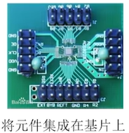

**第四代：大规模、超大规模集成电路时代**

采用大规模或超大规模的集成电路作为逻辑元件，开始出现微处理器、微型计算机。之后微型计算机逐渐步入个人计算机；个人计算机（PC）萌芽；

💡微处理器：CPU

| 发展阶段 | 时间      | 逻辑元件                | 速度（次/秒） | 内存          | 外存                        |
| -------- | --------- | ----------------------- | ------------- | ------------- | --------------------------- |
| 第一代   | 1949-1957 | 电子管                  | 几千-几万     | 汞延迟线/磁鼓 | 穿孔卡片/纸带               |
| 第二代   | 1958-1964 | 晶体管                  | 几万-几十万   | 磁芯存储器    | 磁带                        |
| 第三代   | 1964-1971 | 中小规模集成电路        | 几十万-几百万 | 半导体存储器  | 磁带/磁盘                   |
| 第四代   | 1972-现在 | 大规模/超大规模集成电路 | 上千万-万亿   | 半导体存储器  | 磁盘/磁带/光盘/半导体存储器 |

### 微处理器的发展

| 微处理器    | 机器字长（位） | 年份 | 晶体管数目 |
| :---------- | :------------- | ---: | ---------: |
| Intel 4004  | 4              | 1971 |       2300 |
| Intel 8080  | 8              | 1974 |       6000 |
| Intel 8088  | 16             | 1979 |      29000 |
| Intel 80286 | 16             | 1982 |     134000 |
| Intel 80386 | 32             | 1985 |     275000 |
| Intel 80486 | 32             | 1989 |    1180000 |
| Pentium     | 32             | 1993 |    3100000 |
| Pentium III | 32             | 1999 |   28100000 |
| Pentium 4   | 32             | 2000 |   42000000 |
| Core 2 Duo  | 64             | 2006 |  291000000 |

💡机器字长：计算机一次整数运算所能处理的二进制位数；微型计算机的发展以微处理器技术为标志；

### 目前的发展趋势

“两极“分化：

- 一极是微型计算机向更微型化，网络化，高性能，多用途方向发展；（手机）

- 另一极是巨型机向更巨型化，超高速，并行处理，智能化方向发展；（神威.太湖之光超级计算机）

  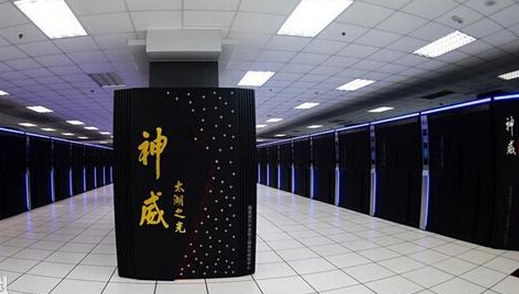

## 1.2 计算机硬件的基本组成

### 1.2.1 硬件的基本组成

 “存储程序”：是指将指令以二进制代码的形式事先输入计算机的主存储器（内存），然后按其在存储器中的首地址执行程序的第一条指令，以后就按该程序的规定顺序执行其他指令，直至程序执行结束。

#### 早期冯诺依曼机：（运算器为中心）

冯诺依曼计算机的特点：

1. 计算机由五大部件组成；
2. 指令和数据以同等地位存于存储器，可按地址寻访；
3. 指令和数据用二进制表示；
4. 指令由操作码和地址码组成；
5. 存储程序（会提前把指令和数据存储到存储程序中）；
6. 以运算器为中心；

>输入/输出设备与存储器之间的数据传送需要通过运算器完成，运算器本来是处理数据的核心部件，但是现在所有的数据中转都需要它来帮我们完成，就会导致数据计算的效率降低；

#### 现代的计算机：（存储器为中心）

由于控制器和运算器关系十分紧密，所以在大规模集成电路工艺出现了之后，这两个部件通常集成在同一个芯片上的，整合了这两个芯片的部件我们称之为CPU，CPU整合了运算器和控制器，可以将结构简化成：

### 1.2.2 各个硬件的工作原理

#### 主存储器的基本组成

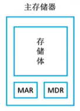

MAR：Memory Address Register（存储 **地址寄存器**）

MAR：Memory Data Register（存储 **数据寄存器**）

存储体会被分成一个一个的存储单元，每个存储单元中存放二进制代码数据称为存储字，每个存储字包含多少二进制位称为存储字长，用于存放二进制的电子元件称为存储元，每个存储元可以存储 1bit；

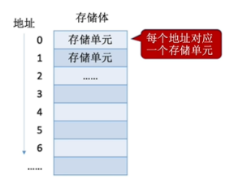

存储字长 = MDR位数

#### 运算器

运算器：用于实现算术运算（如：加减乘除），逻辑运算（如：与或非）

一个运算器有4个主要组成部分：ACC，MQ，X，ALU

**ACC**：累加器用于存放操作数或运算结果；
**MQ**：乘商寄存器，在乘除运算时，用于存放操作数或运算结果；
**X**：通用的操作数寄存器，用于存放操作数；
**ALU**：算术逻辑单元，通过内部复杂的电路实现算数运算，逻辑运算；

#### 控制器

控制器有三个主要组成部分：**CU**，IR，PC

**CU**：控制单元，分析指令，给出控制信号；
**IR**：指令寄存器，存放当前执行的指令；
**PC**：程序计数器，存放下一条指令地址，有自动加1功能；

完成一条指令的过程：

1. 根据PC中记录的指令地址 ，从内存中取出指令
2. 将取出的指令放入IR中进行指令分析
3. 分析完成后CU会控制相关部件完成这个指令的操作

### 1.2.3 计算机系统的层次结构

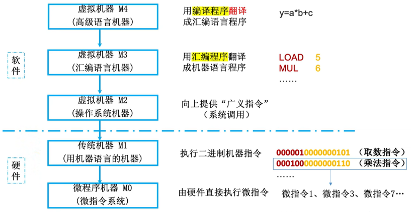

高级语言经过编译程序可以被翻译成汇编语言，然后经过汇编程序可以被翻译成机器语言，机器语言可以直接被识别；高级语言还可以直接通过解释程序翻译成机器语言；

**编译程序**：将高级语言编写的源程序全部语句一次性翻译成机器语言程序，而后再执行机器语言程序（只需翻译一次)

**解释程序**：将源程序的一条语句翻译成对应于机器语言的语句，并立即执行。紧接着再翻译下一句（每次执行都要翻译）

## 1.3 计算机性能指标

### 1.3.1 存储器性能指标

MDR位数 = 存储字长 = 每个存储单元的大小
MAR位数反映存储单元的个数（最多支持多少个，但实际值可能比他小)

总容量 = 存储单元个数 × 存储字长 bit = 存储单元个数 × 存储字长 / 8 Byte

>Eg：MAR为32位，MDR为8位；
>
>总容量 = 2^32 * 8 bit = 4GB

### 1.3.2 CPU性能指标

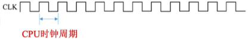

**CPU主频**：CPU内数字脉冲信号振荡的频率；将每个脉冲信号的时间称为CPU的时钟周期（单位：s、ns、us）

>脉冲信号：指挥CPU内部所有的部件来一步一步工作的节奏，就像广播体操一样，部件跟着节奏运行；

CPU主频（时钟频率） = 1/CPU时钟周期

**CPI（Clock cycle Per Instruction）**：执行一条指令所需的时钟周期数；

一般来说，CPU的性能跟主频有关，主频越高，CPU执行的频率越快，效率越高；但还受限于CPI，因为对于不同的CPU，执行相同的指令可能消耗不同的时钟周期；意思都执行乘法指令，因为乘法指令实际实现方式的不同，两个CPU所需要的时钟周期可能不一样；也跟主存（内存）有关系，比如存储器现在的负荷比较大，CPU想要取走一个数可能需要更多的CPI，即更多的时钟周期；

执行一条指令的耗时 = CPI * CPU时钟周期

>Eg：某CPU主频为1000Hz，某程序包含100条指令，平均来看指令的CPI=3。该程序在该CPU上执行需要多久？
>
>1/1000 * 3 * 100 = 0.3s

**IPS（Instructions Per Second）**：每秒执行多少条指令；

**FLOPS（Floating-point Operations Per Second）**：每秒执行多少次浮点运算；

### 1.3.3 系统整体的性能指标

**数据通路带宽**：数据总线一次所能并行传送信息的位数（各硬件部件通过数据总线传输数据）；比如有台计算机它的数据通路带宽为8bit，那么如果要在存储体里面读取16bit的数据到CPU里面就需要两次数据传输；

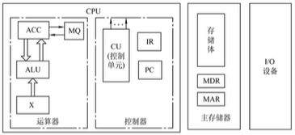

**吞吐量**：指系统在单位事件内处理请求的数量；

它取决于信息能多快地输入内存，CPU能多快地取指令，数据能多快地从内存取出或存入，以及所得结果能多快地从内存送给一台外部设备。这些步骤中的每一步都关系到主存，因此，系统吞吐量主要取决于主存的存取周期。

**响应时间**：指从用户向计算机发送一个请求，到系统对该请求做出响应并获得它所需要的结果的等待时间。

通常包括CPU时间（运行一个程序所花费的时间）与等待时间（用于磁盘访问、存储器访问、I/O操作、操作系统开销等时间）;

**基准程序**：跑分软件；

### Q&A

Q：主频高的CPU一定比主频低的CPU快吗？
A：不一定，如两个CPU，A的主频2GHz，平均CPI为10；B的主频为1GHz，平均CPI为1...

Q：若AB两个CPU的平均CPI相同，那么A的一定更快吗？
A：也不一定，还要看指令系统，如A不支持乘法指令，只能用多次加法实现乘法；而B支持乘法指令；

Q：基准程序执行得越快能说明机器性能越好吗？
A：基准程序中的语句存在拼读差异，运行结果也不能完全说明问题；

# 2. 数据的表示与运算

## 2.1 数制与编码

计算机系统内部都是通常用二进制进行编码的，原因有两点：

- 二进制只有两种状态，使用有两个稳定状态的物理器件就可以表示二进制的每一位；制造成本低，例如用高/低电平或电荷的正负极都可以很方便的表示；
- 二进制0/1正好与逻辑值“真” / “假” 相对应，为计算机实现逻辑运算和程序中的逻辑判断提供了遍历条件；

### 2.1.1 进位计数制

#### 进制转化

**任意进制 => 十进制**

基数：每个数码位所用到的不同符号的个数，r进制的基数就是r

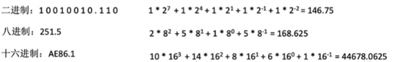

**二进制 <=> 八进制/十六进制**

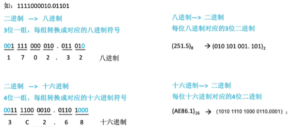

**十进制 => 任意进制**

在十进制转化为其他进制的时候，分为 **整数部分** 和 **小数部分** 分别转化；

整数部分：

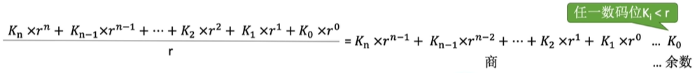

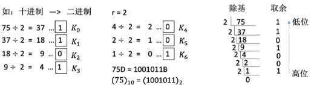

小数部分：

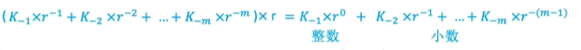

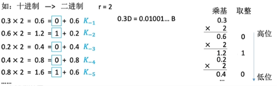

#### 真值和机器数

真值：符合人类习惯的数字；在日常生活中常用正负号来表示正数和负数，如+15 / -8 等；这种带 “+” ，“-” 号的数称为真值；真值是机器数所代表的实际值；

机器数：数字实际存到机器里的形式，正负号需要被 “数字化”；在计算机中，通常将数的符号和数值部分一起编码，将数据的符号数字化，通常用 “0” 表示 “正” ，用 “1” 表示 “负” 。这种把符号 “数字化” 的数称为 机器数；

## 2.2 定点数表示与运算

小数点的位置固定；Eg：996.007 --常规计数；

### 2.2.1 无符号数

无符号数：整个机器字长的全部二进制位均为数值位，没有符号位，相当于数的绝对值；Eg：10011100B = 156D

>n位的无符号数的表示范围位：0 ~ 2^n - 1

### 2.2.2 有符号数

#### 原码

 第一个二进制位表示符号：0正1负，其余位数表示数值；

**定点整数**

若机器字长位 n + 1 位，原码整数的表示范围：-（2^n - 1）<= x <= 2^n - 1；

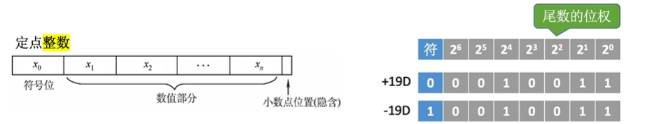

**定点小数**

若机器字长位 n + 1 位，原码小数的表示范围：-（1 - 2^-n）<= x <= 1 - 2^-n；

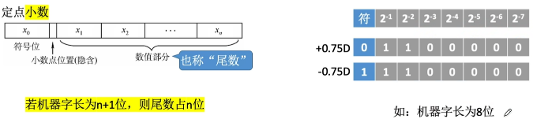

#### 反码

符号位为0，则反码与原码相同，若符号位位1，则数值位全部取反；

在计算机内部，反码是源码转换到补码的中间表示形式；实际没什么卵用；

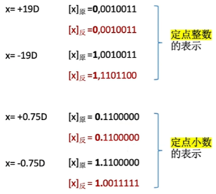

#### 补码

正数的补码 = 原码

负数的补码 = 反码末位 + 1（要考虑进位）

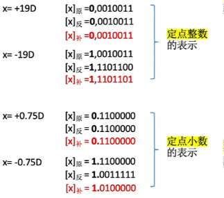

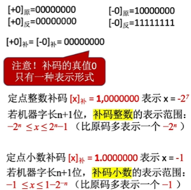

#### 移码

移码：补码的基础上将符号位取反。注意：移码只能用于表示整数；

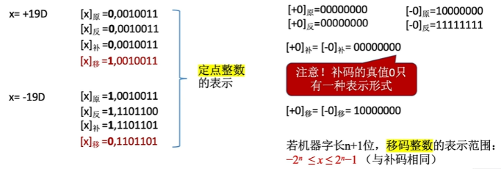

## 2.3 浮点数表示与运算

小数点的位置不固定；Eg：9.96007* 10^2 --科学计数法；

# 3. 存储系统

## 3.1 存储器概述

### 3.1.1 存储器的分类

#### 层次分类

- 告诉缓存（Cache）
- 主存储器（主存/内存）
- 辅助存储器（辅存/外存）

#### 存储介质分类

存储器都是存放二进制信息的；以存储介质进行分类；

1. 以半导体器件来存储信息，半导体存储器（主存/Cache）；

2. 以磁性材料存储信息，磁表面存储器（磁盘，磁带）；

   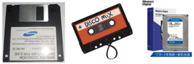

3. 以光介质存储信息，光存储器

#### 存取方式分类

1.  随机存储器：读写任何一个存储单元的时间需要的时间都相同，与存储单元所在的位置无关。

   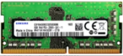

2.  顺序存储器：读写一个存储单元所需要的时间取决于存储单元所在的物理位置；

   

3.  直接存储器：既有随机存储的特性，又有直接存储的特性。先按照随机存储找到区域，然后按照顺序方式存取。

   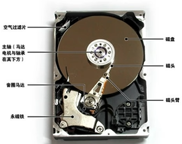

4.  相联存储器：按照存储内容进行访问的存储器。比如快表

#### 信息的可更改性分类

读写存储器（Read/Write Memory）：可存可读（如：磁盘，内存，Cache）

只读存储器（Read Only Memory）：只能读不能存，（如：实体音乐专辑通常采用CD-ROM）

#### 可保存性分类

易失性存储器：断电后存储信息就消失的存储器，比如主存，Cache

非易失性存储器：断电后存储信息依然保存，如磁盘，光盘

### 3.1.2 多层存储器结构

在存储体系中，Cache，主存能与CPU直接交换信息，则辅存则需要通过主存与CPU交换信息；主存与CPU，Cache，辅存都能交换信息；

辅存也就是所说的硬盘，平常使用的微信/游戏都是放在辅存中的；但是辅存的读写速度会比较慢，因此CPU不能和辅存进行直接的交互，是因为CPU的数据处理速度很快，如果让快速的CPU去直接读取辅存的数据，CPU处理数据的速度会被辅存读写数据的速度拖累；所以我们平常比如启动微信，就会微信相关的数据从辅存调入到主存；当微信的程序数据放入到主存之后，CPU就开始运行微信相关的代码；然后就可以正常的使用微信了；

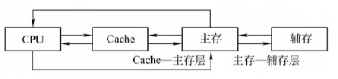

为了解决存储系统大容量/高速度/低成本这三个相互制约的矛盾，在计算机系统中通常采用多级存储器结构，如下图所示；实际上存储系统层次结构主要体现在 Cache-主存层 和 主存-辅存层；

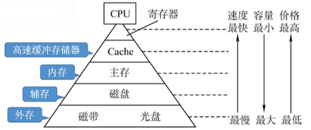

主存 - 辅存：实现了虚拟存储系统，解决了主存容量不够的问题；且主存-辅存是通过硬件和操作系统进行实现的；

Cache - 主存：解决了CPU和主存速度不匹配的问题；且Cache - 主存是通过硬件自动完成的；

### 3.1.3 存储器的性能指标

主要的性能指标有三个：存储容量，单位成本，存储速度。设计存储器的目标是大容量，低成本，高速度。

存储容量：即存储器中可存储的信息比特数。存储容量=存储字数*字长（如1M *8位）

单位成本：每位价格=总价格/总容量

存取速度：数据传输率=数据宽度/存储周期（数据宽度即存储字长）

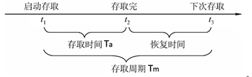

存取时间：指从开始存储到结束存储的时间，分为读取时间和写入时间

存取周期：指存储器进行一次完整的读写操作所需要的时间、即两次访问存储器操 作的时间间隔，一般大于存取时间（因为包括恢复时间）

主存带宽：主存带宽又称数据传输率，表示每秒从主存进出信息的最大数量，单位为字节/秒（B/s）或位/秒（b/s）

## 3.2 主存储器

### 3.3.1 SRAM和DRAM

### 3.3.2 只读存储器ROM

### 3.3.3 主存储器的基本组成

#### 半导体元件的原理

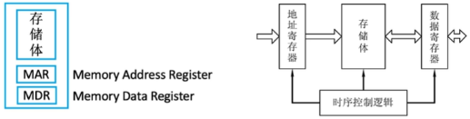

存储体是由多个存储元构成的，也就是存储元件；

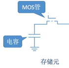

>MOS管可以理解为一种电控开关，输入电压达到某个阈值时，MOS管就可以接通；因此才会叫半导体，因为它不属于导体，也不属于绝缘体；

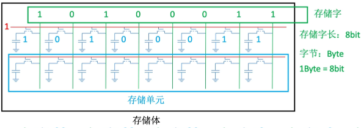

当给MOS管施加电压时候，如果电容里面存在电荷，就会形成通路；电容管中的电荷就会顺着导线往外流，最终被绿色的线检测到，从而判断是0还是1；

当给绿色线和红色线施加电压的时候，电容上极就会有电压，只要电容两块金属板之间有电压差，就会导致电容里面的电荷就会移动，从而电容就会存储一些电荷；然后在将红线断开，电容里的电荷就跑不出去了；

#### 存储器芯片的基本原理

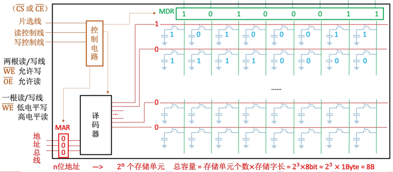

如何根据地址寄存器中的地址去读/写哪一个存储字呢？

需要借助一种叫译码器，译码器后面会连接所有的存储单元，MAR的地址最终会转换成译码器对应的自选线的高电平，即将红色线打通，当被接通之后，就可以通过数据线把每一位的二进制信息传输到MDR当中；然后CPU会通过数据总线从MDR当中取走这一整个字的数据；

控制电路是来控制MAR，MDR，以及译码器的；比如CPU通过地址总线将地址送到MAR当中，但是由于使用的是电信号来传送二进制数据，而电信号难免会有不稳定的情况，因此当MAR里面的电信号稳定之前，地址信息是不能送到译码器的，只有MAR稳定之后才会打开译码器的开关，让译码器翻译这个地址往下走；

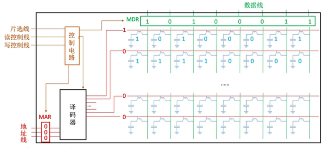

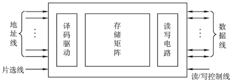

片选线的作用，比如下面的内存条，可能有多个存储芯片构成，加入我想取的数据是在其中一个存储芯片中的指定地址，就需要这个芯片的片选线生效；也就是给个低电平，其他的芯片的片选线给个高电平，就可以保证此次读取的就是指定数据；

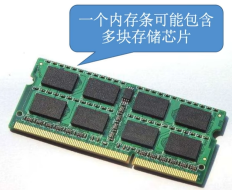

# 4. 指令系统

# 5. 中央处理器

# 6. 总线

# 7. 输入输出系统
