# webpack

https://webpack.js.org/

传统引包方式，自上而下加载，业务代码依赖上方的库那么顺序就一定不能颠倒，这种方式就很不容易扩展。

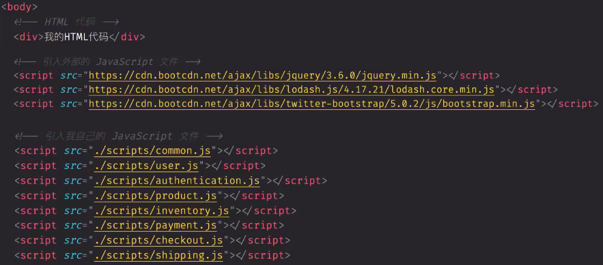

那将这些文件按照一定的顺序合并到一个文件中也可以解决问题， 下面这个js文件包含了11个js文件，是项目中的所有的文件，能解决顺序问题，但还是会出现**作用域问题**，**文件太大**，**可读性差**，**可维护性差**问题。

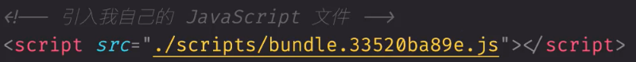

所以不得不对代码进行拆分，对于代码拆分可以使用nodejs基于common.js的模块化，但这种不能在浏览器中运行，所以又使用了esmodule来直接做模块处理。但这种方式浏览器的支持又不够完整。因此提出了webpack这样的工具，支持esmodule和common.js两种打包js的方案。

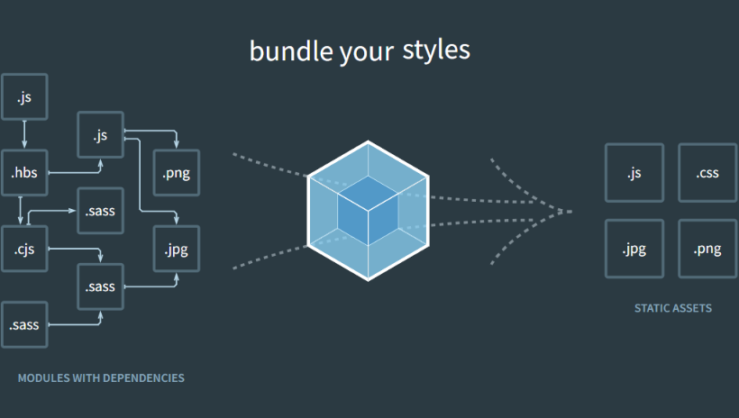

## quick start

### 安装Webpack

>在安装`webpack`之前确保本地安装了`Node.js`，因为`webpack`是构建在`Nodejs`基础之上的


**全局安装**

```shell
npm install webpack webpack-cli --global
```

>不推荐全局安装webpack。这会将你的项目中的webpack锁定到某一个指定的版本，并且在使用不同的webpack版本的项目，可能会导致构建失败。


**本地安装**

本地安装webpack之前，先去安装一个npm的包管理的配置文件

```shell
npm init -t
```

在项目的根路径下会产生一个package.json

```shell
npm install webpack webpack-cli --save-dev
```

>是否使用`--save-dev`取决于你的应用场景。假设你仅使用webpack进行构建操作，那么建议你在安装时使用`--save-dev`选项，因为可能你不需要在生产环境上使用webpack。如果需要应用与生产环境，请忽略`--save-dev`选项。

### 运行Webpack

```js
// helloworld.js
function helloWorld() {
    console.log('hello world');
}
export default helloWorld;
```


```js
// index.js
import helloWorld from './hello-world';
helloWorld()
```


```html
<!DOCTYPE html>
<html lang="en">
<head>
    <meta charset="UTF-8">
    <title>Webpack5</title>
</head>
<body>
    <script src="./src/index.js"></script>
</body>
</html>
```

>因为局部安装webpack，在Terminal中是找不到webpack命令的，但又不想全局安装webpack，所以在package.json中添加个别名来运行webpack

```shell
"scripts": {
	"test": "echo \"Error: no test specified\" && exit 1",
	"build": "webpack"
},
```

运行Webpack，结果如下：

```shell
D:\Environment\nvm\nodejs\npm.cmd run build

> webpack@1.0.0 build
> webpack

asset main.js 50 bytes [emitted] [minimized] (name: main)
orphan modules 89 bytes [orphan] 1 module
./src/index.js + 1 modules 144 bytes [built] [code generated]

WARNING in configuration
The 'mode' option has not been set, webpack will fallback to 'production' for this value.
Set 'mode' option to 'development' or 'production' to enable defaults for each environment.
You can also set it to 'none' to disable any default behavior. Learn more: https://webpack.js.org/configuration/mode/

webpack 5.101.3 compiled with 1 warning in 1246 ms

Process finished with exit code 0
```

在没有任何配置的情况下运行Webpack，这里还有个警告`mode`选项没有设置。从结果上看，webpack为生成了一个main.js文件，具体见下图：

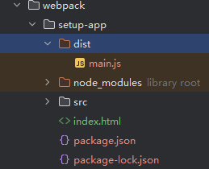

`main.js`信息如下：

```js
(()=>{"use strict";console.log("hello world")})();
```

此时就是生成的代码，`asset main.js`是从`src`打包出来的，src中正好有一个index.js就成为它默认默认打包的入口文件。通过配置可以配置入口文件路径和文件名。

### 自定义Webpack配置


```shell
npx webpack --help

PS E:\Beanmeat_project\Beanmeat_note> npx webpack --help 
Usage: webpack [entries...] [options]
Alternative usage to run commands: webpack [command] [options]

The build tool for modern web applications.

Options:
  -c, --config <pathToConfigFile...>     Provide path to one or more webpack configuration files to process, e.g. "./webpack.config.js".
  --config-name <name...>                Name(s) of particular configuration(s) to use if configuration file exports an array of multiple configurations.
  -m, --merge                            Merge two or more configurations using 'webpack-merge'.
  --disable-interpret                    Disable interpret for loading the config file.
  --env <value...>                       Environment variables passed to the configuration when it is a function, e.g. "myvar" or "myvar=myval".
  --node-env <value>                     Sets process.env.NODE_ENV to the specified value for access within the configuration.(Deprecated: Use '--config-node-env' instead)
  --config-node-env <value>              Sets process.env.NODE_ENV to the specified value for access within the configuration.
  --analyze                              It invokes webpack-bundle-analyzer plugin to get bundle information.
  --progress [value]                     Print compilation progress during build.
  -j, --json [pathToJsonFile]            Prints result as JSON or store it in a file.
  --fail-on-warnings                     Stop webpack-cli process with non-zero exit code on warnings from webpack.
  -d, --devtool <value>                  A developer tool to enhance debugging (false | eval | [inline-|hidden-|eval-][nosources-][cheap-[module-]]source-map).
  --no-devtool                           Negative 'devtool' option.
  --entry <value...>                     A module that is loaded upon startup. Only the last one is exported.
  -e, --extends <value...>               Path to the configuration to be extended (only works when using webpack-cli).
  --mode <value>                         Enable production optimizations or development hints.
  --name <value>                         Name of the configuration. Used when loading multiple configurations.
  -o, --output-path <value>              The output directory as **absolute path** (required).
  --stats [value]                        Stats options object or preset name.
  --no-stats                             Negative 'stats' option.
  -t, --target <value...>                Environment to build for. Environment to build for. An array of environments to build for all of them when possible.
  --no-target                            Negative 'target' option.
  -w, --watch                            Enter watch mode, which rebuilds on file change.
  --no-watch                             Negative 'watch' option.
  --watch-options-stdin                  Stop watching when stdin stream has ended.
  --no-watch-options-stdin               Negative 'watch-options-stdin' option.

Global options:
  --color                                Enable colors on console.
  --no-color                             Disable colors on console.
  -v, --version                          Output the version number of 'webpack', 'webpack-cli' and 'webpack-dev-server' and commands.
  -h, --help [verbose]                   Display help for commands and options.

Commands:
  build|bundle|b [entries...] [options]  Run webpack (default command, can be omitted).
  configtest|t [config-path]             Validate a webpack configuration.
  help|h [command] [option]              Display help for commands and options.
  info|i [options]                       Outputs information about your system.
  serve|server|s [entries...]            Run the webpack dev server and watch for source file changes while serving. To see all available options you need to install 'webpack', 'webpack-dev-server'.
  version|v [options]                    Output the version number of 'webpack', 'webpack-cli' and 'webpack-dev-server' and commands.
  watch|w [entries...] [options]         Run webpack and watch for files changes.
```


命令行不能直接保存我们配置的信息不直观，因此webpack给我提供了同一个一个配置文件来自定义配置参数。在项目的根路径下新建一个文件名字`webpack.conf.js`，这个名字不能修改，是要webpack自动去读取的，因为这个文件是在`nodejs`环境下运行的，所以我们在定义模块的时候，得使用`nodejs`的`commonJs`模块。

```js
module.exports = {
    entry: './src/index.js',

    output: {
        filename: 'bundle.js',
        path: './dist'
    },
    mode: "none"
}
```

如果这样配置运行`webpack`会导致报错，效果如下：

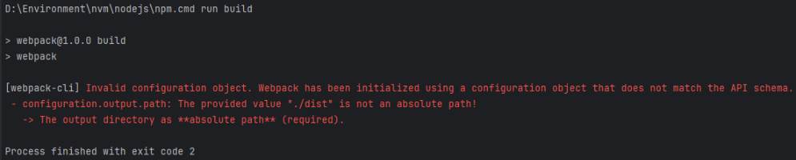

要求路径必须是绝对路径，所以需要借助nodejs中的path模块来构建绝对路径

```js
const path = require('path');

module.exports = {
    entry: './src/index.js',

    output: {
        filename: 'bundle.js',
        path: path.resolve(__dirname, './dist'),
    },
    mode: "none"
}
```

再次输入命令成功打包，效果如下：

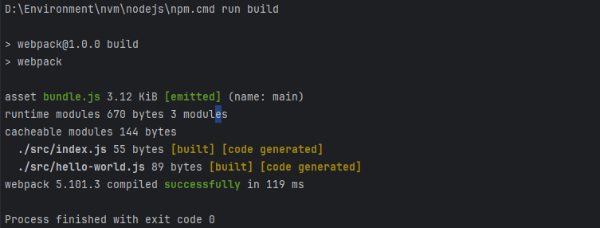

然后运行项目后发现报错

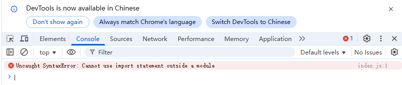

是因为页面引用的`js`代码，浏览器不能正确解析了，我们需要引用打包好的`js`代码才对。修改`index.html`

```html
<!DOCTYPE html>
<html lang="en">
<head>
    <meta charset="UTF-8">
    <title>Webpack5</title>
</head>
<body>
    <script src="./dist/bundle.js"></script>
</body>
</html>
```


## 自动引入资源

到目前为止，都是通过`index.html`文件中手动引入所有资源，然而随着应用程序增长，如果继续手动管理`index.html`文件，就会变得困难起来，然而，通过一些插件可以使这个过程更容易管控。使用`webpack`插件就可以实现。


### webpack插件

插件是`webpack`的核心功能。插件可以用于执行一些特定的任务，包括：打包优化，资源管理，注入环境变量等。`webpack`自身也是构建于你在`webpack`配置中用到的`相同的插件系统`之上！

想要使用一个插件，你只需要`require()`它，然后把它添加到`plugins`数组中。多数插件可以通过选项(option)自定义。你也可以在一个配置文件中因为不同目的而多次使用同一个插件，这时需要通过使用`new`操作符来创建一个插件实例。

`webpack`官方提供了很多开箱即用的插件：https://webpack.js.org/plugins/

### [HtmlWebpackPlugin](https://webpack.js.org/plugins/html-webpack-plugin/)

The HtmlWebpackPlugin simplifies creation of HTML files to serve your webpack bundles. This is especially useful for webpack bundles that include a hash in the filename which changes every compilation. You can either let the plugin generate an HTML file for you, supply your own template using lodash templates, or use your own loader.

#### Installation

```shell
npm install --save-dev html-webpack-plugin
```

#### Basic Usage

The plugin will generate an HTML5 file for you that includes all your webpack bundles in the body using `script` tags. Add the plugin to your webpack configuration as follows:

```shell
const path = require('path');
const HtmlWebpackPlugin = require('html-webpack-plugin');

module.exports = {
    entry: './src/index.js',

    output: {
        filename: 'bundle.js',
        path: path.resolve(__dirname, './dist'),
    },
    mode: "none",

    plugins: [new HtmlWebpackPlugin()]
}
```

运行webpack后，打包后的dist目录下面出现两个文件，一个是`bundle.js`，一个是`index.html`

This will generate a file `dist/index.html` containing the following:

```html
<!DOCTYPE html>
<html>
  <head>
    <meta charset="utf-8">
    <title>Webpack App</title>
  <meta name="viewport" content="width=device-width, initial-scale=1"><script defer src="bundle.js"></script></head>
  <body>
  </body>
</html>
```

插件生成的html跟自己写的本身没有任何关系，如果向产生关系，需要通过修改配置来实现。

```js
const path = require('path');
const HtmlWebpackPlugin = require('html-webpack-plugin');

module.exports = {
    entry: './src/index.js',

    output: {
        filename: 'bundle.js',
        path: path.resolve(__dirname, './dist'),
    },
    mode: "none",

    plugins: [new HtmlWebpackPlugin({
        template: path.resolve(__dirname, './index.html'),
        filename: "app.html", // 生成的文件名字
        inject: 'body' // 标签注入到body标签里面
    })]
}
```

再次运行webpack之后，生成出来的html效果如下：

```html
<!DOCTYPE html>
<html lang="en">
<head>
    <meta charset="UTF-8">
    <title>Webpack5</title>
</head>
<body>
<script defer src="bundle.js"></script></body>
</html>
```

#### 清理上次打包内容

仔细留意一下，上次打包后的文件是依旧存在的，已经没有用了，webpack将生成文件并防止在dist文件夹中，但是它不会追踪那些文件是在项目中用到的。通常比较推荐的做法是，在每次构建前清理`/dist`文件夹，这样只会生成用到的文件。

```js
const path = require('path');
const HtmlWebpackPlugin = require('html-webpack-plugin');

module.exports = {
    entry: './src/index.js',

    output: {
        filename: 'bundle.js',
        path: path.resolve(__dirname, './dist'),
        clean: true // 清理上次打包信息
    },
    mode: "none",

    plugins: [new HtmlWebpackPlugin({
        template: path.resolve(__dirname, './index.html'),
        filename: "app.html", // 生成的文件名字
        inject: 'body' // 标签注入到body标签里面
    })]
}
```

## 搭建开发环境

截至目前，只能通过复制`dist/index.html`完整物理路径到浏览器地址栏里访问页面。现在来看如何设置一个开发环境，使开发体验轻松。

### mode

开始前，先将`mode`设置为`development`

```js
module.exports = {
    // ...
    mode: "development",
	// ...
}
```

### source map

当webpack打包源代码时，可能会很难追踪到error（错误）和warning（警告）在源代码中的原始位置。例如，如果将三个源文件（`a.js, b.js, c.js`）打包到一个`bundle.js`中，而其中一个源文件包含一个错误，那么堆栈跟踪就会指向到`bundle.js`。你可能需要精准的知道错误来自于哪个源文件，所以这种提示通常不会提供太大帮助。

为了更容易地追踪 error 和 warning，Javascript 提供了 `source maps` 功能，可以将编译后的代码映射回原始源代码。如果一个错误来自于`b.js`，source map就会明确告诉你。

使用`inline-source-map`选项：

```js
module.exports = {
     devtool: 'inline-source-map', // 在开发模式下追踪代码
}
```

配置完之后，在hello-world.js文件中产生一个错误。

```js
function helloWorld() {
    // 拼写错误
    sole.log('hello world');
}

export default helloWorld;
```

再次编译，再次打开Sources，查看的是具体我们编写的文件内容，这样精确定位错误的行数。

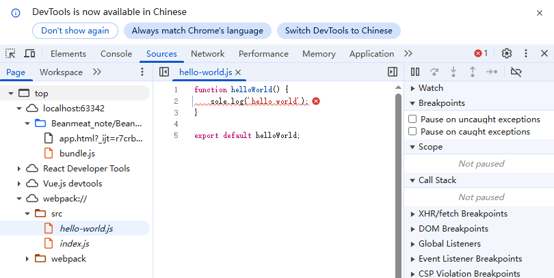

### watch mode（观察模式）

在每次编译代码时，手动运行`npx webpack`会显得很麻烦。

我们可以在 webpack 启动时添加 `watch`参数。如果其中一个文件被更新，代码将重新编译。所以你不必再去手动运行整个构建。

```shell
npx webpack --watch
```

当修改源文件的时候，会发现终端重新编译

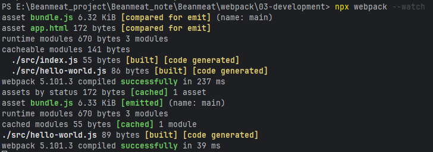

现在保存文件并检查Terminal（终端）窗口，应该可以看到webpack自动地重新编译模块，唯一的缺点就是，为了看到修改后的实际效果，需要刷新浏览器，如果能够自动刷新浏览器就更好了，`webpack-dev-server`实现此功能。

### webpack-dev-server

`webpack-dev-server`提供了一个基本的 web-server，并且具有 live reloading（实时重新加载）功能，先安装：

```shell
npm install --save-dev webpack-dev-server
```

安装成功后，修改配置文件，告知 dev server，从什么位置查找文件：

```js
module.exports = {
	// ...
    devServer: {
        static: './dist'
    }
    // ...
}
```

以上配置告知`webpack-dev-server`，将`dist`目录下的文件作为`web`服务的根目录。

>webpack-dev-server在编译之后不会写入到任何输出文件。而是将bundle文件保留在内存中，然后将它们serve到server中，就好像它们挂载在server根路径上的真是文件一样。

执行命令：

```shell
npx webpack-dev-server
```

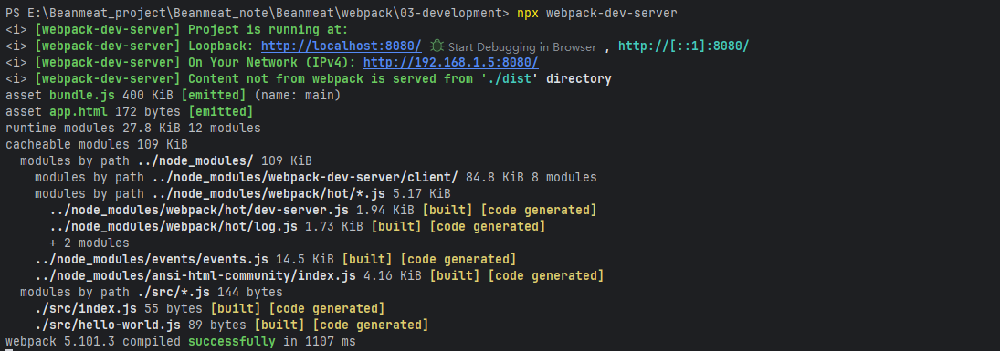

## 资源模块

目前可以在控制台上显示简单信息，现在混合一些其他资源，比如 images。

在 webpack出现之前，前端会使用`grunt`和`gupl`等工具来处理资源，并将它们从`/src`文件夹移动到`/dist`或`build`目录中。webpack最出色的功能就是除了引入Javascript，还可以内置的资源模块`Asset Modules`引入任何其他类型的文件。

资源模块（asset module）是一种模块类型，它允许我们应用webpack来打包其他资源文件（如字体，图标等）

资源模块类型（asset module type），通过添加4中新的模块类型，来替换所有这些loader：

- `asset/resource`发送一个单独的文件并导出URL
- `asset/inline`导出一个资源的 data URI
- `asset/source`导出资源的源代码
- `asset` 在导出一个data URI和发送一个单独的文件之间自动选择

### Resource资源

修改`webpack.config.js`配置：

```js
module.exports = {
    // ...
    // 配置资源文件
    module: {
        rules: [{
            test: /\.png/,
            type: 'asset/resource',
        }]
    }
    // ...
}
```

在src下加入img图片，并修改index.js代码。

```js
import helloWorld from './hello-world';
import imgSrc from './assets/temp.png';

helloWorld()

const img = document.createElement('img');
img.src = imgSrc;
document.body.appendChild(img);
```

执行打包命令：`npx webpack` ，发现png文件已经导报到了dist目录下：

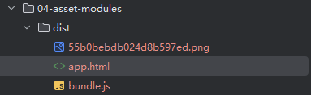

执行启动服务命令：

```shell
npx webpack serve --open
```

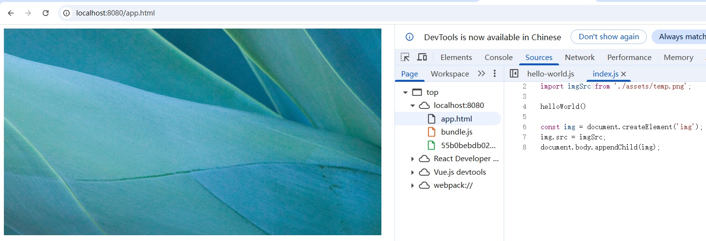

#### 自定义输出文件名

默认情况下，`asset/resource`模块以 **[contenthash\]\[ext][query]**文件名发送到输出目录。可以通过webpack配置中设置`output.assetModuleFilename`来修改此模板字符串：

```shell
assetModuleFilename: 'images/[contenthash][ext][query]'
```


```js
module.exports = {
    // ...
    output: {
        // ...
        assetModuleFilename: 'images/[contenthash][ext][query]',
    }
    // ...
}
```

输出结果与`assetModuleFilename`设置一样，编译效果如下：

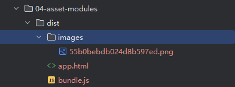

### inline资源

修改`webpack.config.js`配置：

```js
module.exports = {
    // ...
    // 配置资源文件
    module: {
        rules: [
            // ...
            {
                test: /\.svg$/,
                type: 'asset/inline'
            }
        ]
    }
}
```

修改index.js代码，引入svg资源，看打包效果。

```js
import helloWorld from './hello-world';
import imgSrc from './assets/temp.png';
import logoSrc from './assets/webpack.svg';

helloWorld()

const img = document.createElement('img');
img.src = imgSrc;
document.body.appendChild(img);

const img2 = document.createElement('img');
img2.style.cssText = 'width:200px;height:100px;';
img2.src = logoSrc;
document.body.appendChild(img2);
```

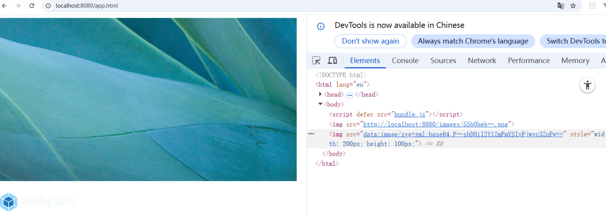

可见，`.svg`文件都将作为data URI注入到bundle中。

#### 自定义data URI生成器

webpack输出的data URI，默认是呈现为使用 Base64 算法编码的文件内容。如果要使用自定义编码算法，则可以指定一个自定义函数来编码文件内容。

安装自定义函数模块：

```shell
npm install mini-svg-data-uri -D
```

修改配置文件：

```js
const svgToMiniDataURI = require('mini-svg-data-uri')

module.exports = {
    // ...

    // 配置资源文件
    module: {
        rules: [
             // ...
            {
                test: /\.svg$/,
                type: 'asset/inline',
                generator: {
                    dataUrl: content => {
                        content =  content.toString();
                        return svgToMiniDataURI(content);
                    }
                }
            }
        ]
    }
}
```

现在所有`.svg`文件都将通过`mini-svg-data-uri`包进行编码。重新启动服务，在浏览器查看效果，看URI编码效果：

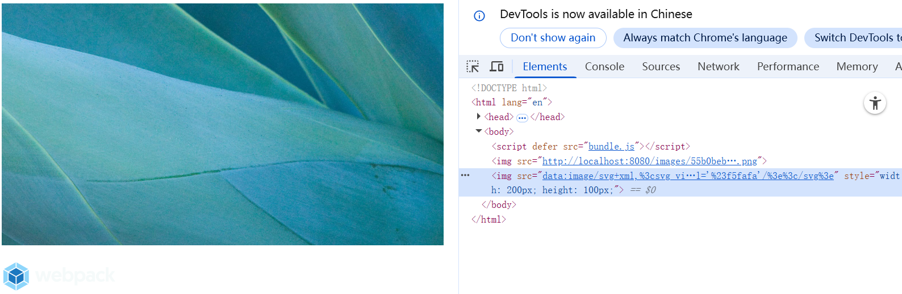

### source资源

source资源，导出资源的源代码。修改配置文件，添加：

```js
module.exports = {
    // ...

    // 配置资源文件
    module: {
        rules: [
            // ...
            {
                test: /\.txt$/,
                type: 'asset/source'
            }
        ]
    }
}
```

在assets里面创建一个`example.txt`文件，然后修改`index.js`文件

```js
import helloWorld from './hello-world';
import imgSrc from './assets/temp.png';
import logoSrc from './assets/webpack.svg';
import exampleTxt from './assets/example.txt';

helloWorld()

const img = document.createElement('img');
img.src = imgSrc;
document.body.appendChild(img);

const img2 = document.createElement('img');
img2.style.cssText = 'width:200px;height:100px;';
img2.src = logoSrc;
document.body.appendChild(img2);

const block = document.createElement('div');
block.style.cssText = 'width:200px;height:200px; background:blue;';
block.textContent = exampleTxt;
document.body.appendChild(block);
```

重启服务，打开浏览器：


所有`.txt`文件将原样注入到 bundle中。

### 通用资源类型

通用资源类型`asset`，在导出一个data URI和发送一个单独的文件之间自动选择。

修改配置文件：

```js
module.exports = {
  	// ...

    // 配置资源文件
    module: {
        rules: [
            // ...
            {
                test: /\.jpg$/,
                type: 'asset'
            }
        ]
    }
}
```

现在`webpack`将按照默认条件，自动地在`resource`和`inline`之间进行选择：小于8kb的文件，将会视为`inline`模块类型，否则会被视为`resource`模块类型。

可以通过`webpack`配置的 module rule层级中，设置选项来修改此条件。

```js
module.exports = {
  	// ...

    // 配置资源文件
    module: {
        rules: [
            // ...
            {
                test: /\.jpg$/,
                type: 'asset',
                parser: {
                    dataUrlConditon: {
                        maxSize: 4 * 1024 // 4kb
                    }
                }
            }
        ]
    }
}
```

## 管理资源

除了四种资源模块引入外部资源，还可以通过loader引入其他类型的文件。

### loader

webpack只能理解JavaScript和JSON文件，这是webpack开箱可用的自带能力。**loader**让webpack能够去处理其他类型的文件，并将它们转换为有效模块，以供引用程序使用，以及被添加到依赖图中。

在`webpack`的配置中，**loader**有两个属性：

1. `test`属性，识别出哪一个文件会被转换。
2. `use`属性，定义出在进行转换时，应该使用哪一个loader。

```js
const path = require('path')

module.exports = {
    output: {
        filename: 'my-first-webpack.bundle.js'
    }
    module: {
    	rules: [{ test: /\.txt$/, use: 'raw-loader' }]
	}
}
```

以上配置中，对一个单独的module对象定义了`rules`属性，里面包含了两个必须属性：`test`和`use`，这告诉webpack编辑器（compiler）如下信息：

>当你碰到【在`require()`/`import`语句中被解析为'.txt'的路径】时，在你对它打包之前，先使用`use(使用)`row-loader 转换一下。

### 加载css

为了在JavaScript模块中`import`一个CSS文件，你需要安装`style-loader`和`css-loader`，并在`module配置`中添加这些loader：

```shell
npm install --save-dev style-loader css-loader
```

修改配置文件：

```js
module.exports = {
    // ...

    // 配置资源文件
    module: {
        rules: [
            // ...
            {
                test: /\.css$/,
                use: ['style-loader', 'css-loader']
            }
        ]
    }
}
```

模块loader可以链式调用。链中的每一个loader都将对资源进行转换。链会逆序执行。第一个loader将其结果（被转换后资源）传递给下一个loader，一次类推。最后，webpack期望链中的最后的loader返回javaScript。

应保证loader的先后顺序：`style-loader`在前，而`css-loader`在后，如果不遵守，webpack会报错。webpack根据正则表达式来确定应该找哪些文件，并将其提供给指定的loader，在这个示例中，所有以`.css`结尾的文件，都将被提供给`style-loader`和`css-loader`。

这使你可以在依赖于此样式的js文件中`import './style.css'`。现在在此模块执行过程中，含有css字符串的`<style>`标签，将被插入到html文件的`<head>`中。

在项目中添加一个新的`style.css`文件，并将其import到我们的`index.js`中：

```js
import helloWorld from './hello-world';
import imgSrc from './assets/temp.png';
import logoSrc from './assets/webpack.svg';
import exampleTxt from './assets/example.txt';
import hello from './assets/style.css'

helloWorld()

const img = document.createElement('img');
img.src = imgSrc;
document.body.appendChild(img);

const img2 = document.createElement('img');
img2.style.cssText = 'width:200px;height:100px;';
img2.src = logoSrc;
document.body.appendChild(img2);

const block = document.createElement('div');
block.style.cssText = 'width:200px;height:200px; background:blue;';
block.textContent = exampleTxt;
document.body.appendChild(block);

document.body.classList.add('hello');
```

启动服务，打开浏览器

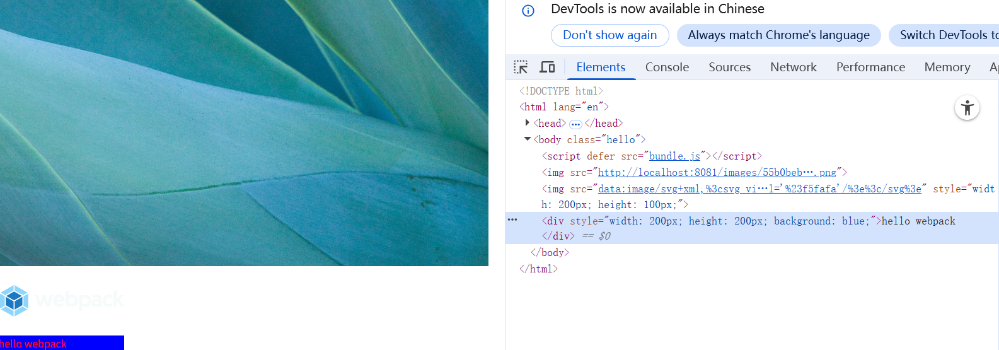

现有的loader可以支持任何你可以想到的CSS风格，-`sass`和`less`等。安装less-loader：

```shell
npm install less less-loader --save-dev
```

修改配置文件

```js
const path = require('path');
const HtmlWebpackPlugin = require('html-webpack-plugin');
const svgToMiniDataURI = require('mini-svg-data-uri')

module.exports = {
    // ...

    // 配置资源文件
    module: {
        rules: [
            // ...
            {
                test: /\.less$/,
                use: ['style-loader', 'css-loader','less-loader']
            }
        ]
    }
}
```

在项目`src`目录下创建`style.less`文件：

```less
@color: green;
.world {
    color: @color;
}
```

在入口文件中引入`.less`文件：

```js
import helloWorld from './hello-world';
import imgSrc from './assets/temp.png';
import logoSrc from './assets/webpack.svg';
import exampleTxt from './assets/example.txt';
import hello from './assets/style.css'
import world from './assets/beanmeat.less';

helloWorld()

const img = document.createElement('img');
img.src = imgSrc;
document.body.appendChild(img);

const img2 = document.createElement('img');
img2.style.cssText = 'width:200px;height:100px;';
img2.src = logoSrc;
document.body.appendChild(img2);

const block = document.createElement('div');
block.style.cssText = 'width:200px;height:200px; background:blue;';
block.textContent = exampleTxt;
document.body.appendChild(block);

document.body.classList.add('hello');
document.body.classList.add('world');
```


### 抽离和压缩CSS

在多数情况下，我们也可以进行压缩CSS，以便在生产环境中节省加载时间，同时还可以将CSS文件抽离成一个单独的文件。实现这个功能，需要`mini-css-extract-plugin`这个插件来帮忙。安装插件：

```shell
npm install mini-css-extract-plugin --save-dev
```

本插件会将css提取到单独的文件中，为每一个CSS的JS文件创建一个CSS文件，并且支持CSS和SourceMaps的按需加载。

这个插件基于webpack5 v5的新特性构建，并且需要webpack5才能正常工作。之后将loader与plugin添加到webpack配置文件中：

```js
module.exports = {
    // ...
	 plugins: [
        // ...
        new MiniCssExtractPlugin()
    ],
    // 配置资源文件
    module: {
        rules: [
            // ...
            {
                test: /\.css$/,
                use: [MiniCssExtractPlugin.loader, 'css-loader']
            }
        ]
    }
}
```

执行编译，查看打包信息：

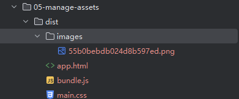

单独的`mini-css-extract-plugin`插件不会将这些CSS加载到页面中。这里`html-webpack-plugin`帮助我们自动生成`link`标签或者在创建`index.html`文件时使用`link`标签。

>/dist/app.html
>
>```html
><!DOCTYPE html>
><html lang="en">
><head>
>    <meta charset="UTF-8">
>    <title>Webpack5</title>
><link href="main.css" rel="stylesheet"></head>
><body>
><script defer src="bundle.js"></script></body>
></html>
>```

`link`标签已经生成出来了，把我们打包好的`main.css`文件加载进来。`main.css`文件被打包抽离到`dist`根目录下，能否将其打包到一个单独的文件夹里面呢？修改配置文件：

```js
const path = require('path');
const HtmlWebpackPlugin = require('html-webpack-plugin');
const svgToMiniDataURI = require('mini-svg-data-uri')
const MiniCssExtractPlugin = require('mini-css-extract-plugin');

module.exports = {
    // ...

    plugins: [
        // ...
        new MiniCssExtractPlugin({
            filename: 'style/[contenthash].css'
        })
    ],

    // 配置资源文件
    module: {
        rules: [
            // ...
            {
                test: /\.(css|less)$/,
                use: [MiniCssExtractPlugin.loader, 'css-loader','less-loader']
            }
        ]
    }
}
```

再次执行编译，查看打包完成后的目录和文件：

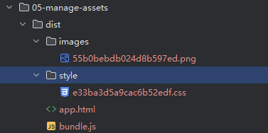

>/dist/app.html
>
>```html
><!DOCTYPE html>
><html lang="en">
><head>
>    <meta charset="UTF-8">
>    <title>Webpack5</title>
><link href="style/e33ba3d5a9cac6b52edf.css" rel="stylesheet"></head>
><body>
><script defer src="bundle.js"></script></body>
></html>
>```

`app.html`文件引用的路径同样更新了。

>/dist/style/e33ba3d5a9cac6b52edf.css
>
>```css
>/*!*****************************************************************************************************************!*\
>  !*** css ../node_modules/css-loader/dist/cjs.js!../node_modules/less-loader/dist/cjs.js!./src/assets/style.css ***!
>  \*****************************************************************************************************************/
>.hello {
>  color: red;
>}
>
>/*!*********************************************************************************************************************!*\
>  !*** css ../node_modules/css-loader/dist/cjs.js!../node_modules/less-loader/dist/cjs.js!./src/assets/beanmeat.less ***!
>  \*********************************************************************************************************************/
>.world {
>  color: green;
>}
>
>
>/*# sourceMappingURL=data:application/json;charset=utf-8;base64,eyJ2ZXJzaW9uIjozLCJmaWxlIjoic3R5bGUvZTMzYmEzZDVhOWNhYzZiNTJlZGYuY3NzIiwibWFwcGluZ3MiOiI7OztBQUFBO0VBQ0k7QUFDSjs7Ozs7QUNEQTtFQUNFO0FBQUYiLCJzb3VyY2VzIjpbIndlYnBhY2s6Ly8vLi9zcmMvYXNzZXRzL3N0eWxlLmNzcyIsIndlYnBhY2s6Ly8vLi9zcmMvYXNzZXRzL2JlYW5tZWF0Lmxlc3MiXSwic291cmNlc0NvbnRlbnQiOlsiLmhlbGxvIHtcbiAgICBjb2xvcjogcmVkO1xufSIsIkBjb2xvcjogZ3JlZW47XG4ud29ybGQge1xuICBjb2xvcjogQGNvbG9yO1xufSJdLCJuYW1lcyI6W10sInNvdXJjZVJvb3QiOiIifQ==*/
>```

发现文件并没有压缩和优化，为了压缩文件输出，使用`css-minimizer-webpack-plugin`这样的插件，安装插件

```shell
npm install css-minimizer-webpack-plugin --save-dev
```

配置插件

```js
module.exports = {
    // ...
    mode: "production",
    // 优化配置
    optimization: {
        minimizer: [
            new CssMinimizerPlugin()
        ]
    },

    // 配置资源文件
    module: {
        rules: [
            // ...
            {
                test: /\.(css|less)$/,
                use: [MiniCssExtractPlugin.loader, 'css-loader','less-loader']
            }
        ]
    }
}
```

再次打包重新编译，查看CSS文件，效果如下：

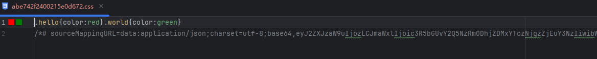

### 加载 images 图像

假如，现在我们正在下载 CSS，但是像 background 和 icon 这样的图像，要如何处理呢？在 webpack 5 中，可以使用内置的`Asset Modules`，我们可以轻松地将这些内容混入我们的系统中，这个我们在"资源模块"已经介绍。这里再补充一个方法，在 css 文件里也可以直接引用文件，修改`style.css`和`index.js`：

```css
.block-bg {
    background-image: url('./assets/webpack-logo.svg');
}
```

修改index.js文件

```js
import helloWorld from './hello-world';
import imgSrc from './assets/temp.png';
import logoSrc from './assets/webpack.svg';
import exampleTxt from './assets/example.txt';
import hello from './style.css'
import world from './beanmeat.less';

helloWorld()

const img = document.createElement('img');
img.src = imgSrc;
document.body.appendChild(img);

const img2 = document.createElement('img');
img2.style.cssText = 'width:200px;height:100px;';
img2.src = logoSrc;
document.body.appendChild(img2);

const block = document.createElement('div');
block.style.cssText = 'width:200px;height:200px; background:blue;';
block.textContent = exampleTxt;
block.classList.add('block-bg');
document.body.appendChild(block);

document.body.classList.add('hello');
document.body.classList.add('world');
```

启动服务，打开浏览器：


通过样式把北京图片加到了页面中。

### 加载fonts字体

### 加载数据

此外还可以加载的有用资源还有数据，如JSON文件，CSV，TSV和XML。类似于NodeJS，JSON支持实际上是内置的，也就是说`import Data from './data.json'`默认将正常运行。要导入CSV、TSV和XML，可以使用`csv-loader`和`xml-loader`，处理加载这三类文件：

```shell
npm install --save-dev csv-loader xml-loader
```

添加配置：

```js
module.exports = {
    //...
    // 配置资源文件
    module: {
        rules: [
            {
                test: /\.(csv|tsv)$/,
                use: ['csv-loader']
            },
            {
                test: /\.xml$/,
                use: ['xml-loader']
            }
        ]
    }
}
```

现在可以 import 这四种类型的数据（JSON，CSV，TSV，XML）中的任何一种，所导入的 Data 变量，将包含可直接使用的已解析 JSON：

创建两个文件验证：`data.xml`，`data.csv`

>data.xml
>
>```xml
><?xml version="1.0" encoding="UTF-8"?>
><note>
>    <to>Mary</to>
>    <from>John</from>
>    <heading>Reminder</heading>
>    <body>Call Cindy on Tuesday</body>
></note>
>```
>
>data.csv
>
>```csv
>to,from,heading,body
>Mary,John,Reminder,Call Cindy on Tuesday
>Zoe,Bill,Reminder,Buy orange juice
>Autumn,Lindsey,Letter,I miss you
>```

修改index.js，在入口文件里加载数据模块，并打印导入内容：

```js
import Data from './assets/data.xml'
import Notes from './assets/data.csv'


console.log(Data)
console.log(Notes)
```

重新启动，查看导入的数据是否打印。

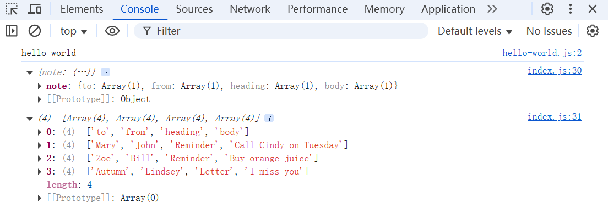

`data.xml`文件转换为一个JS对象，`data.cvs`转换为一个数组。

### 自定义JSON模块parser

通过使用`自定义parser`替代特定的webpack loader，可以将任何`toml`，`yaml`或`json5`文件作为JSON模块导入。

假设你在`src`文件夹下有一个`data.toml`、一个`data.yaml`以及一个`data.json5`文件：

>data.toml
>
>```toml
>title = "TOML Example"
>[owner]
>name = "Tom Preston-Werner"
>organization = "GitHub"
>bio = "GitHub Cofounder & CEO\nLikes tater tots and beer."
>dob = 1979-05-27T07:32:00z
>```
>
>data.yaml
>
>```yaml
>title: YAML Example
>owner:
>name: Tom Preston-Werner
>organization: GitHub
>bio: |-
>  GitHub Cofounder & CEO
>  Likes tater tots and beer.
>dob: 1979-05-27T07:32:00.000Z
>```
>
>data.json5
>
>```json
>{
>  // comment
>  title: 'JSON5 Example',
>  owner: {
>    name: 'Tom Preston-Werner',
>    organization: 'GitHub',
>    bio: 'GitHub Cofounder & CEO\n\
>Likes tater tots and beer.',
>    dob: '1979-05-27T07:32:00.000Z',
>  },
>}
>```

首先安装 `toml`，`yamljs` 和 `json5` 的 packages：

```shell
npm install toml yamljs json5 --save-dev
```

并修改配置文件

```js
const toml = require('toml');
const yaml = require('yamljs');
const json5 = require('json5');

module.exports = {
    // ...

    // 配置资源文件
    module: {
        rules: [
            // ...
            {
                test: /\.toml$/,
                type: 'json',
                parser: {
                    parse: toml.parse,
                },
            },
            {
                test: /\.yaml$/,
                type: 'json',
                parser: {
                    parse: yaml.parse,
                },
            },
            {
                test: /\.json5$/,
                type: 'json',
                parser: {
                    parse: json5.parse,
                }
            }
        ]
    }
}
```

在主文件引入模块，并打印内容

```js
import toml from './assets/data.toml'
import json from './assets/data.json5'
import yaml from './assets/data.yaml'

console.log(toml.title)
console.log(yaml.title)
console.log(json.title)
console.log(json.owner.name)
```

启动服务，`toml`,`yaml`和`json5`几个类型的文件都正常输出了结果。

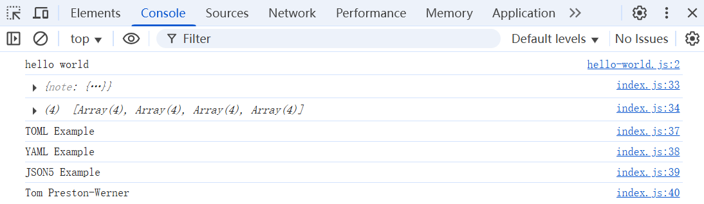

### 使用babel-loader

前面的章节里，我们应用 less-loader 编译过 less 文件，应用 xml-loader 编译过xml 文件，那 js 文件需要编译吗？调整hello-world.js文件

```js
function getString() {
    return new Promise((resolve, reject) => {
        setTimeout(() => {
            resolve(() => {
                resolve('hello world~');
            },2000)
        })
    })
}

async function helloWorld() {
    let string = await getString();
    console.log(string);
}

export default helloWorld;
```

重新编译，查看效果

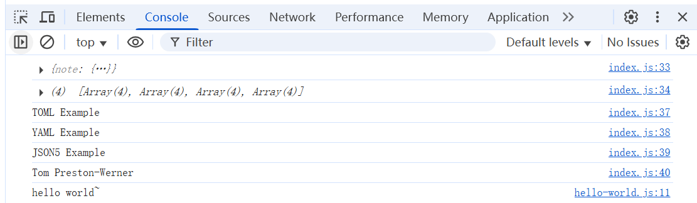

虽然没有报错，但是可以查看打包后的js代码，编写的ES6代码原样输出了，说明浏览器能偶运行我们的ES6代码。但如果浏览器版本过低，就很难保证代码正常运行了。

#### babel-loader

webpack自身可以自动加载JS文件，就像加载JSON文件一样，无需任何loader。可是，加载的JS文件会原样输出，即使你的JS文件里面包含ES6+的代码，也不会做任何的转化。这时我们就需要Babel，Babel是一个JavaScript编译器，可以将ES6+转化成ES5。在webpack里使用Babel，需要使用`babel-loader`

安装`babel-loader`

```shell
npm install -D babel-loader @babel/core @babel/preset-env
```

- `babel-loader`：在webpack里应用babel解析ES6的桥梁
- `@babel/core`：babel核心模块
- `@babel/preset-env`：babel预设，一组babel插件的集合

在webpack配置中，需要将`babel-loader`添加到`module`列表中，如下：

```js
module.exports = {
    // ...
    // 配置资源文件
    module: {
        rules: [
            // ...
            {
                test: /\.js$/,
                exclude: /node_modules/,
                use: {
                    loader: 'babel-loader',
                    options: {
                        presets: ['@babel/preset-env']
                    }
                }
            }
        ]
    }
}
```

执行编译：

>没有babel-loader的js文件
>
>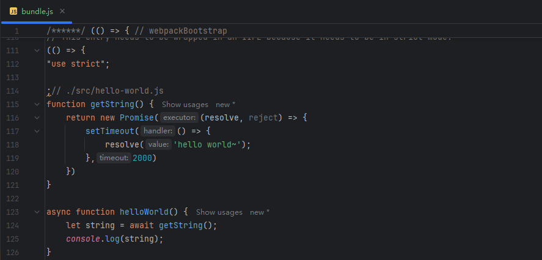
>
>用过babel-loader的js文件
>
>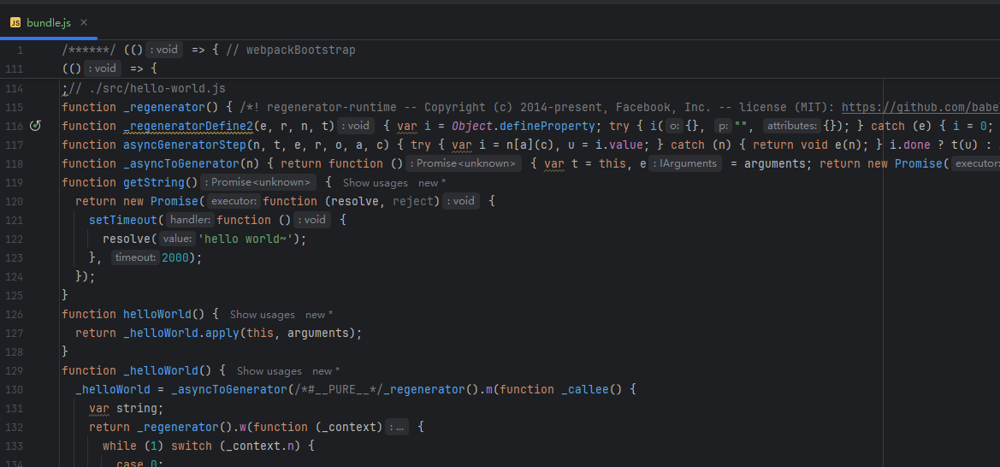

从编译完的结果可以看出， async/await 的ES6语法被 babel 编译了

## 代码分离

代码分离是 webpack 中最重要特性之一。此特性能够把代码分离到不同的bundle 中，然后可以按需加载或并行加载这些文件。代码分离可以用于获取更小的bundle，以及控制资源加载优先级，如果使用合理，会极大影响加载时间。

常用的代码分离方法有三种：

- 入口起点：使用`entry`配置手动地分离代码
- 防止重复：使用`Entry dependencies`或者`SplitChunksPlugin`去重和分离chunk
- 动态导入：通过模块地内联函数调用来分离代码。

### 入口起点

这是最简单直观的分离代码的方式。不过，这种方式手动配置较多，并有一些隐患，我们将会解决这些问题。先来看看如何从 main bundle 中分离 another module（另一个模块）

在`src`目录下创建`another-module.js`文件：

```js
import _ from 'lodash'
console.log(_.join(['Another', 'module', 'loaded!'], ' '))
```

这个模块依赖了 lodash ，需要安装一下

```shell
npm install lodash --save-dev
```

修改配置文件：

```js
module.exports = {
    entry: {
        index: './src/index.js',
        another: './src/another-module.js',
    },

    output: {
        filename: '[name].bundle.js'
    },
    // ...
}
```

执行编译查看各包大小：

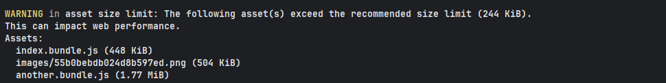

`another.bundle.js (1.77 MiB)`，发现`lodash.js`也被打包到`another.bundle.js`中。

如果index.js也需要`lodash.js`，那么两个文件都会有`lodash.js`，两个文件都会增大。

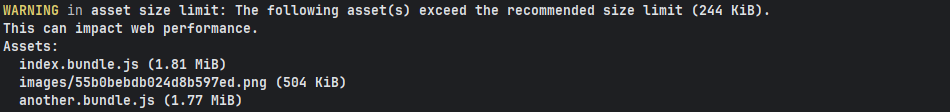

- 如果入口chunk之间包含一些重复的模块，那么重复模块都会被引入到各个bundle中。
- 这种方法不够灵活，并且不能动态地将核心应用程序逻辑中的代码拆分出来。

第一点因为之前`./src/index.js`中也引入过`lodash`，这样就在两个bundle中造成重复引用。


### 防止重复

#### 入口依赖

配置`dependOn option`选项，这样可以多个chunk之间共享模块

```js
module.exports = {
    entry: {
        index: {
            import: './src/index.js',
            dependOn: 'shared'
        },
        another: {
            import: './src/another-module.js',
            dependOn: 'shared'
        },
        shared: 'lodash',
    },
	// ...
}
```

执行编译，查看三个文件的大小：

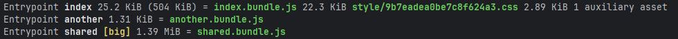

`index.bundle.js`与`another.bundle.js`共享的模块`lodash.js`被打包到一个单独的文件`shared.bundle.js`中。

#### SplitChunksPlugin

`SplitChunksPlugin`插件可以将公共的依赖模块提取到已有的入口chunk中，或者提取到一个新生成的chunk。使用这个插件，将之前的示例中重复的`lodsh`模块去除。

```js
module.exports = {
    entry: {
        index: './src/index.js',
        another: './src/another-module.js'
    },
   	// ...
    // 优化配置
    optimization: {
        // ...
        splitChunks: {
            chunks: 'all',
        }
    },
	// ...
}
```

执行编译，同样可以分隔开

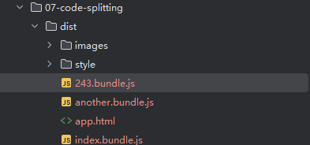

### 动态导入

当涉及到动态代码拆分时，webpack 提供了两个类似的技术。第一种，也是推荐选择的方式是，使用符合 `ECMAScript` 提案 的 `import()` 语法 来实现动态导入。第二种，则是 `webpack` 的遗留功能，使用 `webpack` 特定的 `require.ensure` 

创建`async-module.js`文件：

```js
function getComponent() {
    return import('lodash')
        .then(({
                   default: _
               }) => {
            const element = document.createElement('div')
            element.innerHTML = _.join(['Hello', 'webpack'], ' ')
            return element
        })
        .catch((error) => 'An error occurred while loading the component')
}

getComponent().then((component) => {
    document.body.appendChild(component)
})
```


### 懒加载

懒加载或者按需加载，是一种很好的优化网页或应用的方式。这种方式实际上是先把你的代码在一些逻辑断点处分离开，然后在一些代码块中完成某些操作后，立即引用或即将引用另外一些新的代码块。这样加快了应用的初始加载速度，减轻了它的总体体积，因为某些代码块可能永远不会被加载。

创建一个`math.js`文件，在主页面中通过点击按钮调用其中的函数：

>/src/math.js
>
>```js
>export const add = () => {
>    return x + y
>}
>export const minus = () => {
>    return x - y
>}
>```

编辑`index.js`文件：

```js
const button = document.createElement('button')
button.textContent = '点击执行加法运算'
button.addEventListener('click', () => {
    import(/* webpackChunkName: 'math' */ './math').then(({ add
                                                             }) => {
        console.log(add(4, 5))
    })
})
document.body.appendChild(button)
```

这里有句注释，我们把它称之为魔法注释：`webpackChunkName：'math'`，告诉webpack打包生成的文件名为`math`

启动服务，在浏览器上查看：

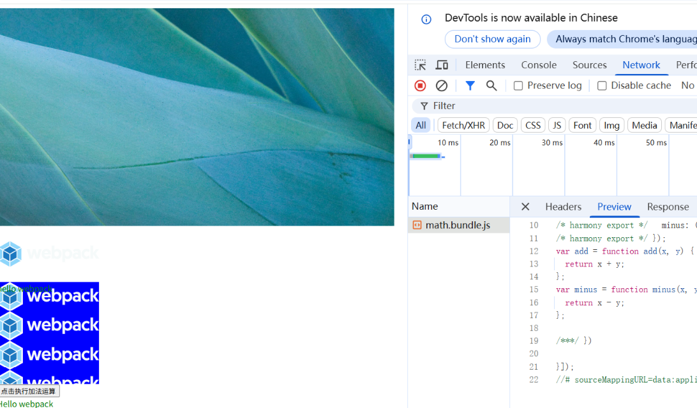

第一次加载完页面，`math.bundle.js`不会加载，当点击按钮之后，才加载`math.bundle.js`文件。

### 预获取/预加载模块

webpack v4.6+ 增加了对预获取和预加载的支持。

在声明import时，使用下面这些内置指令，可以让webpack输出 “resource hint（资源提示）”，来告知浏览器：

- prefetch（预获取）：将来某些导航下可能需要的资源
- preload（预加载）：当前导航下可能需要资源

下面这个prefetch的简单实例中，编辑`index.js`文件

```js
const button = document.createElement('button')
button.textContent = '点击执行加法运算'
button.addEventListener('click', () => {
    import(/* webpackChunkName: 'math',webpackPrefetch: true */ './math').then(({ add }) => {
        console.log(add(4, 5))
    })
})
document.body.appendChild(button)
```

添加第二局魔法注释：`webpackPrefetch: true`

告诉 webpack 执行预获取，这会生成`<link rel="prefetch" href="main.js">`并追加到页面头部，指示这浏览器在闲置时间预取`math.js`文件。

启动程序，效果如下：

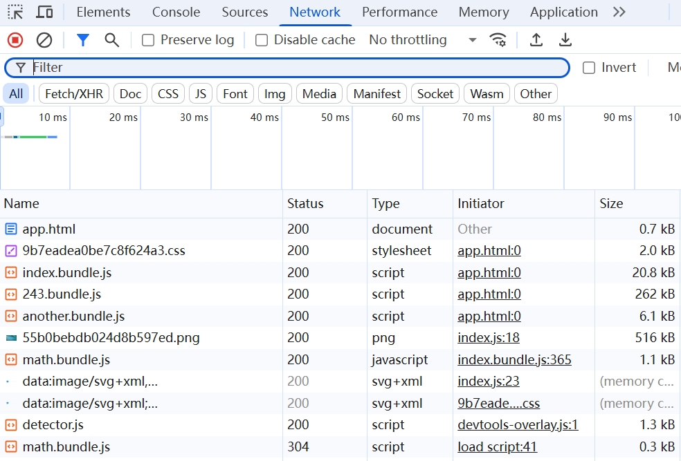

还没开始点击按钮时候，`math.bundle.js`就已经下载下来了，同时在`app.html`里面webpack自动添加了一句：

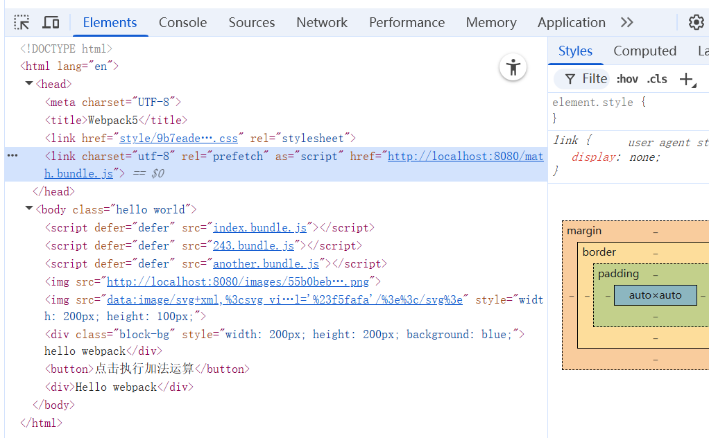

点击按钮会立即调用已经下载好的`math.bundle.js`文件中的`add`方法。

与 prefetch指令相比，preload指令有许多不同之处：

- preload chunk会在父chunk加载时，以并行的方式开始加载。prefetch chunk会在父chunk加载结束后开始加载
- preload chunk具有中等优先级，并立即下载。prefetch chunk在浏览器闲置时下载。
- preload chunk会在父chunk中立即请求，用于当下时刻。prefetch chunk会用于未来的某个时刻。
- 浏览器支持程度不同。

## 缓存
