## 基本概念

### 网络互联模型

>为了更好地促进互联网的研究和发展，国际标准化组织ISO在1985年制定了网络互连模型。
>
>OSI参考模型，具有7层结构：偏理论。
>
>TCP/IP协议模型：实际应用中用的最多，偏实际。
>
>所以TCP/IP是一种网络互连模型的名称。


当然，为了方便学习，一些教材会出现5层结构。因为**数据链路层**和**物理层**很值得单独学习。

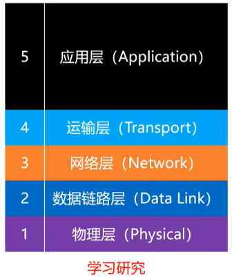

**大致的请求过程**

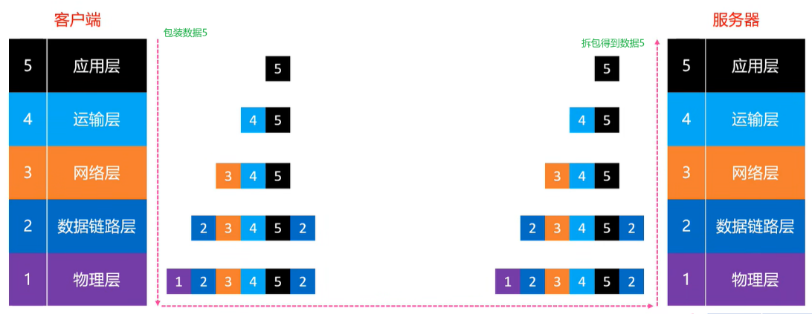

>应用层数据：**报文，用户数据**
>
>经过运输层包装：**段**
>
>经过网络层包装：**包**
>
>经过数据链路层包装：**帧**
>
>经过物理层包装：**比特流**

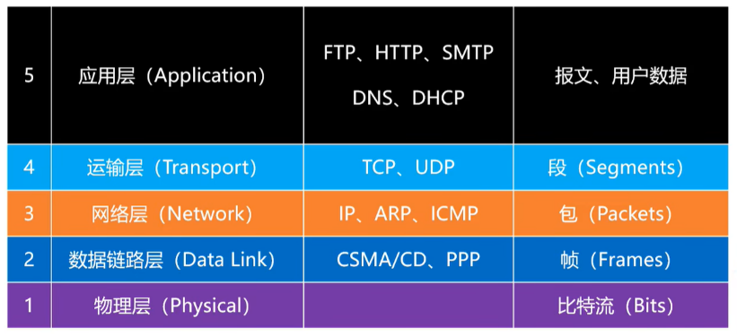

### 计算机之间的通信基础

>需要得知对方的IP地址
>
>最终是根据MAC地址（网卡地址），传送数据到网卡，被网卡接收
>
>​	数据中包括源IP地址、目标IP地址、源MAC地址、目标MAC地址
>
>​	如果网卡发现数据的目标MAC地址是自己，就会将数据传递给上一层处理
>
>​	如果网卡发现数据的目标MAC地址不是自己，就会将数据丢弃，不会传递给上一层进行处理

### 计算机之间的连接方式

#### 网线直连

需要用交叉线（不是直通线）


**直通线**：用于连接不同类型的设备，例如电脑与交换机、路由器与交换机、电脑与路由器等

**交叉线**：用于连接相同类型的设备，例如两台电脑直接相连、两台交换机相连（在不支持自动翻转功能的旧设备上）

>在早期网络设备中，发送和接收信号的引脚是固定的。当连接相同类型的设备时，需要通过交叉线来交换发送和接收引脚的信号，以确保数据能够正确传输。
>
>现代设备大多支持自动翻转功能（Auto-MDIX），可以自动识别并调整信号，因此在很多情况下，直通线和交叉线都可以通用


ARP协议的作用：已知 IP地址，通过 **广播** 获取 MAC地址。

为什么右边出现3个ARP包，实际上是 **一次完整的发送请求，接收响应的过程**。


#### 同轴电缆（Coaxial）

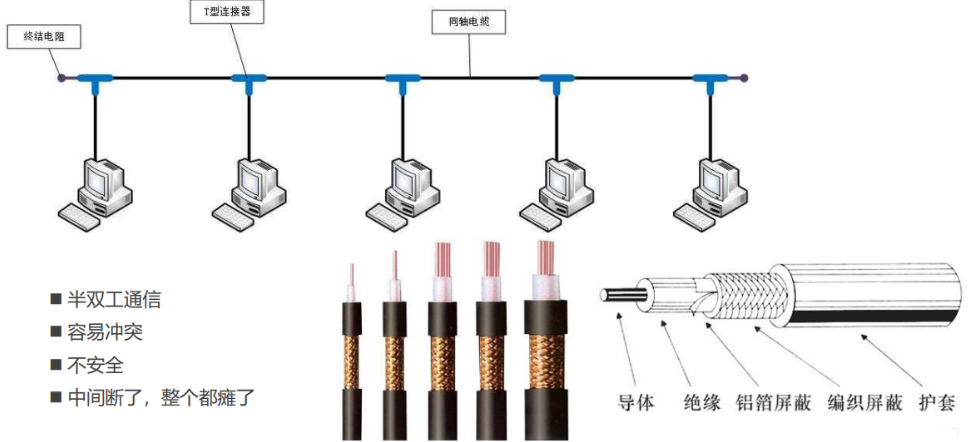

注意：同轴电缆只要有一个地方线断了，整个线路都瘫痪了。

#### 集线器


集线器相比同轴电缆唯一的优点就是：哪怕连着集线器的某一个设备中间线路出问题，不会影响到连着集线器的其他设备。

#### 网桥


所谓隔绝冲突域是通过：**记录设备的MAC地址在左还是在右**。

例如，6向7发数据包，
当6发出请求ARP广播时，网桥会记录6的MAC地址在左；
当7发出响应ARP广播时，网桥会记录7的MAC地址在左。

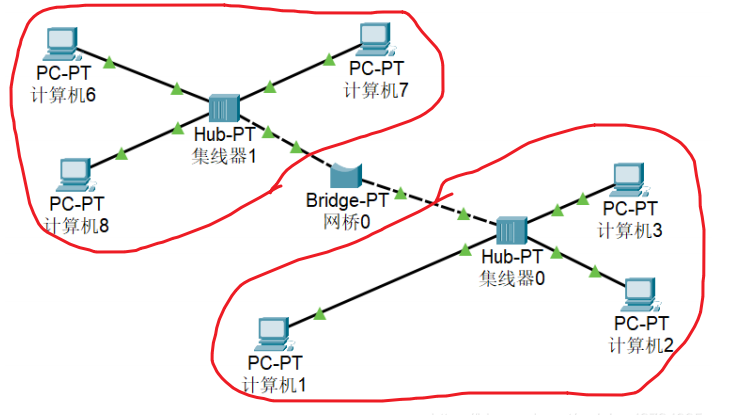

#### 交换机（Switch）

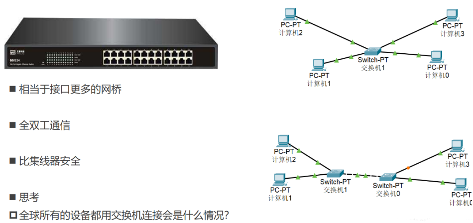

>若全球所有设备都用交换机连接：
>1、他们必然处于同一网段，因此 IP地址可能会不够用
>2、即使使用交换机，第一次发送数据包仍然需要ARP广播，耗费大量时间。
>3、形成广播风暴，只要有一个设备发送ARP广播，全球设备都能收到

#### 路由器（Router）

主机在发数据之前，首先会判断目标主机的IP地址跟它是否在同一个网段：

1. **在同一个网段**：ARP广播、通过 **交换机/集线器** 传递数据
2. **不在同一个网段**：通过**路由器**转发数据

网线直连、同轴电缆、集线器、网桥、交换机

- 连接的设备必须在**同一网段**
- 连接的设备处在**同一广播域**

路由器

- 可以在不同网段之间转发数据
- 隔绝广播域

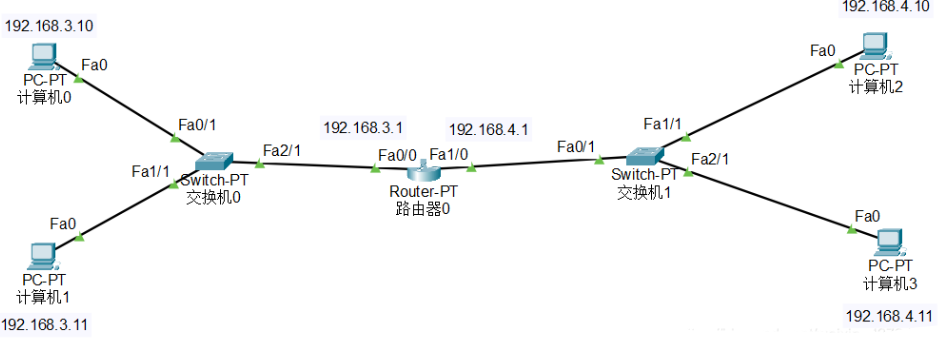

### MAC地址（40-55-82-0A-8C-6D）

每个网卡都有一个 6字节(48bit) 的 MAC地址 (Media Access Control Address)

MAC地址全球唯一，固化在网卡的ROM中，由 IEEE802 标准规定

> 前3字节：OUI (Organizationally Unique Identifier)，组织唯一标识符，由 IEEE 的注册管理机构分配给厂商
> 后3字节：网络接口标识符，由厂商自行分配


OUI 查询：可以根据OUI查询出对应的厂商

- http://standards-oui.ieee.org/oui.txt
- https://mac.bmcx.com/

#### MAC地址的表示格式（Windows、Linux）

- Windows

  40-55-82-0A-8C-6D

- Linux、Android、Mac、iOS（类Unix操作系统）

  40:55:82:0A:8C:6D

- Packet Tracer

  4055.820A.8C6D

> 注：当48位全为1时，代表广播地址：FF-FF-FF-FF-FF-FF

#### MAC地址操作（`ipconfig /all`）

查看MAC地址：`ipconfig /all`

修改MAC地址：更改适配器选项-属性-配置-高级-网络地址（填写的时候需要把 减号`-` 去掉）

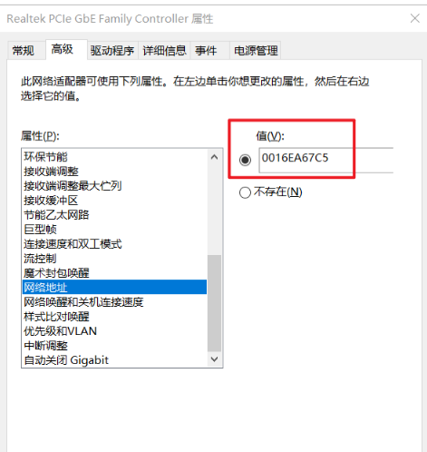

> 注： 有时可以通过修改 MAC地址蹭网...

#### MAC地址的获取（`arp -a`）

不知道对方主机的MAC地址时，可以通过发送ARP广播获取对方的MAC地址

- 获取成功后，会缓存IP地址、MAC地址的映射信息，俗称：**ARP缓存**
- 通过ARP广播获取的MAC地址，属于 **动态（dynamic）缓存**，存储时间比较短（默认是2分钟），过期就自动删除

`arp -a [主机地址]`：查看ARP缓存
`arp -d [主机地址]`：删除ARP缓存
`arp -s 主机地址 MAC地址`：增加一条缓存信息（这是**静态缓存**，存储时间较久，不同系统的存储时间不同）

#### ARP（Address Resolution Protocol）

**ARP (Address Resolution Protocol)，地址解析协议**

> 通过 IP地址 获取 MAC地址

**RARP (Reverse Address Resolution Protocol)，逆地址解析协议**

>使用与ARP相同的报头结构
>
>作用与ARP相反，用于**将MAC地址转换为IP地址**
>
>后来被 BOOTP、**DHCP** 所取代

#### ICMP（Internet Control Message Protocol）

**ICMP (Internet Control Message Protocol)，互联网控制消息协议**

>IPv4中的ICMP被称作 **ICMPv4**，IPv6中的ICMP则被称作 **ICMPv6**
>
>通常用于返回错误信息，比如 TTL值过期、目的不可达
>
>ICMP的错误消息总是包括了源数据并返回给发送者

## IP

IP地址 (Internet Protocol Address)：互联网上的每一个主机都有一个IP地址

>最初是 **IPv4** 版本，32bit（4字节），2019年11月25日，全球的IP地址已经用完
>
>后面推出了 **IPv6** 版本，128bit（16字节）
>
>我们在学习中讨论的都是 **IPV4**


### IP地址的组成

IP地址 由2部分组成：**网络标识（网络ID）、主机标识（主机ID）**

- 通过子网掩码（subnet mask）可以得知 网络ID 、主机ID

主机所在的网段 = 子网掩码 & IP地址

```text
IP地址：192.168.1.10
子网掩码：255.255.255.0

	1100 0000 . 1010 1000 . 0000 0001 . 0000 1010
&	1111 1111 . 1111 1111 . 1111 1111 . 0000 0000
----------------------------------------------------
	1100 0000 . 1010 1000 . 0000 0001 . 0000 0000

网段：192.168.1.0  
```

**网段是由子网掩码计算得出**，只有IP地址无法得知网段。

```text
IP地址：130.168.1.10
子网掩码：255.255.0.0
网段：130.168.0.0

该网段最多有 256*256-2 个IP地址
-2是因为: 全0代表网段,全1代表广播
网段和广播无法分配IP地址.
```

计算机和其他计算机通信前，会先判断目标主机和自己是否在同一网段：

- 同一网段：不需要由路由器进行转发
- **不同网段**：交由**路由器**进行转发

### IP地址的分类

注：判断IP地址的类别只要看第一部分即可。

只有 A\B\C 类地址才能分配给主机

- 主机ID为 **全0**，表示主机所在的**网段**，如 `192.168.1.0`
- 主机ID为 **全1**，表示主机所在**网段的全部主机（广播）**，如 `192.168.1.255`
  可以尝试用`ping`给某个网段的全部主机发数据

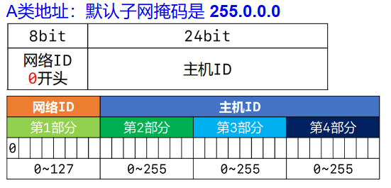

>网络ID
>
>- 0 不能用，127 作为保留网段。
>- 其中 127.0.0.1 是 **本地环回地址（Loopback）**，代表本机地址
>- 可以分配给主机的第1部分的取值范围是：1~126
>
>主机ID
>
>- 第2、3、4部分的取值范围是：0~255
>- **每个A类网络能容纳的最大主机数是：256\*256\*256–2 = 2^24–2 = 16777214**


>网络ID
>
>- 第1部分的取值范围是：128~191
>- 第2部分的取值范围是：0~255
>
>主机ID
>
>- 第3、4部分的取值范围是：0~255
>- **每个B类网络能容纳的最大主机数是：256\*256-2 = 2^16-2 = 65534**


>网络ID
>
>- 第1部分的取值范围是：192~223
>- 第2、3部分的取值范围是：0~255
>
>主机ID
>
>- 第4部分的取值范围是：0~255
>- **每个C类网络能容纳的最大主机数是：256-2 = 254**


### 子网掩码的CIDR表示方法

**CIDR (Classless Inter-Domain Routing)，无类别域间路由**

子网掩码的CIDR表示方法

- 192.168.1.100/24，代表子网掩码有24个1，也就是 255.255.255.0
- 123.210.100.200/16，代表子网掩码有16个1，也就是 255.255.0.0

计算工具：https://www.sojson.com/convert/subnetmask.html

### 子网划分

#### 为什么要进行子网划分？

如果需要让 **200** 台主机在同一个网段内，可以分配一个 **C类网段**，比如`192.168.1.0/24`

- 共 254 个可用IP地址：`192.168.1.1` ~ `192.168.1.254`
- 多出 54 个空闲的IP地址，这种情况并不算浪费资源

如果需要让 **500** 台主机在同一个网段内，那就分配一个 **B类网段**，比如`191.100.0.0/16`

- 共 65534 个可用IP地址：`191.100.0.1` ~ `191.100.255.254`
- 多出 65034 个空闲的IP地址，这种情况属于极大的浪费资源

如何尽量避免浪费IP地址资源？

- 合理进行 **子网划分**

> 子网划分：借用主机位作子网位，划分出多个子网
>
> - **等长子网划分**：将一个网段等分成多个子网，**每个子网的可用IP地址数量一样**
> - **变长子网划分**：**每个子网的可用IP地址数量可以是不一样的**

子网划分器：http://www.ab126.com/web/3552.html


**子网划分的步骤**

1. 确定子网的子网掩码长度
2. 确定子网中第1个、最后1个主机可用的IP地址

#### 等长子网划分

##### C类子网划分

```text
本来有一个C类网段: 192.168.0.0/24

划分成两个子网后:

A子网: 192.168.0.0/25 子网掩码: 255.255.255.128
可用IP地址: 192.168.0.1 ~ 192.168.0.126 共 126 个

B子网: 192.168.0.128/25 子网掩码: 255.255.255.128
可用IP地址: 192.168.0.129 ~ 192.168.0.254 共 126 个
```

等分成 2 个子网：


等分成 4 个子网：

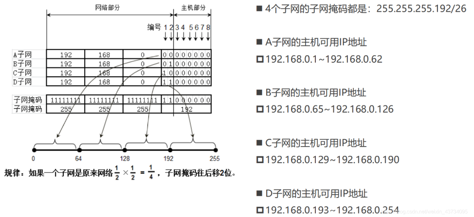

等分成 4 个子网的**广播地址**：

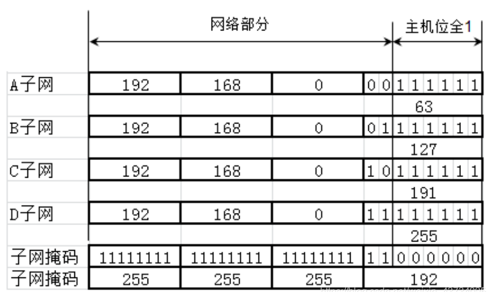

等分成 8 个子网：

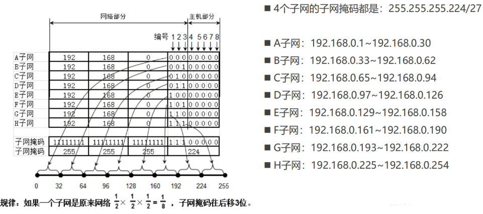

#####  A、B类子网划分

B类子网划分：


A类子网划分 ：


#### 子网划分实践

如此划分，他们还是属于同一个网段，可以直接 ping 通。


下面这样划分就不是一个网段了，它们分别属于 `192.168.0.0` 和 `192.168.0.128` 网段，需要用路由器并设置网关才可以 ping 通。

注：下图 `192.168.0.129/25` 和 `192.168.0.1/25` 写反了。

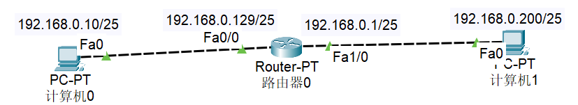


#### 思考题：双方子网掩码不同，计算对方所处网段

问：下列两台计算机可以正常通信吗？

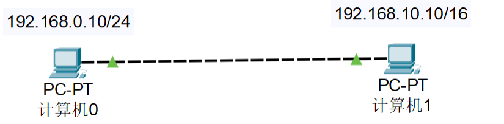

答：不可以。计算机0 想要发送数据包，先判断计算机1是否和自己处于同一个网段，计算网段的方法是：IP地址 & 子网掩码，计算机0判断计算机1的网段为 192.168.10.10 & 255.255.255.0 = 192.168.10.0，而计算机0判断自身所处网段为 192.168.0.10 & 255.255.255.0 = 192.168.0.0，双方不处于同一网段，所以计算机0无法将数据包发给计算机1（不同网段的数据通信需要路由器）


解决方案：利用路由器。


### 超网合并

超网：跟子网反过来，它是将多个**连续的网段**合并成一个更大的网段

需求：原本有200台计算机使用 192.168.0.0/24 网段，现在希望增加200台设备到同一个网段

- 200台在 192.168.0.0/24 网段，200台在 192.168.1.0/24 网段
- 合并 192.168.0.0/24、192.168.1.0/24 为一个网段：192.168.0.0/23
  （子网掩码往左移动1位）


>问：192.168.0.255/23 这个IP地址，可以分配给计算机使用么？
>
>192.168.0.255/24 是广播，不能分配给计算机。
>
>192.168.0.255/23 如下：
>
>

主机部分并不全为1，所以是可以分配给计算机使用的。

#### 合并4个网段

子网掩码向左移动 2 位，可以合并 4 个网段


将 192.168.0.0/24、192.168.1.0/24、192.168.2.0/24、192.168.3.0/24 合并为**192.168.0.0/22** 网段

#### 子网合并的规律

假设 n 是 2 的 k 次幂（k≥1），子网掩码左移 k 位能够将能够合并 n 个网段


假设 n 是 2 的 k 次幂（k≥1），如果第一个网段的网络号能被 n 整除，那么由它开始连续的 n 个网段，能通过左移 k 位子网掩码进行合并。

- 第一个网段的网络号以二进制 0 结尾，那么由它开始连续的 2 个网段，能通过左移1位子网掩码进行合并

- 第一个网段的网络号以二进制 00 结尾，那么由它开始连续的 4 个网段，能通过左移2位子网掩码进行合并
- 第一个网段的网络号以二进制 000 结尾，那么由它开始连续的 8 个网段，能通过左移3位子网掩码进行合并


#### 判断一个网段是子网还是超网

首先看该网段的类型，是A类网络、B类网络、C类网络？

- A类子网掩码的位数是8（255.0.0.0）
- B类子网掩码的位数是16（255.255.0.0）
- C类子网掩码的位数是24（255.255.255.0）

如果该网段的子网掩码位数比默认子网掩码**多**，就是**子网**
如果该网段的子网掩码位数比默认子网掩码**少**，则是**超网**

>例如：判断 25.100.0.0/16 是子网还是超网？
>
>- 根据 25 判断出这是个 A 类网络，默认子网掩码 8 位
>- 由于该网段子网掩码 16 位，比默认**多**，所以是**子网**
>
>判断 200.100.0.0/16 是子网还是超网？
>
>- 根据 200 判断出这是个 C 类网络，默认子网掩码 24 位
>- 由于该网段子网掩码 16 位，比默认**少**，所以是**超网**

## 物理层（Physical）

>物理层定义了接口标准，线缆标准，传输标准，传输方式等。

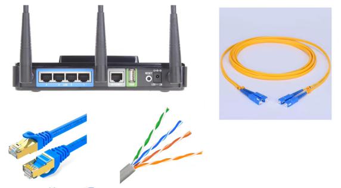

### 相关概念

#### 模拟信号/数字信号

>模拟信号
>
>连续的信号，适合长距离传输
>
>抗干扰能力差，收到干扰时表型变形很难纠正。
>
>
>
>数字信号
>
>离散的信号，不适合长距离传输
>
>抗干扰能力强，受到干扰时波形失真可以修复。
>
>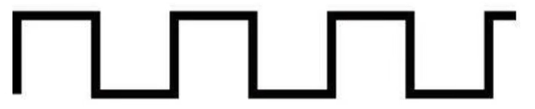

#### 数据通信模型

>局域网通信模型


>广域网通信模型


❗ 电话线不能传输数字信号，所以要用猫[^cat]将数字信号转成模拟信号。

#### 信道

> 信息传输的通道，一条传输介质上（比如网线）上可以有多条信道
>

> 单工通信：有A，B两端进行通讯。信号只能往一个方向传输，任何时候都不能改变信号的传输方向。比如无线电广播，有限电视广播。
>
> 半双工通信：信号可以双向传输，但是A，B两端必须交替进行，同一时间只能往一个方向传输。比如对讲机。
>
> 全双工通信：信号可以同时双向传输。比如手机（打电话，听说同时进行）

## 数据链路层（Data Link）

>不同类型的数据链路，在数据链路层所用的通信协议可能是不同的。
>
>广播信道：CSMA/CD协议。
>
>点对点信道：PPP协议。
>
>数据链路层的数据：**帧**。

**链路：**从一个节点到相邻节点的一段物理线路（有线或无线），中间没有其他交换节点。(注意：集线器是没有智商的，完全可以把它当成一根网线)

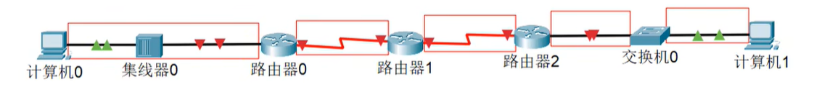

**数据链路：**在一条链路上传输数据时，需要有对应的通信协议来控制数据的传输。

>不同类型的数据链路，在**数据链路层**所用的通信协议可能是不同的：
>
>广播信道：CSMA/CD协议（广播信道：比如同轴电缆，集线器组成的网络）
>
>点对点信道：PPP协议（比如两个路由器之间的信道）

### 数据链路层的3个特性

#### 封装成帧

>把来自网络层的数据包封装成数据帧。
>
>帧的数据部分就是网络层传递下来的数据包（IP数据包，Package）

>最大传输单元MTU（Maximum Transfer Unit）：每一种数据链路层协议都规定了能够传送的帧的数据长度上线，以太网的MTU位1500个字节


#### 透明传输

>帧在传输介质上传输的时候，是一连串的多个帧进行传输的。那么怎么区分那一部分是一个完整的帧呢？
>
>数据链路层在包装来自网络层的数据包时，会在帧两头加上帧首部（SOH）和帧尾部（EOT）。但是这又会出现新的问题，如果帧的数据部分出现了SOH/EOT，这就产生冲突，导致得到一段残缺的帧。


数据部分一旦出现了SOH，EOT，就需要进行**转义**。


#### 差错检验

>考虑到帧在链路上传输时可能会发生差错，那么就有一个差错检验机制。
>
>根据帧数据部分和数据链路层首部，计算出一个值叫做FCS放到帧尾部部分。传到目标端后，对方也会计算出FCS和帧尾部的FCS比较来判断是否出错。如果出错就会丢掉该数据。


### CSMA/CD协议

>CSMA/CD（Carrier Sense Multiple Access with Collision Detection）载波侦听多路访问/冲突检测


>载波侦听：某一端会监听线路上是否有信号在传输，有的话就不发数据；没有的话，才会发数据。
>
>多路访问：各个端都可以发送信号。
>
>冲突检测：如果两个端（计算机）同时检测线路上没有信号在传输，那么就会都发信号。但是此时由于是半双工通信，就会发生冲突。信号发生冲突，就会往回弹。所以计算机要能判断出收到的信号是来自其他端直接发送的还是因为冲突弹回来的。
>
>例如 集线器组成的网络，是半双工通信的，同一时间只能往一个方向传输。

>使用了CSMA/CD协议的网络可以称为是以太网，他传输的是以太网帧。比如集线器，交换机组成的网络。（局域网）
>
>以太网帧的格式有：Ethernet V2标准， IEEE的802.3标准。
>
>使用最多的是：Ethernet V2标准。

>为了能够检测正在发送的帧是否产生了冲突，以太网帧至少64个字节。
>
>以太帧一般是传输信道的2倍，这样发生冲突时，信号会回弹。弹回到发出点时，会发现该信号还在发送（因为是信道的2倍）。那么就可以认定该信号发生了冲突。

>用交换机组建的网络，已经支持全双工通信。不需要再使用CSMA/CD协议，但它传输的帧依然是以太网帧。
>
>所以用交换机组建的网络仍然可以叫做以太网。

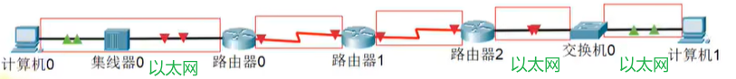

### Ethernet V2帧的格式


>Ethernet V2帧的格式：不需要帧开始符和帧结束符。
>
>那么接收帧时，怎么判断帧结束怎么判断帧开始呢？
>
>以太网使用曼切斯特编码。接收端接收帧过程只要发现没有信号跳变，就认为帧结束。

>帧在传到物理层时，会在帧起始位置加上前同步码和帧开始定界符，一共8字节。

>首部：目标MAC+源MAC+网络类型（IPV4/IPV6）
>
>以太网帧：首部 + 数据（网络层传过来的IP数据包）+FCS
>
>数据部分的长度至少是：64-6-6-2-4=46字节，最多是1500字节
>
>当数据部分的长度小于46个字节时，数据链路层会在数据的后面加入一些字节填充，当接收端接收时又会将填充的部分去掉。


总结：以太网帧的数据长度：46~1500字节，以太网帧的长度：64~1518字节

### PPP协议


>Address字段：图中的值是0xFF，形同虚设，点到点信道不需要源MAC和目标MAC地址。
>
>Control字段：图中的值是0x03，目前没有什么作用
>
>Protocol字段：内部用到的协议类型
>
>帧开始符、帧结束符：0x7E

>PPP协议特点
>
>因为是点对点通信，所以两端是确定的，顺着链路方向只能到达确定的一端。所以不需要源MAC地址和目标MAC地址。
>
>PPP帧和以太网帧是不一样的，但数据部分都是相同的，都是从IP层传下来的。
>
>如果俩个路由器之间有一个交换机，那么路由器和交换机传输的就是以太网帧，有源目的MAC的。


### 网卡

>网卡工作在物理层和数据链路层。

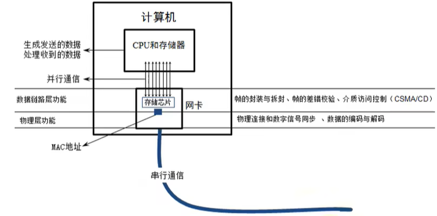

>网卡接收到一个帧，首先会进行差错检验，如果校验通过则接收，否则丢弃
>
>Wireshark抓到的帧没有FCS，因为它抓到的是差错校验通过的帧（帧尾的FCS会被硬件去掉）
>
>Wireshark抓不到差错校验失败的帧

## 网络层

> 概念
>
> 1.网络数据包（IP数据包，Packet[^Package]）由首部，数据两部分组成。
>
> 2.数据部分：很多时候是由传输层传递下来的数据段（Segment[^Segment]）


### 网络层首部

>由两部分组成：① 固定部分20个字节 ②可变部分

#### 固定部分

##### 版本（Version）

> 作用：用来判断是IPV4还是IPV6，占4位
>
> 0100：IPV4
>
> 0110：IPV6

##### 首部长度（Header Length）

> 作用：占4位，二进制乘以4才是最终长度
>
> 最小值：0b0101，对应的十进制值是5，所以最终首部长度最小是5*4=20字节
>
> 最大值：0b1111，对应的十进制值是15，所以最终首部长度最大时15*4=60字节。
>
> 所以根据最小值最大值可以得出：由于首部固定长度是20字节，所以可变长度是0~40字节。


##### 总长度（Total Length）

> 作用：整个数据包的长度
>
> 首部 + 数据部分的长度之和，占16位 ，即整个数据包的长度，最大值是65535[^网络层总长度]字节。
>
> 整个数据包是要传给数据链路层作为帧的数据部分的，但是帧的数据部分不能超过1500字节，所以过大的IP数据包，会被分成片（fragments）传输给数据链路层。
>
> 而且每一片fragments都有自己的网络层首部（IP首部）。


##### 区分服务（Differentiated Services Field）

> 作用：可以用来提高网络的服务质量（了解）
>
> 占8位，可以用来提高网络的服务质量，Quality of Service。
>
> 没有值时：0x00；如果值是0x40，可能路由器就会优先传输这个给IP包，即提高网络服务质量。

##### 标识（Identification）

>作用：专门管理数据包的ID
>
>占16位，数据链路层时，发现数据包过大，数据包就会进行分片。每一片fragments都有自己的IP首部，而且这些片的IP首部的标识部分都一样。这样就能区分哪些片是一个IP包拆分的。
>
>数据包的ID：代表是哪个IP包。而且有一个计数器专门管理数据包的ID，每发出一个数据包，ID就加1。

这个时候虽然能确定下来片fragments属于哪个数据包，但是怎么确定哪个片属于数据包的哪个部分呢？就引出了下一个点：**片偏移**

##### 片偏移（Fragment Offset）

>作用：用来确定当同一个包数据过多是，拆分成多个fragments时候，他们之间的先后顺序
>
>占13位，片偏移乘以8：字节偏移，每一片的长度一定是8的整数倍。
>
>
>
>字节偏移：
>
>第一片：从IP数据包首部后的第0字节处开始算，共1400字节
>
>​			第二片：从IP数据包首部后的第1400字节处开始算，共1400字节。
>
>​			第三片：从IP数据包首部后的第2800字节处开始算，共1000字节。
>
>​			所以第一片的字节偏移是0，其IP首部中片偏移就是0/8=0
>
>​			第二片的字节偏移是1400，其IP首部中片偏移就是1400/8=175
>
>​			第三片的字节偏移是2800，其IP首部中片偏移就是2800/8=350
>
>
>
>❓为什么不直接用字节偏移呢，而是要再除以8，用片偏移呢？
>
>因为存放偏移量的这部分一共才13位，最大值是8192-1=8191。而整个IP数据包的最大长度是65535字节。所以如果用字节偏移量的话，很可能13位不够表示。

​		

##### 标志（Flags）

>作用：占3位，每一位都有着不同的含义
>
>第一位（Reserved Bit）：保留位（没什么用）
>
>第二位（**Don't Fragment**）：1代表不允许分片，0代表允许分片
>
>第三位（**More Fragments**）：1代表不是最后一片，0代表最后一片。

❗	**一旦发现第三位是0，说明这个网络层的数据包已经组装好了。**

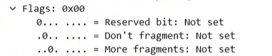

##### 协议和首部检验和（header CheckSum）

>作用：用于检查首部是否正确

##### 协议（Protocol）

>作用：表明所封装的数据是使用了什么协议
>
>8位，网络层的数据是从运输层传下来的，那么`运输层用的什么协议`会被记录下来，放在网络层首部的协议位置处。
>
>另外，ICMP也有协议字段，但是这些协议是被划分到网络层的。
>
>传输层的TCP协议的数据，或者UDP协议的数据，都会传输给网络层，被打包成IP协议的数据。


##### 生存时间：Time To Live, TTL

>作用：防止路由环路，经过路由器的次数
>
>每个路由器在转发之前都会将TTL减1，一旦发现TTL减为0，路由器会返回错误报告。
>
>各个操作系统的发送数据的默认TTL。

​		 


最后回来时的TTL即百度服务器相应的数据，进过多层路由器后，最后TTL减成了48，所以百度服务器应该是部署在linux服务器上，所以中间经历了64 - 52 = **12**个路由器。

> ping baidu.com -i 1
>
> 设置ping的数据的TTL是1，那么经过第一个路由器时就会减成0，就不会往下再发送包，而是返回报错信息。
>
> 我的IP：192.168.3.32，所以我的第一个网关地址就是192.168.3.1：

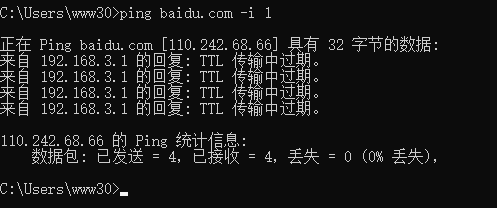

### 工作在网络层的协议

ARP[^ARP]，IP[^IP]，ICMP[^ICMP]。

传输层的TCP协议的数据，或者UDP协议的数据，都会传输给网络层，被打包成IP（IPV4、IPV6）协议的数据。

网络数据包的数据部分很多时候就是由传输层传递下来的数据段。但是这个不是绝对的，因为有时候的传输过程没有用到应用层，传输层等。

比如发送一个ICMP包，ICMP协议是专门工作在网络层的协议。直接在网络层组织一个ICMP包，发送给接收端，此时网络数据包的数据部分就不是来自传输层了。

ARP虽然更贴近数据链路层，ICMP协议在网络层上，但都划到了网络层。

### ping的几个用法

> ping发的是ICMP协议数据
>
> 
>
> ping /?：查看ping的用法。
>
> ping ip地址 -l 数据包大小：发送指定大小的数据包。
>
> ping ip地址 -f：不允许网络分层。
>
> ping ip地址 -i TTL：设置TTL的值


> 通过tracert，pathping命令，可以跟踪数据包经过了哪些路由器。

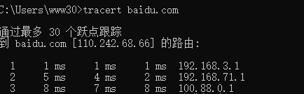


### Demo

ping 4000个字节的包给B站，看一下包分。

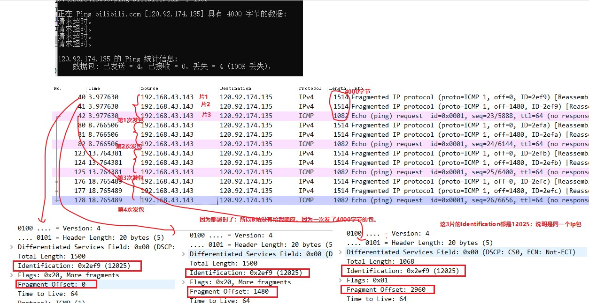

​	1.发了4次包，每次4000字节。

​	2.因为IP包是要传给数据链路层的，而数据链路层的数据部分不能超过1500字节。所以这个4000字节的IP包要分片。

​	3.那么就是这个包要分三片，发现这3片的IP网络层首部的表示部分Identification都是12025，所以这三篇属于同一个包。

​	4.这里的Fragment Offset部分是乘以8之后的结果。

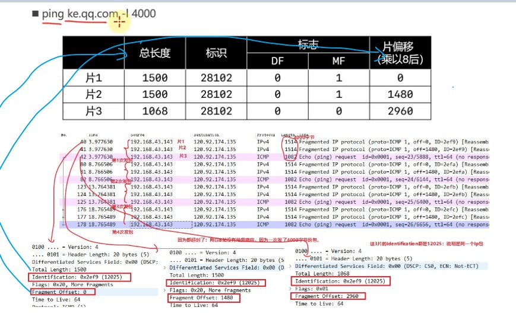

## 传输层

>传输层的TCP协议的数据，或者UDP协议的数据，都会传输给网络层，被打包成IP（IPV4、IPV6）协议的数据。
>
>传输层有两个协议：
>
>TCP（Transmission Control Protocol），传输控制协议
>
>​	如果之前的数据没有发送成功，还会再发送一次，那么就打乱了实时性（现在接收的信息，突然插入一个之前的信息）。
>
>UDP（User Datagram protocol），用户数据报协议
>
>​	如果之前的数据没有成功发过来，那我也不要了，我只关注当前的信息：音视频通话。

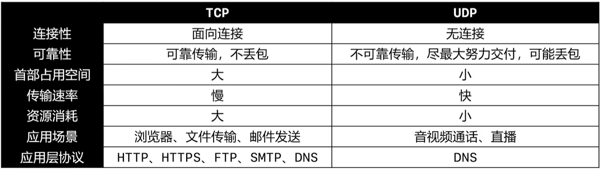

我们一般发送一个请求，是先在应用层用一个协议封装一个数据，然后在发给下一层，即**传输层**。

TCP协议一般封装的是，来自应用层的HTTP/HTTPS等协议封装的数据

UDP协议一般封装的是，来自应用层的DNS协议封装的数据。

### UDP

>UDP是无连接的，减少了建立和释放连接的开销。
>
>UDP尽最大可能交付传输的数据，但是不保证数据的完整性，即不保证可靠交付。
>
>因此不需要维护一些复杂的参数，首部只有8个字节。（TCP首部至少20个字节）

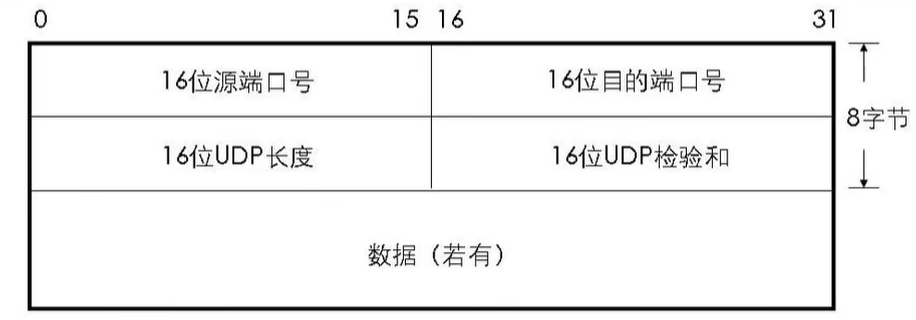

#### 长度（Length）

>16位，2字节：表示首部的长度 + 数据的长度

#### 校验和（ Checksum）

>检验和的计算部分：伪首部+首部+数据
>
>伪首部：仅在计算检验和时起作用，并不会传递给网络层。

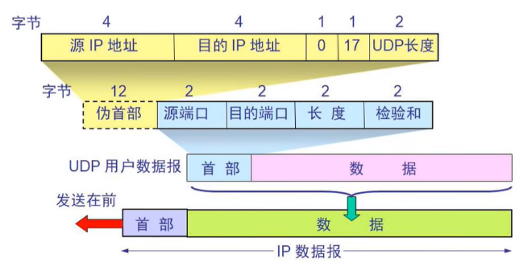

#### 端口（Port）

>服务器可以在一个端口上开启一个服务器软件，这个服务器软件来监听发送到这个端口的数据。之后服务器软件再从8080端口将数据返回给客户端。
>
>UDP首部中每个端口部分占用2字节，可以推测出端口号的取值范围0~65535。
>
>
>
>客户端的源端口是应用软件发送请求时的端口，而且是临时开启的随机端口，不固定。
>
>临时开一个端口发数据，所以同一个应用软件前后两次发数据时，源端口很可能是不一样的。
>
>服务响应请求，返回数据时。此时UDP数据包首部中的目的端口部分，就是客户端发送这个数据的源端口。

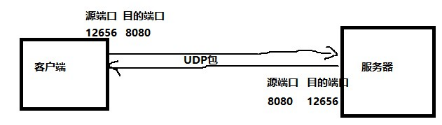

防火墙可以设置开启/关闭一些端口	来提高安全性。

>#### 注意服务器默认是用80端口监听http请求的
>
>Tomcat服务器软件默认配置的监听的端口是8080，所以我们访问部署在Tomcat服务器上的应用时，一般要加上:8080来访问。
>
>我们访问百度时：www.baidu.com 我们输入了域名，域名在解析成ip地址时，自动找到了百度服务器。但是我们没有指明端口呀，因为监听http请求的默认端口是80，即80可以不加。
>
>如果我们想要直接访问部署在tomcat下的项目,不加8080端口，通过直接访问网址不加8080端口。可以通过niginx监听http请求，监听80端口，然后转发给8080端口。

### 常用命令行

>netstat -an：查看被占用的端口
>
>netstat -anb：查看被占用的端口、占用端口的应用程序
>
>telnet：控制面板 - 程序 - 启用或关闭Windows功能 - 勾选 “Telnet Client” - 确定

√ 安装telnet：控制面板 - 程序 - 启用或关闭Windows功能 - 勾选 “Telnet Client” - 确定

### TCP


#### TCP首部

##### 数据偏移

>占4位，取值范围是0x0101~0x1111
>
>乘以4：就是TCP报文段的首部长度（Header length），最小20~最大60字节
>
>因为TCP报文段首部最小是20字节，所以数据偏移的最小值是20/4=5，0x0101
>
>这部分和网络层首部一样

🐦之所以叫数据偏移，可以理解为右部数据的偏移量

##### 保留位

>占6位，目前用不到，预防以后可能用到，现在全是0。

❗ 有些资料中，TCP首部的保留（Reserved）字段占3位，标志（Flags）字段占9位


>一个细节
>
>UDP的首部中有个16位的字段记录了整个UDP报文段的长度（首部+数据）
>
>但是TCP的首部中仅仅有个4位的字段记录了TCP报文段的首部长度，并没有字段进路TCP报文段的数据长度
>
>
>
>分析：
>
>UDP首部中占16位的长度字段是冗余的，纯粹是为了保证首部是32bit对齐
>
>TCP\UDP的数据长度，完全可以由IP数据包的首部推测出来
>
>√ 传输层的数据长度 = 网络层的总长度 - 网络层的首部长度 - 传输层的首部长度

##### 检验和

>16位，两个字节
>
>跟UDP一样，TCP检验和的计算内容：伪首部 + 首部 + 数据
>
>伪首部：占用12个字节，仅在计算检验和的时候起作用，并不会传递给网络层


##### 标志位


###### URG（Urgent）

>紧急标志位
>
>当URG = 1时，紧急指针字段才有效。表明当前报文段是有紧急数据的，应优先尽快传递。
>
>❗ TCP首部存在一个紧急指针，当URG = 1的时，紧急指针的值才有意义。如果不为1的时候，紧急指针存什么值都是瞎放的。
>
>
>
>紧急指针存的是长度，表明数据部分的开头多少数据是需要优先传递的。

###### ACK（Acknowledgment）

>当ACK = 1时，确认号字段才有效。如果ACK = 0时，确认号里面是什么值都没有意义。

###### PSH（PUSH）

> 交互式网络，网上巴拉巴拉资料就行，一般不关注这东西

###### RST（Reset）

>重置
>
>当RST = 1时，表明连接中出现严重差错，必须释放连接，然后再重新建立连接

###### SYN（Synchronization）

>同步
>
>当SYN = 1、ACK = 0时，表明这个一个建立连接的请求。
>
>若对方同意建立连接，则回复SYN = 1、ACK = 1

###### FIN（Finish）

>当FIN = 1时，表明数据已经发送完毕，要求释放连接

##### 序号（Sequence Number）

>占4个字节
>
>首先在传输过程的每一个字节都会有一个编号
>
>在建立连接后，序号代表：**这一次传给对方的TCP数据部分的第一个字节的编号**

##### 确认号（Acknowledgment Number）

>占4个字节
>
>在建立连接之后，确认号代表：期望下一次传递过来的TCP数据部分的第一个字节的编号

##### 窗口（Window）

>占2个字节
>
>这个字段有流量控制的功能，用于告诉对方下一次允许发送数据的大小（字节为单位）

#### 可靠传输

##### 停止等待ARQ协议

>ARQ（Automatic Repeat-reQuest），自动重传请求

假设A要发送给B发送3个包，如果发送第一个包M1时，B没有接收到，那么B就不会给A发送消息，直到B确认收到M1包这个消息。然后A端等待接收ACK消息，直到超时，如果超时的话，就会重新发送M1包，逻辑同上。


**停止等待ARQ协议**实现TCP可靠传输的两种情况：

>确认（信息）丢失：
>
>B收到A发送的M1包，然后返回一个确认信息。但是这个M1确认信息在传输时丢失了。那么A在等待超时后会在次发送一个M1包，此时B端接收后，就会收到两个M1包，B端会丢掉一个M1包，再返回确认收到M1包的消息给A端。
>
>
>
>确认（信息）迟到：
>
>B收到A发送的M1包，然后返回一个确认消息。但是这个确认消息可能因为线路或者网络问题传输的很慢，可能造成A端等待超时，再次发送M1包。B端接收到这第二个M1包后发现已经收到过了，就会丢掉一个M1包，再次发送确认M1消息。
>
>对于A端来说，收到B端发送的确认M1消息后，就会接着发送M2信息。之后可能还会再次收到确认M1信息。A端收到这个迟到的确认信息，发现之前收到过了，那么A端就会不响应这个信息。

❗ **停止等待ARQ协议能够保证TCP的可靠传输，但是因为必须等上一个数据传输结束，下一个信息才能传输，所以效率很低。**


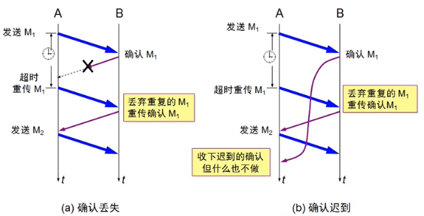

##### 连续ARQ协议 + 滑动窗口

>连续ARQ：发送窗口中有4个分组，会一口气发送完然后再等待确认信息。而且确认信息，也只会发送确认收到最后一个分组的确认信息。等价于确认收到所有分组信息。
>
>滑动窗口：B这边有一个缓存窗口，用来暂时存放每次从A发送来的数据。这个窗口的大小会告诉A。窗口的大小，代表每次最多能能接收多少分组。发送方的窗口大小，一般是由接收方决定的。


**图示一个传输过程：注意序号Seq和确认号ack**


##### SACK（Selective Acknowledgment）选择性确认

>在TCP通信过程中，如果发送序列中间某个数据包丢失（比如1、2、**3**、4、5中的3丢失了）
>
>TCP会通过重传最后确认的分组后续的分组（最后确认的是2，会重传**3**、4、5）
>
>这样原先已经正确传输的分组也可能重复发送（比如4、5），降低了TCP性能

为改善上述情况，发展出SACK（Selective Acknowledgment，选择性确认）技术。告诉发送方哪些数据丢失，哪些数据已经提前收到使TCP只重新发送丢失的包（比如**3**），不用发送后续所有的分组（比如4、5）


>SACK信息会放在TCP首部的**选项部分**：此时TCP首部的选项部分就是SACK选项。
>
>Kind：占1个字节，值为5代表这是SACK选项
>
>Length：占1个字节，表明SACK选项一共占用多少字节
>
>Left Edge：占4个字节，左边界
>
>Right Edge：占4个字节，右边界

##### Q&A

**Q：**如果一个包重传了N次还是失败，会一直持续重传到成功为止吗？

这个取决于操作系统的设置，比如有些操作系统，重传5次还未成功就会发送reset报文（RST）断开TCP。即发送端超出一定的重传次数或等待时间，还没有收到来自接收端的确认报文，于是发送reset报文。当RST=1时，表明连接出现严重错误，必须释放连接，然后再重新建立连接。

**Q：**如果接收窗口最多能接收4个包，但是发送方只发送了2个包，接收方如何确定后面还有没有第3个包呢？

等待一定时间后还是没有第3个包发过来，接收端就认为只传过来了2个包（无论是传输过程中丢包还是只有2个包）。接收端就会返回确认信息：确认收到2个包。

**Q：**为什么选择在传输层就将数据"大卸八块"分成多个段，而不是等到网络层再分片传递给数据链路层？

因为可以提高重传的性能：需要明确的是，可靠传输是在传输层进行控制的，即没有收到确认信息后，发送端会重新发送这个报文段。所以如果在传输层不分段，一旦出现数据丢失，整个传输层的数据都得重传。如果在传输层分了段，一旦出现数据丢失，只需要重传丢失的那些段即可。

#### 流量控制

>让发送方的发送速率不要太快，让接收方来得及接收处理
>
>如果接收方的缓存区满了，发送方还是疯狂的发送数据，接收方只能把收到的数据包丢掉，大量的丢包会极大着浪费网络资源。所以要进行流量控制。
>
>缓存区和窗口是不同的概念：缓存区要比窗口大很多，每次收到一窗口大小的数据，会先放到缓存区中。


##### 原理

>通过确认报文中窗口字段来控制发送方的发送速率。**发送方的发送窗口大小不能超过接收方给出的窗口大小**。当发送方收到接收窗口的大小为0时，发送方就会停止发送数据。
>


##### Q&A

**Q：**一开始接收方给发送方发送了报文段中的窗口字段值为0。后面接收方又有了一些存储空间，会给发送方发送一个非0窗口的报文但是这个报文丢了。结果就是：发送方一直认为接收方的窗口为0，不发送报文；接收方一直等不到数据，一直等待；双方陷入僵局？

A：发送方主动询问窗口大小。当发送方收到窗口为0的报文时，发送方会停止发送报文，但是同时会开启一个定时器，隔一段时间就发个测试报文去询问接收方最新的窗口大小。如果接收方的窗口大小还是0，则发送方会再次刷新启动这个定时器。

#### 拥塞控制


##### 什么是拥塞

>如果一个路由器R3允许通过的最大带宽是1000M，此时R3路由器左侧又连接这个两个路由器R1和R2，R1的最大带宽是700M，R2的最大带宽是600M。那么此时就极有可能发生拥塞现象。
>
>在理想情况下，R3能同时允许1000M的数据通过，但是R1和R2最多能通过1300M。此时就可能发生R3路由器来不及处理这么多数据，或者无法一次性通过这么多数据，就会造成拥塞现象。R3就会丢弃掉过载的数据包。
>
>拥塞是指到达通信子网中某一部分的分组数量过多，使得该部分网络来不及处理，一致引起这个部分乃至整个网络性能下降的现象，严重时甚至会导致网络通信业务陷入停顿，即出现死锁现象。


>**理想情况和实际情况是不同的**
>
>
>
>如果某个链路的理想情况下的吞吐量是1000M，但是实际情况由于数据可能在传输过程中可能会互相干扰。往往实际负载在不到1000M时，该链路的吞吐量就达到最大了，之后再加大负载就会造成拥塞。

##### 拥塞控制

>防止过多的数据注入到网络中，避免网络中的路由器或链路过载。
>
>拥塞控制是一个全局性的过程（流量控制，是两端，点对点的控制过程）。要整个链路来协同控制，涉及到所有的主机，路由器，以及与降低网络传输性能有关的所有因素，是大家共同努力的结果。

##### 相关标志

###### MSS（Maxium Segment Size）

>每个段的数据部分的最大长度
>
>两端建立连接时，会商定一个合适的MSS值，即MSS在建立连接时确定。
>
>每个段数据部分最大值的理论值：1460字节

**抓包观察这个字段**

首先这个MSS段的数据部分的最大长度是在建立连接时确定的，那肯定是在三次握手时确定的：

当SYN=1，ACK=0时，表明这是一个建立连接的请求。

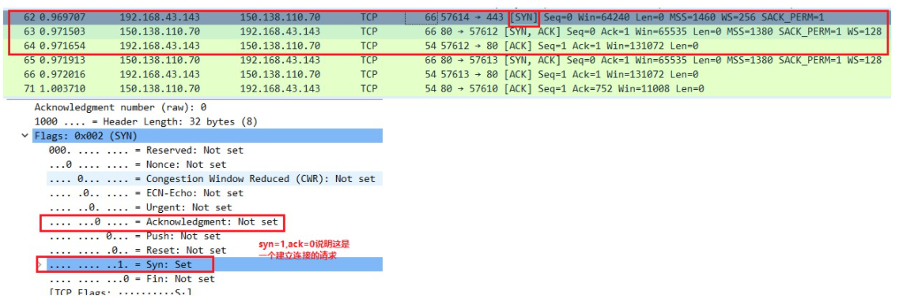

查看这个TCP报文的首部：发现TCP首部长度是32字节，所以有12字节在选项Options部分中。

在Options部分中发现了MSS字段且是1460（注意这个值不是固定的，两端发送的的TCP报文中这个值可能是不一样的）。

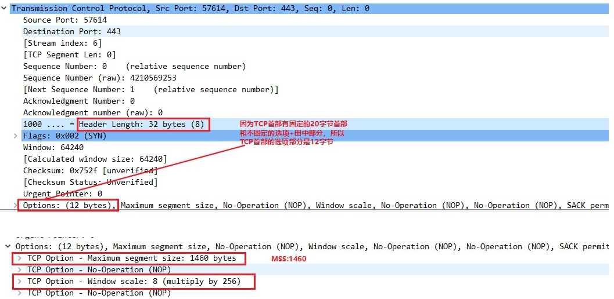

> 这个选项部分Options就是存放两端确定的一些东西：
>
> 比如MSS段的数据部分的最大长度，是否允许SACK选择性确认（SACK permitted）
>
> 注意这个值不是固定的，两端发送的的TCP报文中这个值可能是不一样的。
>
> 比如A发给B的报文中MSS是1460，B发给A的报文中MSS是1412，那么此时MSS在两者中取最小值。为了兼顾两者，这样传输数据两者都能接收。MSS在建立连接时确定（协商的）。

###### cwnd（congestion window）：拥塞窗口

>进行拥塞控制，会动态的变化。

###### rwnd（receive window）：接收窗口

>接收方告诉发送方，你最多一次能发送多少的TCP报文段。

###### swnd（send window）：发送窗口

>swnd = min(cwnd, rwnd)
>
>实际发送方的发送窗口，取拥塞窗口和接收窗口的最小值。

##### 拥塞控制解决方案

###### 慢开始（slow start，慢启动）

>一开始接收方告诉发送方的接收窗口rwnd=3000比较大，且MSS=100比较小。所以理论上发送方可以一口气发送30个报文段给接收方。但是考虑到拥塞控制的话，拥塞窗口cwnd=100一开始会设置的比较小。那么发送窗口swnd会取拥塞窗口cwnd和接收窗口rwnd两者的最小值100，所以第一次会只发送1个报文段。
>
>发送一个报文段后，发现网络状况良好。那么拥塞窗口会 * 2，cwnd=200。发送窗口取两者最小值为swnd=200，所以这次发送2个报文段。发现网络状况依然良好，拥塞窗口继续 * 2，cwnd=400。下一次发送4个报文段，如果网络状况依然良好的话，拥塞窗口cwnd * 2。
>
>发送窗口缓慢增长，试探增长，慢慢开始。试探接收方的接收程度。
>
>cwnd的初始值比较小，然后随着TCP报文段被接收方确认（收到一个ACK）而成倍增长（指数级）。

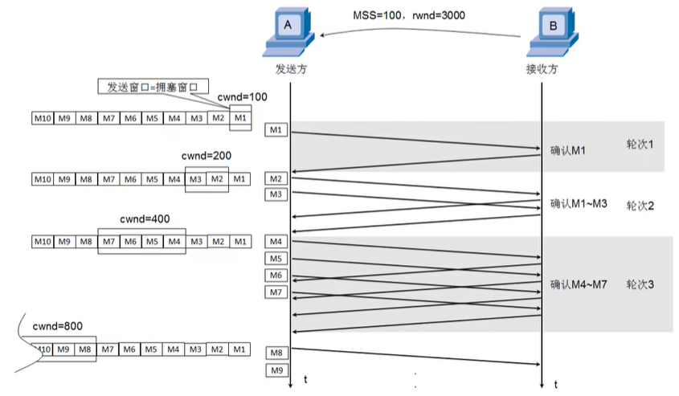

###### 拥塞避免（congestion avoidacne）

>在慢开始的基础上，为拥塞窗口cwnd加上一个慢开始阈值slow start threshold，cwnd在到达阈值之前只要网络良好没有出现拥塞等状况，就会成指数增长（乘以2）；如果达到阈值而且网络状况依然良好，拥塞窗口cwnd会呈乘法级增长（每次加固定值）。
>
>当出现拥塞时（发现开始丢包/报文段），就会把慢开始阈值slow start threshold减半，同时从头开始执行慢开始算法（cwnd从初始值开始）。
>
>ssthresh(slow start threshold)：慢开始阈值，cwnd达到阈值后，以线性方式增长。
>
>拥塞避免（加法增大）：拥塞窗口缓慢增大，以防止网络过早出现拥塞。
>
>乘法减小：只要网络出现拥塞（发现开始丢包了），把ssthresh减半，与此同时，开始重新执行慢开始算法。
>
>当网络出现频繁拥塞的话，ssthresh这个值会下降的很快。

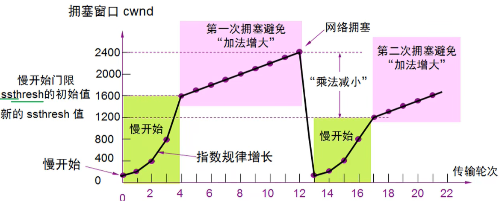

###### 快速重传（fast restransmit）

之前的实现TCP可靠传输时，有一个重传机制是“超时重传”。在ARQ自动重传请求机制中，如果A等待接受B的确认消息，如果等待超时的话，就会重新发送上一个报文段。


> 快重传机制：在接收方和发送方都进行了限制
>
> 接收方：
>
> 之前的做法：A发送5个段给B时，B只有等A的5个都发送完时或最后一个段超时时，才给A发确认信息：我收到了哪些段。
>
> 
>
> 
>
> 快重传做法：当接收方收到第二个分组后，返回一个确认收到分组2。但是没有收到第三个分组，直接收到了分组4，即收到了一个失序的分组。那么在收到分组4后，会立即发出重复的确认（上一个确认信息）：确认收到了分组2。然后继续收到分组5，再次发送确认收到了分组2；然后继续收到分组6，再次发送确认收到了分组2。
>
> 
>
> 发送方：
>
> 如果连续收到3个重复的确认（总共4个相同的确认），就会立即重传尚未收到的报文段。而不必继续等待重传计时器到期后再重传。
>

###### 快速恢复（fast recovery）

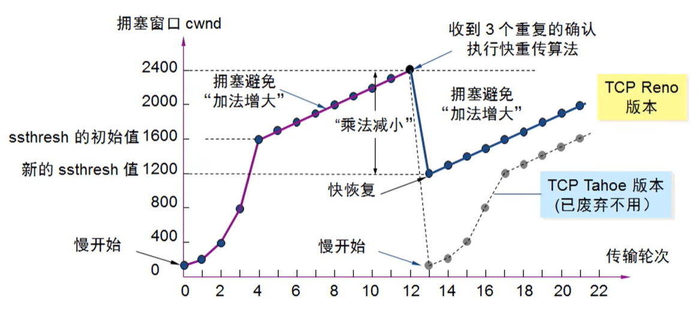

**拥塞控制是上述4个方法综合来治理的**

>**大致过程**
>
>慢开始算法开始增大拥塞窗口，当拥塞窗口以指数增长，直到达到慢开始阈值后，执行拥塞避免算法即拥塞窗口以线性增长。当收到3个重复的确认后，意识到此时开始掉包，产生拥塞了---->慢开始阈值乘法减半，变成以前的一半。之后又重新开始“慢开始算法”，拥塞窗口重初始值开始呈指数增长（这是旧版本的做法，已经弃置不用）。但是这样效率较低，拥塞窗口应该在一个合适的初始值开始增大。拥塞窗口直接以新的慢开始阈值作为初始值，开始以线性增长。当发送方连续收到3个重复确认后，就意识到此时发生了丢包的现象，可能出现了拥塞。就执行“乘法减小”，把慢开始阈值减半。之后不会执行慢开始算法，而是将拥塞窗口的值直接设置为慢开始阈值减半后的新阈值，并且呈线性增长。
>
>发送窗口的限制条件
>
>发送窗口的最大值：swnd = min(cwnd, rwnd)
>
>当rwnd < cwnd时，是接收方的接收能力限制发送窗口的最大值。
>
>cwnd < rwnd时，则是网络的拥塞限制发送窗口的最大值。
>
>**拥塞控制可以理解为是在可靠传输，流量控制的基础上，进一步来控制网络的状态，协调网络的情况。尽量避免网络拥塞，出现状况。**

#### 连接管理

##### 序号，确认号相关过程

>先回顾一下
>
>序号Seq：我当前发送的包的数据部分的第一个字节的编号（在分段之前的整个数据包的编号）。可以理解为我当前这个包的数据从哪个字节发。
>
>确认号Ack：在建立连接后，确认号代表：期望对方下一次穿过来的TCP数据部分的第一个字节的编号。也可以理解，我确认收到了这个编号前面字节的数据。确认号Ack只有在标志位ACK为1时明才有效。
>
>**序号，确认号：相对**


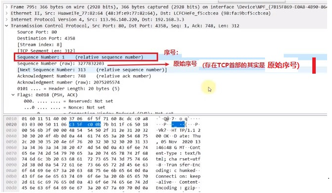

存放在TCP首部的序号和确认号其实都是**原始值**

在建立连接时，客户端会告诉服务器一个序号初始值；服务器也会告诉客户端一个序号初始值；这两个初始值可以不同，而且分别在客户端和服务器中起作用。

> 比如：服务器给客户端发送数据时，序号字段的值就是在序号初始值上在加上发送的数据部分的首字节编号。客户端给服务器发送数据时，序号字段的值就是在序号初始值上在加上发送的数据部分的首字节编号。双方都是在建立连接的时候确定好，以后各自的序号从哪里开始。

##### 分析一下Seq和Ack的变化过程

客户端给服务器发起建立连接的请求：

​				标志位**SYN=1**，确认客户端序号初始值seq = 123456

服务器响应客户端建立连接的请求：

​				标志位**SYN=1，ACK=1**,确认服务器序号初始值seq=234567

客户端响应客户端：我知道你同意建立连接了

​				标志位**SYN=0， ACK=1**：连接建立好了，下面可以发送HTTP请求了

客户端给服务器发送第一个报文段：

​				**序号seq = 123456 + 1，len = 100**

服务器收到这个报文段响应：下一个包希望从这个位置开始接收，前面的都接收到了

​				**确认号ack = 123456 + 1 + 100**

服务器也会给客户端发送第一个数据：

​				**序号seq = 234567 + 1，len = 100**

客户端接收到这个数据后，给服务器一个响应：

​				**确认号ack = 234567 + 1 + 100**

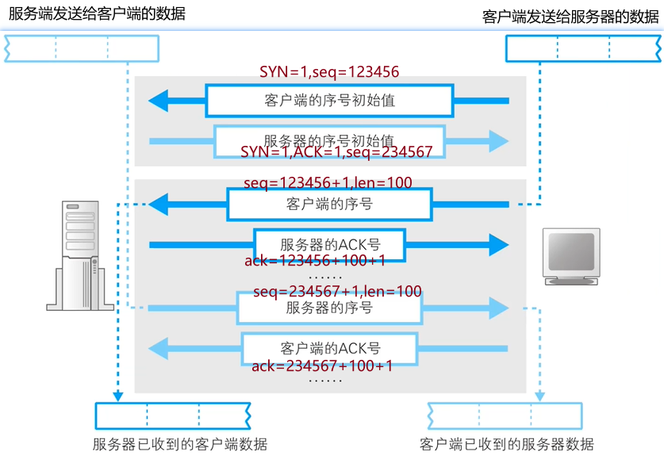

##### 序号、确认号变化过程


①②③是建立连接

④客户端发送HTTP请求给服务器

⑤⑥⑦⑧服务器连发4个数据给客户端

⑨客户端响应服务端


###### ① 客户端向服务器发起建立连接的请求

客户端序号的初始值是**seq=s1，确认号ack=0**，因为没有收到数据


###### ② 服务器响应客户端发起的建立请求

服务器序号**初始值seq=s2，确认号ack=s1+1**。虽然客户端发给服务器的请求`没有数据部分，只有TCP首部。`但是服务器端仍然收到客户端发给服务器的数据，所以要有响应给客户端一个确认号，数据部分收到了0个字节，此时的ack=s1+0+1。意味着，我期待你下次发给我的数据部分从第一个字节开始。

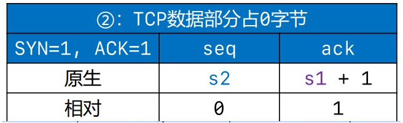

###### ③ 客户端响应服务器的响应

按理说这次也是没有数据部分的，但是为了响应上一次服务器的响应TCP报文的**确认号ack=s1+1**，所以这次TCP报文的**序号是seq=s1+1**。同时客户端发现这次我收到的服务器响应的TCP报文的数据部分是0个字节，所以下次希望从1字节收。响应服务器期待下次发给我的数据部分从第一个字节开始ack=s2+0+1。


###### ④ 真正发送一个HTTP请求

此时的TCP肯定是有数据的，因为发送了HTTP请求，TCP会封装这个HTTP请求到自己的数据部分。


客户端给服务器发送一个HTTP请求，上一次客户端接收到服务器的TCP报文是在第2步。客户端当时接收到的报文中数据部分是len=0。所以在第4步，客户端继续发请求给服务器时的**确认号ack=s2+0+1**。且上一次服务器响应的ack=s1+1，所以这次的序号seq=s1+1，且长度len=k。所以第4步和第3步的seq和ack都是一样的，因为都是对第2步的回应。只是第四步有真正的数据部分。

###### ⑤⑥⑦⑧ 服务器给客户端发送数据


服务器要响应给客户端的数据分4次发送。这4次发送的TCP报文段中的确认号ack都是s1+k+1。因为ack表示响应接收到上一次对方发给自己的数据长度，并且期望下一次从哪个字节开始接收。序号分别是s2+1，s2+b1+1，s2+b1+b2+1，s2+b1+b2+b3+1。

###### ⑨ 客户端连续收到了服务器发送的4个TCP数据段

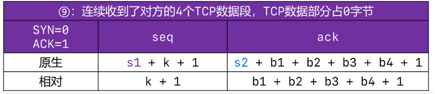

客户端响应给服务器一个TCP报文段：seq=s1+k+1，就是上一次就收到服务器发送的报文的ack。	ack=s2+b1+b2+b3+b4+1，但是此时只是个确认TCP，所以数据部分len=0。

###### 完整图示


##### TCP建立连接

为了建立稳定的TCP连接，通信双方必须从对方了解如下信息：

>对方报文发送的开始序号Seq。
>
>对方发送数据的缓冲区大小。
>
>能被接收的报文段的数据部分的最大长度MSS。
>
>被支持的TCP选项：MSS，是否支持SACK，窗口缩放系数Window scale来确认对方能接受的窗口大小。

在TCP协议中，通信双方将通过三次TCP报文实现对以上信息的了解，并在此基础上建立一个TCP链接。而通信双方的三次TCP报文段的交换过程，也就是通常所说的TCP实现建立连接的三次握手过程。一般是客户端主动发起建立连接的请求。

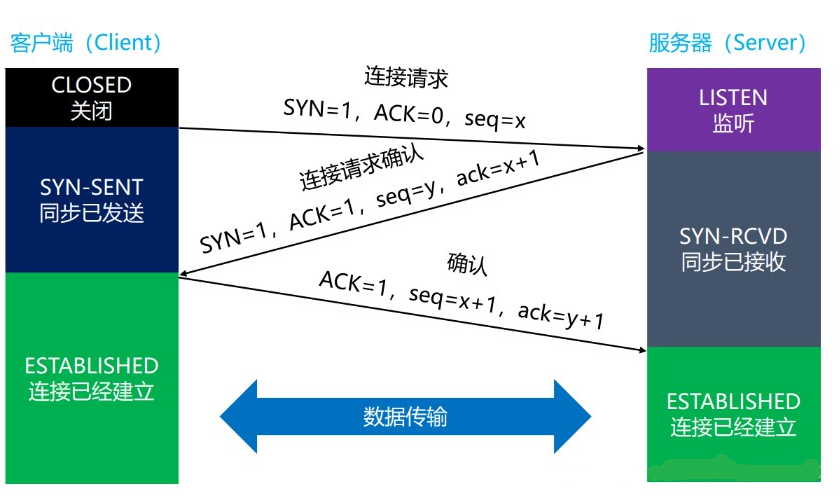

- 首先客户端处于关闭状态CLOSED，服务器是开启的处于监听状态LISTEN，比如监听某一端口。
- 客户端想和服务器建立连接：客户端回结束CLOSED状态，并发送一个建立连接的请求。发送的TCP报文中没有数据部分，且标志位SYN=1，ACK=0；还要告诉了服务器我的初始序号seq=x。之后客户端进入SYN-SENT同步已发送状态，表示客户端已发送SYN报文，等待服务器的第2次握手。-----第一次握手
- 服务器监听到客户端发送的这个建立连接的请求，如果没有问题的话，服务器就会给客户端一个响应，发送一个TCP报文段给客户端，报文的标志位SYN=1，ACK=1；并且返回给客户端一个初始化序号Seq=y和确认号ack=x+1来作为对收到的报文中的seq=x的回应。同时结束LISTEN状态，进入同步已接收SYN-RCVD状态，表示服务器接收到了SYN报文，服务器同意建立连接，并且我也想建立连接。-----第二次握手
- 客户端收到了服务器发过来的确认信息，如果没有问题的话，客户端会给服务器一个响应。发送一个TCP报文给服务器，报文的标志位ACK=1，注意此时的SYN=0标志位没有值；并且由于上一个报文中的ack=x+1，seq=y，所以响应的序号seq=x+1，确认号ack=y+1。同时结束同步已发送SYN-SENT状态，进入ESTABLiSHED连接已建立状态。----第三次握手
- 服务器接收到第三次握手后，会结束同步已接收SYN-RCVD状态，进入ESTABLiSHED连接已建立状态。连接就正式建立了。

##### TCP释放连接

由于TCP连接是全双工的，因此每个方向都必须单独进行关闭。这个原则是当一方完成它的数据发送任务后就会发送FIN标志位，表明我的数据已经发完了，我要终止终止这个方法向的连接。但是也仅仅表示这个方向上没有数据流动了，另一端仍能发送数据。首先进行关闭的一方将执行主动关闭，而另一方执行被动关闭。

全双工：意味着客户端可以给服务器发东西，服务器也可以给客户端发东西，并且可以同时进行。我发东西给你的同时，你也可以同时发数据给我。


1. 首先客户端，服务器都处于ESTABLISHED，链接已建立状态
2. 客户端先发起一个释放连接的请求，客户端会结束ESTABLLISHED连接已建立状态，进入FIN-WAIT-1终止等待1状态。并且发送一个TCP报文，其中标志位是FIN=1，ACK=1。表明客户端的数据已经发完，要断开连接了。**ACK标记为1，说明ack确认号是有用的。**
3. 服务器端会收到一个FIN=1的TCP报文，即客户端发送的连接释放的请求。然后会先回应一个ACK=1的报文给对方，并且结束ESTABLISHED状态，进入CLOSE-WAIT关闭等待状态。客户端不会回应这个相应，但是会结束IN-WAIT-1终止等待1状态，进入FIN-WAIT-2等待2状态。
4. 处于CLOSE-WAIT关闭等待状态的服务器，还要考虑自己是否还有数据要发送对方，如果没有，那么也向对方发送一个释放连接的请求报文FIN=1，并且结束CLOSE-WAIT关闭等待状态，进入LAST-ACK最后确认状态。
5. 客户端收到FIN=1的报文后，就知道服务器也没有东西要发了，服务器也要开始断开连接了。就会在响应一下这个请求，发送一个TCP报文给服务器ACK=1，并且结束FIN-WAIT-2终止等待2状态，进入TIME-WAIT时间等待状态。
6. 服务器收到最后这个请求，就会结束LAST-ACK最后确认状态，进入CLOSED关闭状态。

###### 为什么要进行4次挥手

1. 因为TCP是全双工通信，所以两头，两个传输方向要分别都关闭。

2. 第一次挥手：客户端发送FIN报文段时

   表示客户端告诉服务端，客户端已经没有数据要发送了，但客户端还是可以接收服务端的数据。

3. 第二次挥手：当服务端返回ACK报文段时

   表示服务端已经知道客户端没有数据发送了，但是服务端还是可以发送数数据到客户端。

4. 第三次挥手：当服务端也发送FIN报文段时

   表示服务端告诉客户端，服务端已经没有数据要发送了。

5. 第四次挥手：当客户端返回ACK报文段时

   表示客户端已经知道服务器没有数据要发送了，随后正式断开整个TCP连接。

###### 释放连接时的各个状态

1. FIN-WAIT-1：表示想要主动关闭连接

   向对方发送了FIN报文，此时进入FIN-WAIT-1状态。

2. CLOSE-WAIT：表示正在等待关闭。（在这个阶段，考虑自己需不需要关闭连接）

   当对方发送FIN给自己，自己会回应一个ACK报文给对方，此时则进入CLOSE-WAIT状态。

   在此状态下，需要考虑自己是否还有数据要发给对方，如果没有，发送FIN报文给对方，表明自己也要断开连接了。

3. FIN-WAIT-2：只要对方发送ACK确认后，主动方就会处于FIN-WAIT-2状态，等待看看对方是不是也要发送FIN报文，对方是不是也要结束连接结束

4. CLOSING：一种比较罕见的例外状态

   表示你发送FIN报文后，并没有收到对方的ACK报文，反而却也收到了对方的FIN报文。

   如果双方几乎在同时准备关闭连接的话，那么就会出现双方同时发送FIN报文的情况，也即会出现CLOSING状态，表示双方都正在关闭连接。

5. LAST-ACK：被动关闭一方在发送FIN报文后，最后等待对方的ACK报文

   当收到ACK报文后，即可进入CLOSED关闭连接状态了。

6. TIME-WAIT：表示主动方也收到了对方的FIN报文，并发送出了ACK报文，就等2MSL后即可进入COLSED状态了。

###### TCP释放细节

1. TCP/IP协议栈在设计上，允许任何一方先发起断开请求。这里演示的是Client主动断开请求。

2. Client发送ACK后，需要有个TIME-WAIT阶段，等待一段时候后，再真正关闭连接。

   一般是等待2倍的MSL（Maximum Segment Lifetime，最大分段生存期），即4分钟。

   MSL是TCP报文在Internet上的最大生存时间。

   每个具体的TCP实现（操作系统实现TCP）都必须选择一个确定的MSL值，RFC 1122建议是2分钟。

3. 为什么要有TIME-WAIT这个阶段?

   主要是预防这种情况：如果没有TIME-WAIT阶段，Client发送ACK=1报文后立马断开连接。但是因为网络原因，服务器端没有收到客户端的ACK报文。服务器端就会重发FIN=1报文。但是此时客户端已经关闭了。此时可能出现的情况：

   - Client没有任何反应，服务器那边会干等，甚至多次重发FIN，浪费资源
   - Client启动了一个新的应用程序，并且刚好分配了同一个端口号，新的应用程序就会收到服务器端重发的FIN=1报文。那么客户端就会马上开始执行断开连接的操作，但是客户端本来想和服务器建立连接的。

   换句话说：有了TIME-WAIT阶段可以防止本次连接中产生的数据包误传入下一次连接中（因为本次连接中的数据包包括服务器端重发的FIN=1报文，都会在2MSL时间内消失：所以2MSL时间后没有收到再FIN=1报文，就可以确认服务器端接收到了客户端的ACK报文）。所以TIME-WAIT主要是预防对方端没有收到上一次发送的ACK=1报文，看看能不能收到对方端重发的FIN=1报文。如果在TIME-WAIT阶段又收到FIN=1报文，说明上一次发的ACK=1报文对方没有收到，那么就会再次发送一个ACK=1报文，帮助对方顺利关闭。

##### 保活，心跳包

日常开发中可能出现这种情况，服务器为了节约资源，可能会实现如果在1min中内，没有收到客户端发送的数据，那么就会主动发起一个4次挥手断开连接。之后客户端再想发送数据给客户端时，就要发起一个3次握手建立连接。这样可能导致频繁的建立连接过程。那么为了避免这个情况，客户端就要定期向服务器发送一个心跳包，保证连接存活。

传输层TCP有一个`keep-alive`机制（和应用层HTTP的keep-alive不同），可以设置这个保活时间和心跳包。但是一般不用，开发中我们可以自己设置，相对灵活。

##### Q&A

**为什么建立连接的时候，要进行3次握手，2次不行吗？**

>主要原因：防止服务器端一直等待，浪费资源。如果建立连接的时候，只进行了2次握手，可能会出现一种服务器端一直等待的情况：
>
>客户端发送的第一个连接请求，因为网络延迟等原因，迟迟没有到达服务器端。所以客户端迟迟没有收到服务器端的响应，就会再次发送一个连接请求。并且忘掉上一次的连接请求。这次的连接请求很顺畅，两端成功建立了连接。并且数据传输完成后，连接又释放了。此时，第一个发送的连接请求姗姗来迟。注意！！！这个连接请求，客户端已经忘记了，或者说已经认为它失效了。但是服务器端确认为它是一个新的连接请求，那么服务器端会同意，并返回一个同意连接的响应。客户端收到这个响应有些不明所以，它会认为我没有给你发连接请求呀，所以会不管这个响应。结果就是客户端认为没有建立连接，但是服务器端认为已经建立连接了，所有服务器端会一直等待客户端发送数据过来，直到超时。
>
>采用3次握手既可以避免上述现象：如果是三次握手，在上述情况下：客户端没有向【服务器端的响应】发出确认，服务器端由于收不到确认，就知道客户端并没有建立连接。

**如果第三次握手失败了，会怎么处理？**

>此时服务器端的状态为SYN-RCVD同步已接收状态，如若等不到客户端的ACK=1的TCP报文，客户端会重新发送SYN=1，ACK=1的TCP报文。
>
>如果服务器端多次重发SYN=1，ACK=1的TCP报文还是等不到客户端的ACK=1的TCP报文，服务器端就会发送RET=1的TCP报文，强制关闭连接。


[^Package]: Package 网络层数据的通常叫法
[^Segment]: Segment 传输层数据的通常叫法
[^网络层总长度]: 16位，即16个二进制位，对应1Byte = 8 bit ，即2个字节，16位二进制所表示的数就是1111 1111，即65535
[^ARP]: ARP广播，用于得到目标的额MAC地址的协议
[^IP]: IP协议，IPV4/IPV5
[^ICMP]: ICMP，ping发送的协议，发送数据
[^cat]: 调制解调器，将数字信号转换成模拟信号，方便在电话线中传播


