# 1. 计算机系统概述

## 1.1 计算机的发展

 计算机系统 = 软件 + 硬件

 软件可以划分为系统软件和应用软件，系统软件用来管理整个计算机系统（如：操作系统、数据库管理系统（DBMS） 、标准程序库、网络软件、语言处理程序、服务程序）。应用软件是按任务需要编制而成的各种程序（比如抖音、迅雷、QQ）

### 硬件的发展

**第一代：电子管时代**

第一台电子数字计算机，采用电子管作为逻辑元件（逻辑元件是用于处理电信号的最小单元）；

**第二代：晶体管时代**

采用晶体管作为逻辑单元，大大减少了体积和功耗。有了操作系统雏形；

**第三代：中小规模集成电路时代**

采用中小规模的集成电路作为逻辑元件。体积减少，功耗降低，可靠性高；高级语言迅速发展；但这时候的计算机还是主要用于科学计算等专业用途；开始出现分时操作系统；

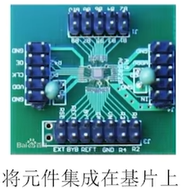

**第四代：大规模、超大规模集成电路时代**

采用大规模或超大规模的集成电路作为逻辑元件，开始出现微处理器、微型计算机。之后微型计算机逐渐步入个人计算机；个人计算机（PC）萌芽；

💡微处理器：CPU

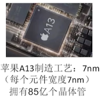

| 发展阶段 | 时间      | 逻辑元件                | 速度（次/秒） | 内存          | 外存                        |
| -------- | --------- | ----------------------- | ------------- | ------------- | --------------------------- |
| 第一代   | 1949-1957 | 电子管                  | 几千-几万     | 汞延迟线/磁鼓 | 穿孔卡片/纸带               |
| 第二代   | 1958-1964 | 晶体管                  | 几万-几十万   | 磁芯存储器    | 磁带                        |
| 第三代   | 1964-1971 | 中小规模集成电路        | 几十万-几百万 | 半导体存储器  | 磁带/磁盘                   |
| 第四代   | 1972-现在 | 大规模/超大规模集成电路 | 上千万-万亿   | 半导体存储器  | 磁盘/磁带/光盘/半导体存储器 |

### 微处理器的发展

| 微处理器    | 机器字长（位） | 年份 | 晶体管数目 |
| :---------- | :------------- | ---: | ---------: |
| Intel 4004  | 4              | 1971 |       2300 |
| Intel 8080  | 8              | 1974 |       6000 |
| Intel 8088  | 16             | 1979 |      29000 |
| Intel 80286 | 16             | 1982 |     134000 |
| Intel 80386 | 32             | 1985 |     275000 |
| Intel 80486 | 32             | 1989 |    1180000 |
| Pentium     | 32             | 1993 |    3100000 |
| Pentium III | 32             | 1999 |   28100000 |
| Pentium 4   | 32             | 2000 |   42000000 |
| Core 2 Duo  | 64             | 2006 |  291000000 |

💡机器字长：计算机一次整数运算所能处理的二进制位数；微型计算机的发展以微处理器技术为标志；

### 目前的发展趋势

“两极“分化：

- 一极是微型计算机向更微型化，网络化，高性能，多用途方向发展；（手机）

- 另一极是巨型机向更巨型化，超高速，并行处理，智能化方向发展；（神威.太湖之光超级计算机）

  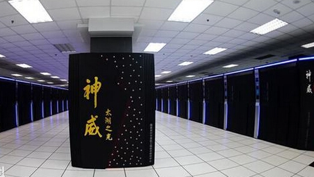

## 1.2 计算机硬件的基本组成

### 1.2.1 硬件的基本组成

 “存储程序”：是指将指令以二进制代码的形式事先输入计算机的主存储器（内存），然后按其在存储器中的首地址执行程序的第一条指令，以后就按该程序的规定顺序执行其他指令，直至程序执行结束。

#### 早期冯诺依曼机：（运算器为中心）

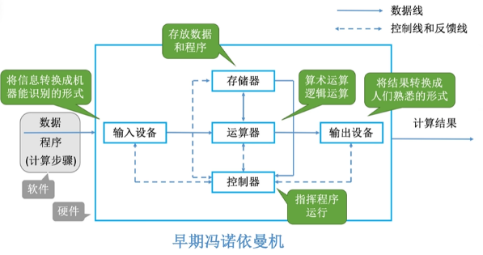

冯诺依曼计算机的特点：

1. 计算机由五大部件组成；
2. 指令和数据以同等地位存于存储器，可按地址寻访；
3. 指令和数据用二进制表示；
4. 指令由操作码和地址码组成；
5. 存储程序（会提前把指令和数据存储到存储程序中）；
6. 以运算器为中心；

>输入/输出设备与存储器之间的数据传送需要通过运算器完成，运算器本来是处理数据的核心部件，但是现在所有的数据中转都需要它来帮我们完成，就会导致数据计算的效率降低；

#### 现代的计算机：（存储器为中心）

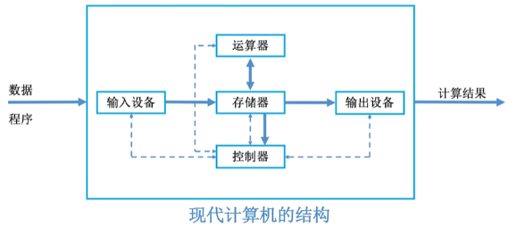

由于控制器和运算器关系十分紧密，所以在大规模集成电路工艺出现了之后，这两个部件通常集成在同一个芯片上的，整合了这两个芯片的部件我们称之为CPU，CPU整合了运算器和控制器，可以将结构简化成：

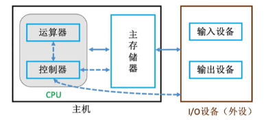

### 1.2.2 各个硬件的工作原理

#### 主存储器的基本组成

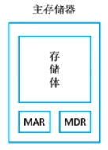

MAR：Memory Address Register（存储 **地址寄存器**）

MAR：Memory Data Register（存储 **数据寄存器**）

存储体会被分成一个一个的存储单元，每个存储单元中存放二进制代码数据称为存储字，每个存储字包含多少二进制位称为存储字长，用于存放二进制的电子元件称为存储元，每个存储元可以存储 1bit；

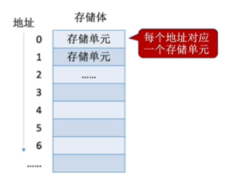

存储字长 = MDR位数

#### 运算器

运算器：用于实现算术运算（如：加减乘除），逻辑运算（如：与或非）

一个运算器有4个主要组成部分：ACC，MQ，X，ALU

**ACC**：累加器用于存放操作数或运算结果；
**MQ**：乘商寄存器，在乘除运算时，用于存放操作数或运算结果；
**X**：通用的操作数寄存器，用于存放操作数；
**ALU**：算术逻辑单元，通过内部复杂的电路实现算数运算，逻辑运算；

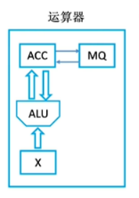

#### 控制器

控制器有三个主要组成部分：**CU**，IR，PC

**CU**：控制单元，分析指令，给出控制信号；
**IR**：指令寄存器，存放当前执行的指令；
**PC**：程序计数器，存放下一条指令地址，有自动加1功能；

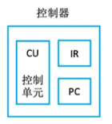

完成一条指令的过程：

1. 根据PC中记录的指令地址 ，从内存中取出指令
2. 将取出的指令放入IR中进行指令分析
3. 分析完成后CU会控制相关部件完成这个指令的操作

### 1.2.3 计算机系统的层次结构

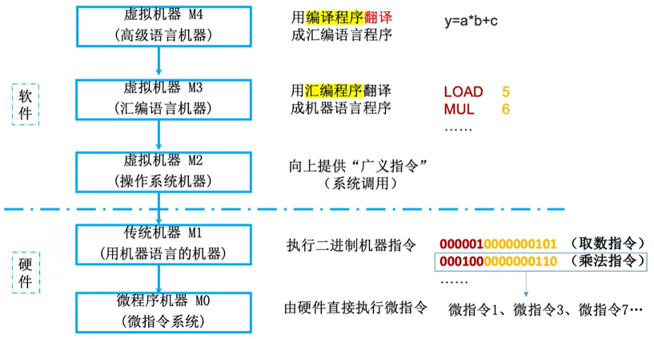

高级语言经过编译程序可以被翻译成汇编语言，然后经过汇编程序可以被翻译成机器语言，机器语言可以直接被识别；高级语言还可以直接通过解释程序翻译成机器语言；

**编译程序**：将高级语言编写的源程序全部语句一次性翻译成机器语言程序，而后再执行机器语言程序（只需翻译一次)

**解释程序**：将源程序的一条语句翻译成对应于机器语言的语句，并立即执行。紧接着再翻译下一句（每次执行都要翻译）

## 1.3 计算机性能指标

### 1.3.1 存储器性能指标

MDR位数 = 存储字长 = 每个存储单元的大小
MAR位数反映存储单元的个数（最多支持多少个，但实际值可能比他小)

总容量 = 存储单元个数 × 存储字长 bit = 存储单元个数 × 存储字长 / 8 Byte

>Eg：MAR为32位，MDR为8位；
>
>总容量 = 2^32 * 8 bit = 4GB

### 1.3.2 CPU性能指标

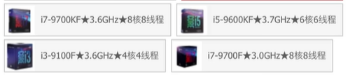

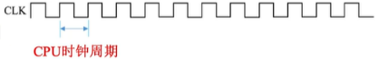

**CPU主频**：CPU内数字脉冲信号振荡的频率；将每个脉冲信号的时间称为CPU的时钟周期（单位：s、ns、us）

>脉冲信号：指挥CPU内部所有的部件来一步一步工作的节奏，就像广播体操一样，部件跟着节奏运行；

CPU主频（时钟频率） = 1/CPU时钟周期

**CPI（Clock cycle Per Instruction）**：执行一条指令所需的时钟周期数；

一般来说，CPU的性能跟主频有关，主频越高，CPU执行的频率越快，效率越高；但还受限于CPI，因为对于不同的CPU，执行相同的指令可能消耗不同的时钟周期；意思都执行乘法指令，因为乘法指令实际实现方式的不同，两个CPU所需要的时钟周期可能不一样；也跟主存（内存）有关系，比如存储器现在的负荷比较大，CPU想要取走一个数可能需要更多的CPI，即更多的时钟周期；

执行一条指令的耗时 = CPI * CPU时钟周期

>Eg：某CPU主频为1000Hz，某程序包含100条指令，平均来看指令的CPI=3。该程序在该CPU上执行需要多久？
>
>1/1000 * 3 * 100 = 0.3s

**IPS（Instructions Per Second）**：每秒执行多少条指令；

**FLOPS（Floating-point Operations Per Second）**：每秒执行多少次浮点运算；

### 1.3.3 系统整体的性能指标

**数据通路带宽**：数据总线一次所能并行传送信息的位数（各硬件部件通过数据总线传输数据）；比如有台计算机它的数据通路带宽为8bit，那么如果要在存储体里面读取16bit的数据到CPU里面就需要两次数据传输；

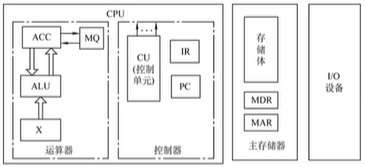

**吞吐量**：指系统在单位事件内处理请求的数量；

它取决于信息能多快地输入内存，CPU能多快地取指令，数据能多快地从内存取出或存入，以及所得结果能多快地从内存送给一台外部设备。这些步骤中的每一步都关系到主存，因此，系统吞吐量主要取决于主存的存取周期。

**响应时间**：指从用户向计算机发送一个请求，到系统对该请求做出响应并获得它所需要的结果的等待时间。

通常包括CPU时间（运行一个程序所花费的时间）与等待时间（用于磁盘访问、存储器访问、I/O操作、操作系统开销等时间）;

**基准程序**：跑分软件；

### Q&A

Q：主频高的CPU一定比主频低的CPU快吗？
A：不一定，如两个CPU，A的主频2GHz，平均CPI为10；B的主频为1GHz，平均CPI为1...

Q：若AB两个CPU的平均CPI相同，那么A的一定更快吗？
A：也不一定，还要看指令系统，如A不支持乘法指令，只能用多次加法实现乘法；而B支持乘法指令；

Q：基准程序执行得越快能说明机器性能越好吗？
A：基准程序中的语句存在拼读差异，运行结果也不能完全说明问题；

# 2. 计算机中的信息表示

